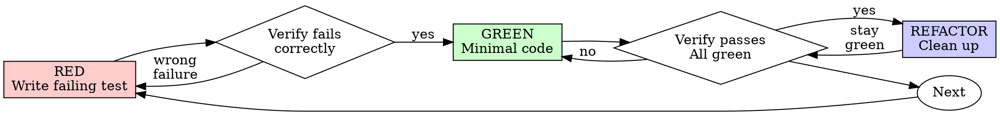

# Test-Driven Development (TDD)

---

## THE IRON LAW

```
+----------------------------------------------------------+
|                                                          |
|     NO PRODUCTION CODE WITHOUT A FAILING TEST FIRST      |
|                                                          |
+----------------------------------------------------------+
```

**This is non-negotiable. There are no exceptions. Zero.**

Write code before the test? **Delete it. Start over.**

- Don't keep it as "reference"
- Don't "adapt" it while writing tests
- Don't look at it
- **Delete means delete**

Implement fresh from tests. Period.

---

## Spirit vs Letter

**Violating the letter of the rules IS violating the spirit of the rules.**

There are no loopholes. There are no exceptions. If you find yourself thinking "technically this isn't breaking the rule because..." - you're breaking the rule.

The "spirit" of TDD is not some abstract ideal separate from its practices. The practices ARE the spirit. Writing tests first, watching them fail, writing minimal code - these aren't rituals around TDD, they ARE TDD.

**Pre-empting the rationalization:**
- "I'm following the spirit by ensuring code quality" - No. Write the test first.
- "The spirit is about confidence, and I'm confident" - No. Your confidence is not verification.
- "The spirit is about good design, and my design is good" - No. TDD drives design through tests.

---

## Overview

Write the test first. Watch it fail. Write minimal code to pass.

**Core principle:** If you didn't watch the test fail, you don't know if it tests the right thing.

## When to Use

**Always:**
- New features
- Bug fixes
- Refactoring
- Behavior changes

**Exceptions (ask your human partner):**
- Throwaway prototypes
- Generated code
- Configuration files

Thinking "skip TDD just this once"? Stop. That's rationalization.

## Red-Green-Refactor



### RED - Write Failing Test

Write one minimal test showing what should happen.

<Good>
```typescript
test('retries failed operations 3 times', async () => {
  let attempts = 0;
  const operation = () => {
    attempts++;
    if (attempts < 3) throw new Error('fail');
    return 'success';
  };

  const result = await retryOperation(operation);

  expect(result).toBe('success');
  expect(attempts).toBe(3);
});
```
Clear name, tests real behavior, one thing
</Good>

<Bad>
```typescript
test('retry works', async () => {
  const mock = jest.fn()
    .mockRejectedValueOnce(new Error())
    .mockRejectedValueOnce(new Error())
    .mockResolvedValueOnce('success');
  await retryOperation(mock);
  expect(mock).toHaveBeenCalledTimes(3);
});
```
Vague name, tests mock not code
</Bad>

**Requirements:**
- One behavior
- Clear name
- Real code (no mocks unless unavoidable)

### Verify RED - Watch It Fail

**MANDATORY. Never skip.**

```bash
npm test path/to/test.test.ts
```

Confirm:
- Test fails (not errors)
- Failure message is expected
- Fails because feature missing (not typos)

**Test passes?** You're testing existing behavior. Fix test.

**Test errors?** Fix error, re-run until it fails correctly.

### GREEN - Minimal Code

Write simplest code to pass the test.

<Good>
```typescript
async function retryOperation<T>(fn: () => Promise<T>): Promise<T> {
  for (let i = 0; i < 3; i++) {
    try {
      return await fn();
    } catch (e) {
      if (i === 2) throw e;
    }
  }
  throw new Error('unreachable');
}
```
Just enough to pass
</Good>

<Bad>
```typescript
async function retryOperation<T>(
  fn: () => Promise<T>,
  options?: {
    maxRetries?: number;
    backoff?: 'linear' | 'exponential';
    onRetry?: (attempt: number) => void;
  }
): Promise<T> {
  // YAGNI
}
```
Over-engineered
</Bad>

Don't add features, refactor other code, or "improve" beyond the test.

### Verify GREEN - Watch It Pass

**MANDATORY.**

```bash
npm test path/to/test.test.ts
```

Confirm:
- Test passes
- Other tests still pass
- Output pristine (no errors, warnings)

**Test fails?** Fix code, not test.

**Other tests fail?** Fix now.

### REFACTOR - Clean Up

After green only:
- Remove duplication
- Improve names
- Extract helpers

Keep tests green. Don't add behavior.

### Repeat

Next failing test for next feature.

---

## Rationalization Prevention

### The Rationalization Table

| Excuse | Reality |
|--------|---------|
| "Too simple to test" | Simple code breaks. Test takes 30 seconds. |
| "I'll test after" | Tests passing immediately prove nothing. |
| "Tests after achieve same goals" | Tests-after = "what does this do?" Tests-first = "what should this do?" |
| "Deleting X hours of work is wasteful" | Sunk cost fallacy. Unverified code is technical debt. |
| "This is just a quick fix" | Quick fixes become permanent. Test it. |
| "I know this works" | Your certainty is not verification. |
| "Time pressure" | Bugs from untested code cost more time. |
| "Already manually tested" | Ad-hoc does not equal systematic. No record, can't re-run. |
| "Keep as reference, write tests first" | You'll adapt it. That's testing after. Delete means delete. |
| "Need to explore first" | Fine. Throw away exploration, start with TDD. |
| "Test hard = design unclear" | Listen to test. Hard to test = hard to use. |
| "TDD will slow me down" | TDD faster than debugging. Pragmatic = test-first. |
| "Existing code has no tests" | You're improving it. Add tests for existing code. |
| "TDD is dogmatic, being pragmatic means adapting" | TDD IS pragmatic. "Pragmatic" shortcuts = debugging in production = slower. |

### Red Flags - Signs You're Rationalizing

**STOP IMMEDIATELY if you notice any of these:**

1. **You feel relieved about not writing a test**
   - Relief = your brain knows you're cutting corners
   - That feeling is your conscience - listen to it

2. **You're thinking "just this once"**
   - There's no "just this once" - every exception becomes precedent
   - "Just this once" today means "just this once" tomorrow

3. **You're writing code before defining expected behavior**
   - If you can't describe what the code should do, you can't test it
   - If you can describe it, describe it in a test first

4. **You catch yourself saying "obviously works"**
   - Nothing is obvious until proven by a failing-then-passing test
   - "Obviously" is the most dangerous word in software

5. **You're justifying based on time pressure**
   - Time pressure is exactly when bugs sneak in
   - Time pressure means you need TDD MORE, not less

6. **You're using any phrase from the rationalization table**
   - If you hear yourself saying those words, stop
   - The table exists because these are common lies we tell ourselves

7. **You're looking for loopholes in these rules**
   - Loophole-seeking = rationalization
   - The rules are simple: test first, always

8. **You've written more than 3 lines of production code without a failing test**
   - Delete it
   - Start over
   - No exceptions

---

## Complete TDD Cycle Example

### Bad: Writing Code First (DO NOT DO THIS)

<Bad>
```typescript
// Step 1: Write implementation first (WRONG!)
function calculateDiscount(price: number, customerType: string): number {
  if (customerType === 'premium') {
    return price * 0.2;
  } else if (customerType === 'regular') {
    return price * 0.1;
  }
  return 0;
}

// Step 2: Then write tests to "verify" (TOO LATE!)
test('calculates discount', () => {
  expect(calculateDiscount(100, 'premium')).toBe(20);
  expect(calculateDiscount(100, 'regular')).toBe(10);
  expect(calculateDiscount(100, 'guest')).toBe(0);
});
// Test passes immediately - PROVES NOTHING!
// Did you test edge cases? What about negative prices? Empty strings?
// You'll never know if the test actually catches bugs.
```
Tests passing immediately means they prove nothing. You're testing what you built, not what's required.
</Bad>

### Good: The Full TDD Cycle (DO THIS)

<Good>
```typescript
// ============================================
// STEP 1: RED - Write the failing test FIRST
// ============================================

test('premium customers get 20% discount', () => {
  const result = calculateDiscount(100, 'premium');
  expect(result).toBe(20);
});

// RUN THE TEST:
// $ npm test discount.test.ts
// FAIL: ReferenceError: calculateDiscount is not defined
//
// This failure is expected! The function doesn't exist yet.
// We've proven the test actually checks for our function.

// ============================================
// STEP 2: GREEN - Write MINIMAL code to pass
// ============================================

function calculateDiscount(price: number, customerType: string): number {
  if (customerType === 'premium') {
    return price * 0.2;
  }
  return 0; // Only handle premium for now - that's what the test requires
}

// RUN THE TEST:
// $ npm test discount.test.ts
// PASS: premium customers get 20% discount
//
// Test passes! But we're not done - we need more behaviors.

// ============================================
// STEP 3: RED - Add next failing test
// ============================================

test('regular customers get 10% discount', () => {
  const result = calculateDiscount(100, 'regular');
  expect(result).toBe(10);
});

// RUN THE TEST:
// $ npm test discount.test.ts
// FAIL: expected 10, received 0
//
// Good! It fails because we haven't implemented regular yet.

// ============================================
// STEP 4: GREEN - Add minimal code for this test
// ============================================

function calculateDiscount(price: number, customerType: string): number {
  if (customerType === 'premium') {
    return price * 0.2;
  }
  if (customerType === 'regular') {
    return price * 0.1;
  }
  return 0;
}

// RUN THE TEST:
// $ npm test discount.test.ts
// PASS: all tests pass

// ============================================
// STEP 5: RED - Edge case: negative prices?
// ============================================

test('throws error for negative prices', () => {
  expect(() => calculateDiscount(-50, 'premium')).toThrow('Price cannot be negative');
});

// RUN THE TEST:
// $ npm test discount.test.ts
// FAIL: expected to throw 'Price cannot be negative', but no error was thrown
//
// We discovered this edge case BY WRITING THE TEST FIRST!
// If we'd written code first, we might never have considered this.

// ============================================
// STEP 6: GREEN - Handle negative prices
// ============================================

function calculateDiscount(price: number, customerType: string): number {
  if (price < 0) {
    throw new Error('Price cannot be negative');
  }
  if (customerType === 'premium') {
    return price * 0.2;
  }
  if (customerType === 'regular') {
    return price * 0.1;
  }
  return 0;
}

// RUN THE TEST:
// $ npm test discount.test.ts
// PASS: all tests pass

// ============================================
// STEP 7: REFACTOR - Clean up (tests stay green!)
// ============================================

const DISCOUNT_RATES: Record<string, number> = {
  premium: 0.2,
  regular: 0.1,
};

function calculateDiscount(price: number, customerType: string): number {
  if (price < 0) {
    throw new Error('Price cannot be negative');
  }
  return price * (DISCOUNT_RATES[customerType] ?? 0);
}

// RUN THE TEST:
// $ npm test discount.test.ts
// PASS: all tests still pass after refactoring!
//
// We can refactor with confidence because our tests catch any regression.
```
Each step: write test, watch fail, write code, watch pass. No shortcuts.
</Good>

---

## Good Tests

| Quality | Good | Bad |
|---------|------|-----|
| **Minimal** | One thing. "and" in name? Split it. | `test('validates email and domain and whitespace')` |
| **Clear** | Name describes behavior | `test('test1')` |
| **Shows intent** | Demonstrates desired API | Obscures what code should do |

## Why Order Matters

**"I'll write tests after to verify it works"**

Tests written after code pass immediately. Passing immediately proves nothing:
- Might test wrong thing
- Might test implementation, not behavior
- Might miss edge cases you forgot
- You never saw it catch the bug

Test-first forces you to see the test fail, proving it actually tests something.

**"I already manually tested all the edge cases"**

Manual testing is ad-hoc. You think you tested everything but:
- No record of what you tested
- Can't re-run when code changes
- Easy to forget cases under pressure
- "It worked when I tried it" does not equal comprehensive

Automated tests are systematic. They run the same way every time.

**"Deleting X hours of work is wasteful"**

Sunk cost fallacy. The time is already gone. Your choice now:
- Delete and rewrite with TDD (X more hours, high confidence)
- Keep it and add tests after (30 min, low confidence, likely bugs)

The "waste" is keeping code you can't trust. Working code without real tests is technical debt.

**"TDD is dogmatic, being pragmatic means adapting"**

TDD IS pragmatic:
- Finds bugs before commit (faster than debugging after)
- Prevents regressions (tests catch breaks immediately)
- Documents behavior (tests show how to use code)
- Enables refactoring (change freely, tests catch breaks)

"Pragmatic" shortcuts = debugging in production = slower.

**"Tests after achieve the same goals - it's spirit not ritual"**

No. Tests-after answer "What does this do?" Tests-first answer "What should this do?"

Tests-after are biased by your implementation. You test what you built, not what's required. You verify remembered edge cases, not discovered ones.

Tests-first force edge case discovery before implementing. Tests-after verify you remembered everything (you didn't).

30 minutes of tests after does not equal TDD. You get coverage, lose proof tests work.

---

## Red Flags - STOP and Start Over

- Code before test
- Test after implementation
- Test passes immediately
- Can't explain why test failed
- Tests added "later"
- Rationalizing "just this once"
- "I already manually tested it"
- "Tests after achieve the same purpose"
- "It's about spirit not ritual"
- "Keep as reference" or "adapt existing code"
- "Already spent X hours, deleting is wasteful"
- "TDD is dogmatic, I'm being pragmatic"
- "This is different because..."

**All of these mean: Delete code. Start over with TDD.**

---

## Example: Bug Fix

**Bug:** Empty email accepted

**RED**
```typescript
test('rejects empty email', async () => {
  const result = await submitForm({ email: '' });
  expect(result.error).toBe('Email required');
});
```

**Verify RED**
```bash
$ npm test
FAIL: expected 'Email required', got undefined
```

**GREEN**
```typescript
function submitForm(data: FormData) {
  if (!data.email?.trim()) {
    return { error: 'Email required' };
  }
  // ...
}
```

**Verify GREEN**
```bash
$ npm test
PASS
```

**REFACTOR**
Extract validation for multiple fields if needed.

---

## Verification Checklist

Before marking work complete:

- [ ] Every new function/method has a test
- [ ] Watched each test fail before implementing
- [ ] Each test failed for expected reason (feature missing, not typo)
- [ ] Wrote minimal code to pass each test
- [ ] All tests pass
- [ ] Output pristine (no errors, warnings)
- [ ] Tests use real code (mocks only if unavoidable)
- [ ] Edge cases and errors covered

Can't check all boxes? You skipped TDD. Start over.

## When Stuck

| Problem | Solution |
|---------|----------|
| Don't know how to test | Write wished-for API. Write assertion first. Ask your human partner. |
| Test too complicated | Design too complicated. Simplify interface. |
| Must mock everything | Code too coupled. Use dependency injection. |
| Test setup huge | Extract helpers. Still complex? Simplify design. |

## Debugging Integration

Bug found? Write failing test reproducing it. Follow TDD cycle. Test proves fix and prevents regression.

Never fix bugs without a test.

## Testing Anti-Patterns

When adding mocks or test utilities, read @testing-anti-patterns.md to avoid common pitfalls:
- Testing mock behavior instead of real behavior
- Adding test-only methods to production classes
- Mocking without understanding dependencies

---

## Final Rule

```
Production code -> test exists and failed first
Otherwise -> not TDD
```

No exceptions without your human partner's permission.
