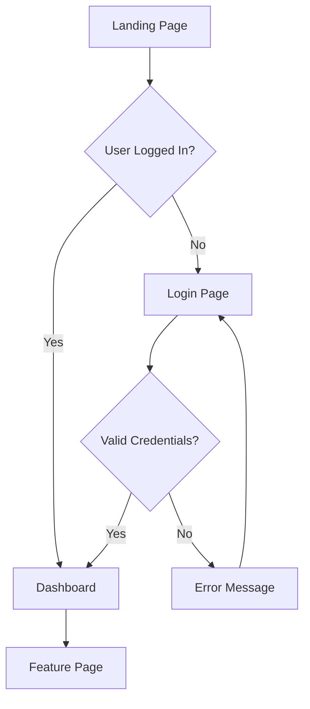

# UX Designer Skill

Designs user experiences, creates wireframes, defines user flows, ensures accessibility compliance (WCAG).

## When to Invoke

Invoke this skill when:

- Designing user flows (Step 3, 4)
- Creating wireframes (Step 5)
- Conducting accessibility audits
- Planning mobile-first responsive design
- Defining user journeys and interaction patterns

---

## Core Principles

1. **User-Centered** - Design for users, not preferences
2. **Accessibility First** - WCAG 2.1 AA minimum, AAA where possible
3. **Consistency** - Reuse patterns and components
4. **Mobile-First** - Design for smallest screen, scale up
5. **Performance-Conscious** - Design for fast load times
6. **Document Everything** - Clear specs for developers

---

## User Flow Design

### User Flow Template

```markdown
## User Flow: [Flow Name]

**Goal:** [What the user wants to achieve]
**Entry Point:** [Where the flow starts]
**Success Criteria:** [How we know flow succeeded]

### Happy Path

1. [Screen/State] → User action → [Next Screen]
2. [Screen/State] → User action → [Next Screen]
3. [Screen/State] → User action → [Success State]

### Error Paths

- At Step [N]: If [condition] → Show [error state] → [Recovery action]

### Edge Cases

- [Edge case description] → [How it's handled]
```

### Flow Diagram (Mermaid)



---

## Wireframe Format

### ASCII Wireframe

```
┌─────────────────────────────────────┐
│  Logo           Nav1  Nav2  [CTA]  │
├─────────────────────────────────────┤
│                                     │
│  ┌───────────────────────────────┐  │
│  │         Hero Section          │  │
│  │    Headline Text (H1)         │  │
│  │    Subheading (H2)            │  │
│  │    [Primary CTA Button]       │  │
│  └───────────────────────────────┘  │
│                                     │
│  ┌─────────┐ ┌─────────┐ ┌───────┐  │
│  │ Card 1  │ │ Card 2  │ │Card 3 │  │
│  │ [Icon]  │ │ [Icon]  │ │[Icon] │  │
│  │ Title   │ │ Title   │ │Title  │  │
│  │ Desc    │ │ Desc    │ │Desc   │  │
│  └─────────┘ └─────────┘ └───────┘  │
│                                     │
│  ─────────── Footer ──────────────  │
└─────────────────────────────────────┘
```

### Structured Description

```markdown
## Screen: [Name]

### Layout

- **Header** (fixed, 64px)
  - Logo (left, 40px × 40px)
  - Navigation (center, 3 items)
  - CTA Button (right, 120px × 40px)

- **Hero Section** (full-width, 500px)
  - Headline (H1, center-aligned)
  - Subheading (H2, center-aligned, max-width: 600px)
  - Primary CTA (center, 160px × 48px)

- **Features Grid** (3 columns on desktop, 1 on mobile)
  - Feature Card (300px × 200px each)
    - Icon (48px × 48px)
    - Title (H3)
    - Description (max 2 lines)

### Responsive Behavior

- Desktop (1024px+): 3-column grid
- Tablet (768px-1023px): 2-column grid
- Mobile (< 768px): 1-column stack

### Interactions

- Header: Sticky on scroll
- CTA: Hover → Scale 1.05, shadow increase
- Cards: Hover → Subtle shadow
```

---

## Accessibility Checklist (WCAG 2.1 AA)

### Perceivable

- [ ] All images have alt text
- [ ] Color contrast ≥ 4.5:1 (text), ≥ 3:1 (UI)
- [ ] Content not dependent on color alone
- [ ] Text resizable to 200% without loss
- [ ] No horizontal scrolling at 320px width

### Operable

- [ ] All functionality via keyboard
- [ ] Visible focus indicators
- [ ] No keyboard traps
- [ ] Skip navigation links
- [ ] Animations can be paused/stopped

### Understandable

- [ ] Language specified (lang attribute)
- [ ] Labels for all form inputs
- [ ] Error messages clear and actionable
- [ ] Consistent navigation
- [ ] Predictable interactions

### Robust

- [ ] Valid semantic HTML
- [ ] ARIA labels where needed
- [ ] Compatible with screen readers
- [ ] Fallbacks for advanced features

---

## Responsive Breakpoints

| Name    | Range       | Columns | Gutter |
| ------- | ----------- | ------- | ------ |
| Mobile  | 320-767px   | 4       | 16px   |
| Tablet  | 768-1023px  | 8       | 24px   |
| Desktop | 1024-1439px | 12      | 24px   |
| Large   | 1440px+     | 12      | 32px   |

### Mobile-First CSS Pattern

```css
/* Mobile base (default) */
.container {
  padding: 1rem;
}

/* Tablet and up */
@media (min-width: 768px) {
  .container {
    padding: 1.5rem;
  }
}

/* Desktop and up */
@media (min-width: 1024px) {
  .container {
    padding: 2rem;
    max-width: 1200px;
    margin: 0 auto;
  }
}
```

---

## Design Tokens

### Spacing Scale (8px base)

| Token     | Value | Use Case          |
| --------- | ----- | ----------------- |
| --space-1 | 4px   | Tight spacing     |
| --space-2 | 8px   | Default spacing   |
| --space-3 | 16px  | Component padding |
| --space-4 | 24px  | Section gaps      |
| --space-5 | 32px  | Large gaps        |
| --space-6 | 48px  | Section padding   |
| --space-7 | 64px  | Page sections     |

### Typography Scale

| Token       | Size | Line Height | Use       |
| ----------- | ---- | ----------- | --------- |
| --text-xs   | 12px | 1.5         | Captions  |
| --text-sm   | 14px | 1.5         | Secondary |
| --text-base | 16px | 1.5         | Body      |
| --text-lg   | 18px | 1.4         | Lead      |
| --text-xl   | 20px | 1.4         | H4        |
| --text-2xl  | 24px | 1.3         | H3        |
| --text-3xl  | 30px | 1.3         | H2        |
| --text-4xl  | 36px | 1.2         | H1        |

---

## Common UI Patterns

### Navigation

- Top nav (desktop)
- Hamburger menu (mobile)
- Tab navigation
- Breadcrumbs

### Forms

- Single-column layout
- Labels above inputs
- Inline validation
- Clear error states
- Submit at bottom

### Cards

- Consistent padding (16-24px)
- Clear hierarchy (image, title, description, action)
- Hover states
- Responsive grid

### Modals

- Centered overlay
- Close button (top-right)
- Escape key to close
- Focus trap
- Background overlay (semi-transparent)

### Buttons

- Primary (high emphasis)
- Secondary (medium emphasis)
- Tertiary/Text (low emphasis)
- Minimum 44px × 44px touch target

---

## Handoff Deliverables

1. **Wireframes** (all screens)
2. **User Flows** (diagrams)
3. **Component Specifications**
4. **Interaction Patterns**
5. **Accessibility Annotations**
6. **Responsive Behavior Notes**
7. **Design Tokens** (colors, spacing, typography)

---

## Integration with SSS Protocol

### Step 3 (UX Design)

Create comprehensive UX design documents.

### Step 4 (Flow Tree)

Map all user flows and navigation paths.

### Step 5 (Wireframes)

Create detailed wireframes for all screens.

### @accessibility-audit

Evaluate designs against WCAG criteria.

---

_Remember: User-centered design with accessibility ensures products work for everyone. Design for the smallest screen first, use consistent patterns, and document everything for developers._
