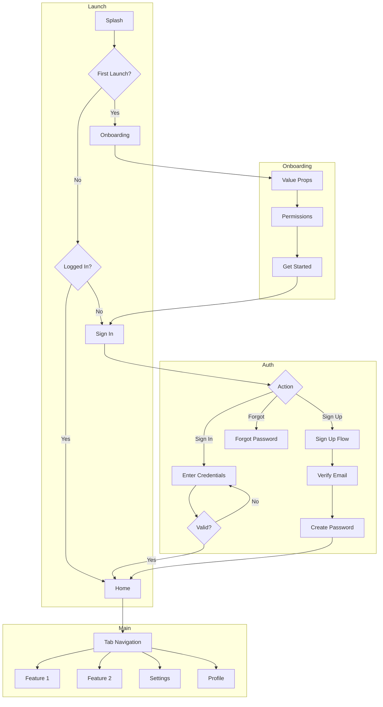

# /step-4-flow-tree — Flow Tree & Screen Architecture (Product Director + $1B Valuation Context)

**Source:** Sigma Protocol steps module
**Version:** 2.4.0

**Mission**
Create a comprehensive **Mobbin-style Flow Tree** showing **every single screen** in your application before any wireframes are built.

**Valuation Context:** You are a **Product Director at a $1 Billion Company**. You've seen how "lazy screen mapping" kills products. Every screen must be accounted for. No shortcuts. No "we'll add login later." This is the **complete blueprint** of your product's interface.

**Why This Step Exists:**
- **Prevents lazy screens** — Forces enumeration of EVERY screen before building
- **Mobbin-level detail** — Creates a professional flow tree like top apps document
- **Clear scope** — Know exactly what you're building before writing any code
- **Stakeholder alignment** — Visual representation everyone can understand

---

## THE FLOW TREE PHILOSOPHY

### "If It's Not in the Tree, It Doesn't Exist"

**Every screen in your app must be:**
1. Named explicitly
2. Placed in a flow hierarchy
3. Given entry/exit points
4. Assigned a priority
5. Counted toward total screen inventory

### What Mobbin Does Right (Our Target)

Looking at professional apps like Cash App on Mobbin:
- **Onboarding**: 22 screens (broken into sub-flows)
- **Home**: 7 screens
- **Card**: 4 screens (with sub-flows: Ordering 12, Customizing 6, Offers 3)
- **Money**: 4 screens (with sub-flows: Starting a pool 3, Add people 2)
- **Activity**: 2 screens
- **Profile**: 3 screens (with sub-flows: Uploading photo 3, Personal info 3)

**Key Insight:** Sub-flows have their own screen counts. "Card" isn't 4 screens—it's 4 + 12 + 6 + 3 = 25 screens total.

---

## FLOW TREE FRAMEWORKS (MANDATORY APPLICATION)

### Framework 1: Complete Screen Taxonomy

**Every app has these flow categories (enumerate ALL that apply):**

| Category | Typical Screens | Mobile | Web |
|----------|-----------------|--------|-----|
| **Launch** | Splash, App Update, Maintenance | ✅ | ❌ |
| **Onboarding** | Welcome, Value Props, Permissions, Tutorial | ✅ | ✅ |
| **Authentication** | Sign Up, Sign In, Forgot Password, 2FA, OAuth | ✅ | ✅ |
| **Core Features** | Primary feature screens (varies by app) | ✅ | ✅ |
| **Settings** | Account, Privacy, Notifications, Billing | ✅ | ✅ |
| **Profile** | View Profile, Edit Profile, Preferences | ✅ | ✅ |
| **Navigation** | Tab Bar, Drawer, Bottom Sheet | ✅ | ✅ |
| **Modals/Overlays** | Confirmations, Alerts, Pickers | ✅ | ✅ |
| **Error States** | No Internet, Empty, Access Denied | ✅ | ✅ |
| **Marketing** | Landing, Pricing, Features, About | ❌ | ✅ |
| **Admin** | User Management, Analytics, System | ❌ | ✅ |

### Framework 2: Screen Naming Convention

**Format:** `[Flow]-[SubFlow]-[Screen]`

**Examples:**
- `auth-signup-enter-email`
- `auth-signup-verify-code`
- `auth-forgot-password-reset`
- `home-dashboard-main`
- `settings-account-edit-name`
- `profile-edit-upload-photo`

**Rules:**
- Lowercase with hyphens
- Max 4 levels deep
- Descriptive but concise
- Unique across entire app

### Framework 3: Screen Complexity Rating

| Rating | Criteria | Example |
|--------|----------|---------|
| **Simple** | Static content, <3 interactive elements | Splash, Success confirmation |
| **Medium** | Form with validation, list with actions | Sign up form, Settings page |
| **Complex** | Real-time data, multiple states, animations | Dashboard, Chat, Feed |

### Framework 3.5: Animation Complexity Rating

| Rating | Animation Types | Example Components |
|--------|-----------------|-------------------|
| **Simple** | Fade in/out, basic transitions | `opacity`, `transform: translateY` |
| **Medium** | Spring physics, staggered children | `border-trail`, `animated-group` |
| **Complex** | Orchestrated sequences, particle effects | `dock`, `morphing-dialog`, `particle-button` |

> **Animation Research Reference:** See `/commands/MOBILE_APP_DESIGN_LEARNINGS.md` for comprehensive animation patterns and code examples.

### Framework 4: Screen Priority Matrix

| Priority | Criteria | Build Order |
|----------|----------|-------------|
| **P0** | Core user journey, MVP required | Build first (Week 1-2) |
| **P1** | Important but not blocking, enhances UX | Build second (Week 3-4) |
| **P2** | Nice-to-have, can defer | Build later (Week 5+) |
| **P3** | Future enhancement, not in initial scope | Backlog |

---

## INFORMATION ARCHITECTURE FRAMEWORKS (MANDATORY APPLICATION)

### Framework 5: Three Circles of IA (Rosenfeld & Morville)
Every screen exists at the intersection of:
- **Users**: Who uses this screen? What are their goals?
- **Content**: What information must this screen display?
- **Context**: What business objectives does this screen serve?

**Application:** For each screen, document User/Content/Context alignment.

### Framework 6: Dan Brown's 8 Principles of IA
Validate your flow tree against these principles:
| Principle | Application to Flow Tree |
|-----------|-------------------------|
| **Objects** | Each screen is a "living object" with attributes |
| **Choices** | Limit choices per screen (Miller's 7±2) |
| **Disclosure** | Progressive disclosure - show only what's needed |
| **Exemplars** | Use icons/previews to indicate content types |
| **Front Doors** | Design for deep linking - users don't always start at home |
| **Multiple Classification** | Allow multiple paths to same content |
| **Focused Navigation** | Don't mix navigation types |
| **Growth** | Design for 10x more screens than you have today |

### Framework 7: Abby Covert's Sensemaking (7 Steps)
Use this process when flows are unclear:
1. **Identify the Mess** - What's confusing about the current flow?
2. **State Your Intent** - What should this flow accomplish?
3. **Face Reality** - What constraints exist?
4. **Choose a Direction** - Pick a structure pattern
5. **Measure Distance** - How far from ideal?
6. **Play with Structure** - Iterate on organization
7. **Prepare to Adjust** - Plan for evolution

### Framework 8: Jesse James Garrett's 5 Planes
Flow Tree = **Structure Plane**
- Above us: Strategy (why), Scope (what)
- Below us: Skeleton (how arranged), Surface (how it looks)
- Our job: Define the conceptual structure before visual design

### Framework 9: Peter Morville's UX Honeycomb
Evaluate each screen against 7 facets:
| Facet | Screen Question |
|-------|-----------------|
| **Useful** | Does this screen serve a real need? |
| **Usable** | Can users accomplish their goal easily? |
| **Findable** | Can users discover this screen? |
| **Credible** | Does this screen build trust? |
| **Accessible** | Can all users access this screen? |
| **Desirable** | Does this screen create positive emotion? |
| **Valuable** | Does this screen deliver value? |

---

## DESIGN DNA FRAMEWORK (MANDATORY SELECTION)

### Select Your App's Design DNA Archetype

**Every app has a dominant design "personality."** Select the archetype that best matches your product vision:

| DNA Archetype | Core Philosophy | Examples | Key Characteristics |
|---------------|-----------------|----------|---------------------|
| **Professional/Craft** | Quality as winning strategy | Linear, Stripe, Figma, Vercel | Precision, polish, attention to detail, understated elegance |
| **Gamified/Engaging** | Make the mundane addictive | Duolingo, Superhuman | Rewards, streaks, progression, dopamine triggers |
| **Wellbeing/Calming** | Mindful design for wellness | Headspace, Opal | Soft colors, gentle animations, breathing room |
| **Aggressive/High-Energy** | Create urgency & action | Sales apps, fitness apps | Bold colors, strong CTAs, momentum |
| **Delightful/Playful** | Spark joy in interactions | Notion, Arc Browser | Personality, whimsy, surprises |
| **Premium/Luxury** | Exclusivity & sophistication | High-end fintech, VIP apps | Dark modes, gold accents, minimal chrome |
| **Social/Viral** | Encourage sharing & connection | TikTok, Instagram | Share prompts, social proof, FOMO triggers |
| **Health/Fitness** | Minimal friction, maximum results | Cal AI, Ladder | Photo-first, progress tracking, coaching UX |
| **Fintech/Trust** | Security meets usability | Cash App, Chime, PayPal | Bold branding, spatial illustrations, trust signals |
| **Crypto/Trading** | Clarity at speed | Robinhood, Coinbase | Radical simplicity, real-time data, green/red indicators |
| **Recovery/Transformation** | Deep personalization for change | QUITTR, sobriety apps | 34-step onboarding, quantified problems, gamified progress |
| **Open/Developer** | Transparent, community-first | Cal.com, open-source tools | Public roadmaps, API-first, extensibility |

### Design DNA Selection Prompt

**HITL Checkpoint →** Ask user to select DNA archetype.
**Prompt:**
```
Which Design DNA best matches your product vision?

1. **Professional/Craft** - Linear, Stripe style (precision, polish)
2. **Gamified/Engaging** - Duolingo style (rewards, streaks)
3. **Wellbeing/Calming** - Headspace style (soft, mindful)
4. **Aggressive/High-Energy** - Fitness app style (bold, urgent)
5. **Delightful/Playful** - Notion, Arc style (personality, whimsy)
6. **Premium/Luxury** - VIP app style (exclusive, sophisticated)
7. **Social/Viral** - TikTok style (sharing, FOMO)
8. **Health/Fitness** - Cal AI style (photo-first, coaching)
9. **Fintech/Trust** - Cash App style (bold, trust signals)
10. **Crypto/Trading** - Robinhood style (simple, real-time)
11. **Recovery/Transformation** - QUITTR style (deep personalization)
12. **Open/Developer** - Cal.com style (transparent, API-first)

Reply with the number or name of your chosen DNA archetype.
```

### DNA-Specific Screen Considerations

**After DNA selection, apply these guidelines:**

#### Professional/Craft DNA (Linear, Stripe, Figma, Vercel)
- **Screens:** Minimal, purposeful, every pixel intentional
- **Animations:** Subtle, physics-based, never gratuitous
- **Typography:** Clean sans-serif, strong hierarchy
- **Colors:** Monochromatic with single accent, often purple/blue
- **Philosophy (Karri Saarinen):** "Quality is the winning strategy"

#### Gamified/Engaging DNA (Duolingo, Superhuman)
- **Screens:** Progression-focused, reward-dense
- **Animations:** Celebratory, confetti, level-ups
- **Typography:** Friendly, rounded, approachable
- **Colors:** Bright, energetic, high contrast
- **Philosophy (Rahul Vohra):** "Game design, not gamification"

#### Wellbeing/Calming DNA (Headspace, Opal)
- **Screens:** Breathable, generous whitespace
- **Animations:** Slow, organic, nature-inspired
- **Typography:** Soft, rounded, comfortable
- **Colors:** Pastels, earth tones, low saturation
- **Philosophy (Kenneth Schlenker):** "Design for digital wellbeing"

#### Health/Fitness DNA (Cal AI, Ladder)
- **Screens:** Photo-first interaction, progress visualization
- **Animations:** Smooth tracking, achievement celebrations
- **Typography:** Bold, confident, motivational
- **Colors:** High energy, contrast, fitness brand palette
- **Philosophy (Zach Yadegari):** "Minimal friction, maximum results"

#### Fintech/Trust DNA (Cash App, Chime, PayPal)
- **Screens:** Trust-building, security signals prominent
- **Animations:** Spatial illustrations, confidence-building transitions
- **Typography:** Strong, trustworthy, accessible
- **Colors:** Bold brand colors, green for success
- **Philosophy (Cameron Worboys/Lauren LoPrete):** "Materiality, composition, lighting"

#### Crypto/Trading DNA (Robinhood, Coinbase)
- **Screens:** One screen, one button, one core action
- **Animations:** Real-time data updates, ticker animations
- **Typography:** Clear numbers, data hierarchy
- **Colors:** Green/red indicators, minimal palette
- **Philosophy (Vlad Tenev):** "Radical simplicity democratizes access"

#### Recovery/Transformation DNA (QUITTR)
- **Screens:** Deep personalization, quantified problem framing
- **Animations:** Progress trees, milestone celebrations
- **Typography:** Supportive, non-judgmental, educational
- **Colors:** Growth-focused (greens), calming (blues)
- **Philosophy (Alex Slater):** "Deep personalization for high-intent conversion"

#### Open/Developer DNA (Cal.com)
- **Screens:** Transparent, extensible, API-visible
- **Animations:** Functional, not decorative
- **Typography:** Technical, monospace accents
- **Colors:** Clean, accessible, customizable
- **Philosophy (Peer Richelsen):** "Open infrastructure, beautiful by default"

---

## EXPERT QUALITY PRINCIPLES (APPLY THROUGHOUT)

### Karri Saarinen's 10 Rules for Craft (Linear)
1. **Quality as strategy** - Every detail is a competitive advantage
2. **Ship fast, but never sloppy** - Speed with precision
3. **Opinionated defaults** - Make decisions for users
4. **Consistency is king** - Same patterns everywhere
5. **Performance is UX** - Speed is a feature
6. **Details matter** - Micro-interactions tell stories
7. **Dark mode as first-class** - Not an afterthought
8. **Keyboard-first** - Power users are happy users
9. **Animation with purpose** - Every motion means something
10. **Documentation as product** - Everything is well-documented

### Rahul Vohra's 7 Principles of Game Design (Superhuman)
Apply game thinking to your flow design:
1. **Goals** - Clear objectives on every screen
2. **Emotions** - Design for feelings, not features
3. **Flow state** - Challenge matches skill level
4. **Motivation** - Intrinsic rewards > extrinsic
5. **Toys/tools** - Features that are fun to use
6. **Social** - Enable showing off, competition
7. **Control** - User always feels in charge

### Vlad Tenev's Simplicity Principle (Robinhood)
- **One screen** - Do one thing perfectly
- **One button** - Primary action is unmissable
- **One core action** - No decision paralysis
- **Democratize access** - Remove barriers to entry

### QUITTR Deep Personalization Framework (Alex Slater)
For high-intent conversion flows:
1. **34+ Step Onboarding** - More questions = more commitment
2. **Quantify the Problem** - "You've spent X hours on [problem]"
3. **Education First** - Teach before selling
4. **Gamified Progress** - Life trees, streaks, milestones
5. **Hard Paywall** - Value established before payment
6. **Lifestyle Personalization** - Adapt to user's context

---

## FINTECH-SPECIFIC SCREEN PATTERNS

### Trust-Building Screens (Cash App, PayPal, Chime Style)

| Screen Type | Key Elements | Trust Signals |
|-------------|--------------|---------------|
| **Account Overview** | Balance prominent, recent activity | Bank-grade security badge, encryption mention |
| **Transaction Detail** | Clear breakdown, receipts | Status indicators, dispute options |
| **Payment Confirmation** | Review before send | Face ID/Touch ID, amount verification |
| **Security Settings** | 2FA, biometrics, session management | "Bank-level security" messaging |
| **Identity Verification** | KYC/AML compliance flows | Progress indicator, why we need this |

### Trading/Crypto Screens (Robinhood, Coinbase Style)

| Screen Type | Key Elements | Design Patterns |
|-------------|--------------|-----------------|
| **Portfolio Overview** | Total value, change %, holdings | Green/red indicators, sparklines |
| **Asset Detail** | Price chart, buy/sell buttons | Real-time updates, order book preview |
| **Trade Execution** | Order type, amount, review | One-tap trading, confirmation gate |
| **Price Alerts** | Threshold setting, notifications | Quick-set percentages |
| **Learning/Education** | Earn rewards for learning | Duolingo-style micro-lessons |

### Neobanking Screens (Chime, Revolut Style)

| Screen Type | Key Elements | Design Patterns |
|-------------|--------------|-----------------|
| **Card Management** | Virtual/physical card, freeze toggle | Card visualization, spending limits |
| **Direct Deposit** | Setup wizard, paycheck tracking | "Get paid early" value prop |
| **Savings Goals** | Round-ups, auto-save | Progress visualization, celebratory moments |
| **Spending Insights** | Categories, trends, budgets | Charts, spending breakdown |
| **ATM Finder** | Map view, fee-free locations | Location services integration |

### Design System References

| Company | Design System | Key Patterns |
|---------|---------------|--------------|
| **Cash App** | Spatial illustration system | Materiality, composition, lighting playbook |
| **Robinhood** | Snack design system | One-handed trading, bite-sized info |
| **Coinbase** | Clarity design system | Accessibility as quality metric |
| **Chime** | Mobile-first banking | Financial peace of mind messaging |

---

## PREFLIGHT (auto)

1) **Get date**: run `date +"%Y-%m-%d"` and capture `TODAY`.
2) **Detect platform**: Check `/docs/stack-profile.json` for platform type.
3) **Create folders (idempotent)** if missing:
   - `/docs/flows`
4) **Read previous step outputs**:
   - `/docs/specs/MASTER_PRD.md` (Step 1)
   - `/docs/architecture/ARCHITECTURE.md` (Step 2)
   - `/docs/ux/UX-DESIGN.md` (Step 3)
   - `/docs/journeys/USER-JOURNEYS.md` (Step 3)
   - `/docs/design/UI-PROFILE.md` (Step 3)
   - `/docs/design/ui-profile.json` (Step 3, machine-readable)

**UI Profile rule (blocking):**
- If `/docs/design/UI-PROFILE.md` and `/docs/design/ui-profile.json` do **not** exist, **STOP** and go back to Step 3 to select a UI Profile.
- Step 4 must persist the chosen profile into `meta.uiProfile` inside `/product/flows/flow-tree.json` so downstream steps can enforce it.
5) **Writing policy**: For large files, **write in small chunks** to avoid editor limits.

---

## PLANNING & TASK CREATION (CRITICAL - DO THIS FIRST)

**Before executing anything, you MUST:**

1. **Analyze Requirements**: Review PRD features, user journeys, and architecture
2. **Create Task List**: Generate comprehensive task list with checkboxes
3. **Present Plan**: Show the user your complete flow tree plan
4. **Get Approval**: Wait for user to approve the plan before executing

**Task List Format** (create at the start):
```markdown
## Step-4 Flow Tree Development Plan

### Phase A: Flow Discovery
- [ ] Read PRD and extract all features requiring screens
- [ ] Read User Journeys and map to flows
- [ ] Read Architecture for platform constraints
- [ ] Read UI Profile (from Step 3) and confirm baseline (Cool Professional vs Satin Dark, etc.)
- [ ] Identify platform type (web/mobile/both)
- [ ] HITL checkpoint: Present initial flow categories
- [ ] Wait for approval

### Phase B: Flow Category Enumeration
- [ ] List all major flow categories for this app
- [ ] Identify sub-flows within each category
- [ ] Create hierarchical flow structure
- [ ] HITL checkpoint: Present flow hierarchy
- [ ] Wait for approval

### Phase C: Screen Enumeration (Per Flow)
- [ ] For EACH flow category:
  - [ ] [Flow 1]: Enumerate every screen
  - [ ] [Flow 2]: Enumerate every screen
  - [ ] [Flow N]: Enumerate every screen
- [ ] Count total screens per flow
- [ ] Identify shared/reusable screens
- [ ] HITL checkpoint: Present screen counts
- [ ] Wait for approval

### Phase D: Screen Specifications
- [ ] For each screen, document:
  - [ ] Screen name (following naming convention)
  - [ ] Purpose (1-2 sentences)
  - [ ] Entry points (how users arrive)
  - [ ] Exit points (where users go next)
  - [ ] Complexity rating (Simple/Medium/Complex)
  - [ ] Priority (P0/P1/P2/P3)
- [ ] HITL checkpoint: Present screen specs
- [ ] Wait for approval

### Phase E: Transition Mapping
- [ ] Document navigation between screens
- [ ] Identify decision points/branches
- [ ] Map back navigation paths
- [ ] Identify deep linking entry points
- [ ] Create flow diagram (Mermaid)
- [ ] HITL checkpoint: Present transition map
- [ ] Wait for approval

### Phase F: Document Assembly
- [ ] Write `/docs/flows/FLOW-TREE.md`
- [ ] Write `/docs/flows/SCREEN-INVENTORY.md`
- [ ] Write `/docs/flows/TRANSITION-MAP.md`
- [ ] Verify all quality gates pass
- [ ] FINAL checkpoint: Present complete flow tree
- [ ] Wait for final approval
```

**Execution Rules**:
- ✅ Check off EACH task as you complete it
- ✅ Do NOT skip ahead - complete tasks in order
- ✅ Do NOT proceed to next phase until user approves
- ✅ Every screen in the PRD MUST appear in the flow tree
- ✅ No TBDs - every screen has specifications

---

## INPUTS TO CAPTURE

Ask the user and echo back as a table:

| Input | Source | Required |
|-------|--------|----------|
| Platform | `/docs/stack-profile.json` or ask | Yes |
| PRD | `/docs/specs/MASTER_PRD.md` | Yes |
| User Journeys | `/docs/journeys/USER-JOURNEYS.md` | Yes |
| Architecture | `/docs/architecture/ARCHITECTURE.md` | Yes |
| Similar Apps | User input (for reference) | Optional |
| Screen Count Target | User estimate | Optional |

> Ground rules: If any item is unknown, ask concise HITL questions now and proceed with clearly flagged assumptions.

---

## PERSONA PACK

### Core Personas
- **Product Director** – Complete product vision, no shortcuts, every screen matters.
- **UX Architect** – Information architecture, navigation patterns, user flows.
- **Mobile Platform Expert** – iOS HIG, Material Design, platform conventions.
- **Web Platform Expert** – Page types, SEO considerations, responsive breakpoints.
- **QA Lead** – Edge cases, error states, what screens are missing?

### Expert Personas (Research-Backed)
- **Information Architect (Louis Rosenfeld school)** – Structure, findability, labeling systems, Three Circles of IA.
- **Mobile Design Expert (Luke Wroblewski school)** – Mobile-first prioritization, thumb zones, one-handed operation.
- **UX Strategist (Jesse James Garrett school)** – 5 planes alignment, user-centered structure.
- **Sensemaker (Abby Covert school)** – Taxonomy, ontology, controlled vocabularies.
- **Interaction Designer (Jenifer Tidwell school)** – UI patterns, screen archetypes.
- **Craft Obsessive (Karri Saarinen school)** – Quality as strategy, every detail matters.
- **Game Designer (Rahul Vohra school)** – Goals, emotions, flow state, intrinsic motivation.
- **Fintech Expert (Cash App/Robinhood school)** – Trust signals, clarity at speed, one-action screens.

> Tone: Comprehensive, detail-oriented, research-backed, no screen left behind.

---

## PHASE A — FLOW DISCOVERY

### A.0 Research & Pattern Discovery (MCP-Driven)

**Use MCP tools to research before defining flows:**

**Step 1: Exa Code Context Research**
```
Use get_code_context_exa with queries:
- "[App Type] screen flow patterns mobile"
- "[App Category] user journey best practices"
- "[Industry] mobile app IA patterns"
```

**Step 2: Company Research**
```
Use company_research_exa to analyze:
- Top 3-5 apps in your space
- How they structure their flows
- What screens they prioritize
```

**Step 3: Pattern Documentation**
```
Research sources:
- Mobbin.com flow trees for your app type
- Screenlane patterns
- Industry-specific UX case studies
```

**Deliverable:** `/docs/flows/PATTERN-RESEARCH.md` documenting:
- 3-5 competitor/inspiration apps analyzed
- Common flow patterns identified (with screen counts)
- Unique opportunities discovered
- DNA archetype patterns from research

**Example Pattern Research:**
```markdown
## Pattern Research: [App Type]

### Competitor Analysis
| App | Total Screens | Key Flows | Notable Patterns |
|-----|---------------|-----------|------------------|
| [App 1] | ~80 | Onboarding (12), Core (25) | Deep personalization onboarding |
| [App 2] | ~60 | Auth (8), Dashboard (15) | Single-screen dashboard |
| [App 3] | ~100 | Full feature set | Progressive disclosure |

### Common Patterns
1. [Pattern 1]: Found in 3/5 apps
2. [Pattern 2]: Industry standard
3. [Pattern 3]: Emerging trend

### Opportunities
- [Gap in competitor offerings]
- [Underserved user need]
```

### A.1 Read Previous Step Outputs

**Read and extract from PRD (Step 1):**
- All features listed
- User stories
- MVP scope vs. future features
- Target users

**Read and extract from User Journeys (Step 3):**
- Primary user journey (screens mentioned)
- Secondary user journeys
- Entry points
- Exit points

**Read and extract from Architecture (Step 2):**
- Platform type (web/mobile/both)
- Authentication approach
- Key integrations that need screens

### A.2 Platform Detection

**If Mobile App:**
```
Required Flow Categories:
├── Launch (splash, app update, maintenance)
├── Onboarding (welcome, permissions, tutorial)
├── Authentication (signup, signin, password reset, 2FA)
├── Main App (tab-based or stack navigation)
├── Settings (account, privacy, notifications)
├── Profile (view, edit)
├── Error States (offline, empty, error)
└── Modals/Overlays (confirmations, pickers)
```

**If Web App:**
```
Required Flow Categories:
├── Marketing (landing, features, pricing, about)
├── Authentication (signup, signin, password reset, OAuth)
├── Onboarding (welcome, setup, tutorial)
├── Dashboard/App (main feature screens)
├── Settings (account, billing, team, integrations)
├── Profile (view, edit)
├── Error States (404, 500, access denied)
└── Admin (if applicable)
```

**If SwiftUI Native iOS App:**
```
Required Flow Categories:
├── Launch (splash, app update)
├── Onboarding (welcome carousel, permissions, tutorials)
├── Authentication (signup, signin, password reset, Face ID/Touch ID)
├── Main App (TabView-based or NavigationStack)
│   ├── Tab 1: [Primary Feature]
│   ├── Tab 2: [Secondary Feature]
│   ├── Tab 3: [Tertiary Feature]
│   └── Tab 4+: [Additional Tabs]
├── Settings (account, privacy, notifications, subscription)
├── Profile (view, edit, avatar)
├── Sheets (bottom sheets, full-screen covers)
├── Error States (no network, empty states, error recovery)
└── Modals (confirmations, pickers, alerts)

Navigation Pattern Selection:
├── NavigationStack (iOS 16+) ← RECOMMENDED
│   • Programmatic navigation via NavigationPath
│   • Type-safe destinations with .navigationDestination
│   • Deep linking support
│
├── TabView
│   • Standard tab bar at bottom
│   • Each tab has its own NavigationStack
│   • 2-5 tabs recommended (Apple HIG)
│
├── Sheet / FullScreenCover
│   • Modal presentations
│   • Use for focused tasks (create, edit)
│   • Dismiss via swipe or explicit button
│
└── Custom (rare)
    • Sidebar for iPadOS
    • Custom navigation containers
```

**SwiftUI Navigation Implementation:**
```swift
// Root navigation pattern
struct ContentView: View {
    @State private var selectedTab = 0

    var body: some View {
        TabView(selection: $selectedTab) {
            NavigationStack {
                HomeView()
            }
            .tabItem { Label("Home", systemImage: "house") }
            .tag(0)

            NavigationStack {
                SearchView()
            }
            .tabItem { Label("Search", systemImage: "magnifyingglass") }
            .tag(1)

            NavigationStack {
                ProfileView()
            }
            .tabItem { Label("Profile", systemImage: "person") }
            .tag(2)
        }
    }
}
```

**Reference:** `/docs/swiftui/SWIFTUI-BEST-PRACTICES.md` → Navigation Patterns section

### A.3 Initial Flow Categories

**Create initial list of flow categories for THIS specific app.**

Example for a Fintech Mobile App:
```
Flow Categories for [App Name]:
├── Launch (3 screens estimated)
├── Onboarding (8 screens estimated)
├── Authentication (12 screens estimated)
├── Home/Dashboard (5 screens estimated)
├── Transactions (10 screens estimated)
├── Cards (15 screens estimated)
├── Transfers (8 screens estimated)
├── Settings (12 screens estimated)
├── Profile (6 screens estimated)
├── Support (4 screens estimated)
└── Error/Empty States (6 screens estimated)

Total Estimated: ~89 screens
```

**HITL checkpoint →** Present initial flow categories and estimates.
**Prompt:** "Approve flow categories? Reply `approve categories` or `add: [category]` or `remove: [category]`."

---

## PHASE B — FLOW CATEGORY ENUMERATION

### B.1 For Each Flow Category, Define Sub-Flows

**Example: Authentication Flow**
```
Authentication (12 screens)
├── Sign Up Flow (5 screens)
│   ├── Enter Phone/Email
│   ├── Verify Code
│   ├── Create Password
│   ├── Enter Name
│   └── Success
├── Sign In Flow (3 screens)
│   ├── Enter Credentials
│   ├── 2FA Code (if enabled)
│   └── Success
├── Forgot Password Flow (3 screens)
│   ├── Enter Email
│   ├── Reset Link Sent
│   └── Create New Password
└── Social Auth (1 screen)
    └── OAuth Callback
```

### B.2 Create Complete Flow Hierarchy

**Document the FULL hierarchy with screen counts:**

```
COMPLETE FLOW TREE: [App Name]
=====================================
Total Screens: [X]

├── 1. LAUNCH (3 screens)
│   ├── 1.1 Splash Screen
│   ├── 1.2 App Update Required
│   └── 1.3 Maintenance Mode
│
├── 2. ONBOARDING (8 screens)
│   ├── 2.1 Welcome Screen
│   ├── 2.2 Value Prop 1
│   ├── 2.3 Value Prop 2
│   ├── 2.4 Value Prop 3
│   ├── 2.5 Permission - Notifications
│   ├── 2.6 Permission - Location
│   ├── 2.7 Permission - Camera
│   └── 2.8 Get Started CTA
│
├── 3. AUTHENTICATION (12 screens)
│   ├── 3.1 Sign Up Flow (5)
│   │   ├── 3.1.1 Enter Phone/Email
│   │   ├── 3.1.2 Verify Code
│   │   ├── 3.1.3 Create Password
│   │   ├── 3.1.4 Enter Name
│   │   └── 3.1.5 Success
│   ├── 3.2 Sign In Flow (3)
│   │   ├── 3.2.1 Enter Credentials
│   │   ├── 3.2.2 2FA Code
│   │   └── 3.2.3 Success
│   ├── 3.3 Forgot Password (3)
│   │   ├── 3.3.1 Enter Email
│   │   ├── 3.3.2 Check Email
│   │   └── 3.3.3 Reset Password
│   └── 3.4 Social Auth (1)
│       └── 3.4.1 OAuth Callback
│
├── 4. [CORE FEATURE 1] (X screens)
│   └── [Sub-flows...]
│
├── 5. [CORE FEATURE 2] (X screens)
│   └── [Sub-flows...]
│
├── N. SETTINGS (12 screens)
│   ├── N.1 Settings Home
│   ├── N.2 Account Settings (3)
│   │   ├── N.2.1 Edit Name
│   │   ├── N.2.2 Edit Email
│   │   └── N.2.3 Change Password
│   ├── N.3 Privacy & Security (3)
│   │   ├── N.3.1 Privacy Settings
│   │   ├── N.3.2 2FA Setup
│   │   └── N.3.3 Active Sessions
│   ├── N.4 Notifications (2)
│   │   ├── N.4.1 Push Settings
│   │   └── N.4.2 Email Settings
│   └── N.5 Support (3)
│       ├── N.5.1 Help Center
│       ├── N.5.2 Contact Us
│       └── N.5.3 FAQ
│
└── ERROR/EMPTY STATES (6 screens)
    ├── No Internet Connection
    ├── Empty List State
    ├── Empty Search Results
    ├── Generic Error
    ├── Access Denied
    └── Session Expired
```

**HITL checkpoint →** Present complete flow hierarchy with counts.
**Prompt:** "Approve flow tree structure? Reply `approve tree` or `revise: [changes]`."

---

## PHASE C — SCREEN ENUMERATION

### C.1 Screen Inventory Table

Create a comprehensive table of EVERY screen:

| # | Screen ID | Screen Name | Flow | Sub-Flow | Complexity | Priority |
|---|-----------|-------------|------|----------|------------|----------|
| 1 | launch-splash | Splash Screen | Launch | - | Simple | P0 |
| 2 | launch-update | App Update Required | Launch | - | Simple | P1 |
| 3 | launch-maintenance | Maintenance Mode | Launch | - | Simple | P2 |
| 4 | onboard-welcome | Welcome Screen | Onboarding | - | Simple | P0 |
| 5 | onboard-value-1 | Value Proposition 1 | Onboarding | - | Simple | P0 |
| ... | ... | ... | ... | ... | ... | ... |

### C.2 Screen Count Summary

| Flow Category | Sub-Flows | Total Screens | P0 | P1 | P2 |
|---------------|-----------|---------------|----|----|----|
| Launch | 0 | 3 | 1 | 1 | 1 |
| Onboarding | 0 | 8 | 6 | 2 | 0 |
| Authentication | 4 | 12 | 10 | 2 | 0 |
| [Core Feature 1] | X | X | X | X | X |
| Settings | 5 | 12 | 4 | 6 | 2 |
| Error States | 0 | 6 | 4 | 2 | 0 |
| **TOTAL** | **X** | **X** | **X** | **X** | **X** |

### C.3 Shared/Reusable Screens

Identify screens that appear in multiple flows:

| Screen | Used In Flows | Notes |
|--------|---------------|-------|
| Loading Overlay | All flows | Universal loading indicator |
| Error Modal | All flows | Generic error display |
| Success Toast | Auth, Core Features | Transaction confirmations |
| Confirmation Dialog | Settings, Core Features | Destructive action confirmation |

### C.4 Data Requirements Matrix (NEW — Bridges Screens to Backend)

**Purpose:** Map every screen to its data requirements. This feeds directly into Step 5's Backend Data Operations and Step 11's Section 0.5 (Full Stack Overview).

| # | Screen ID | Data Entities (READ) | Operations (WRITE) | Real-Time? | Complexity |
|---|-----------|---------------------|-------------------|------------|------------|
| 1 | launch-splash | App config | None | No | Simple |
| 2 | auth-login | None | Create session | No | Medium |
| 3 | auth-signup | None | Create user, session | No | Medium |
| 4 | dashboard-main | User, Activities (list), Stats | None | Yes (activities) | Complex |
| 5 | item-create | Categories, Templates | Create item | No | Medium |
| 6 | item-detail | Item (single), Comments (list) | None | Yes (comments) | Complex |
| 7 | settings-profile | User profile | Update user | No | Simple |
| ... | ... | ... | ... | ... | ... |

**Data Complexity Legend:**
- **Simple**: Static or CRUD, no real-time, no complex queries
- **Medium**: Forms with validation, filtered lists, computed fields
- **Complex**: Real-time updates, aggregations, relationships, pagination

### C.5 Data Entity Summary

From the Data Requirements Matrix, summarize the entities needed:

| Entity | Screens Using (READ) | Screens Modifying (WRITE) | Real-Time Needed |
|--------|---------------------|--------------------------|------------------|
| User | dashboard-main, settings-*, profile-* | auth-signup, settings-profile | No |
| Activity | dashboard-main, activity-list | [various action screens] | Yes |
| Item | item-list, item-detail | item-create, item-edit | No |
| Comment | item-detail | item-detail (add comment) | Yes |
| ... | ... | ... | ... |

### C.6 Backend Complexity Estimate

Based on the Data Requirements Matrix:

| Metric | Count | Notes |
|--------|-------|-------|
| **Total Entities** | [N] | From C.5 Entity Summary |
| **Real-Time Screens** | [N] | Screens requiring WebSocket/polling |
| **Complex Screens** | [N] | Data complexity = Complex |
| **External Integrations** | [N] | From Step 1 Technical Preview |

**Estimated Backend Complexity:** [Simple / Medium / Complex / Very Complex]

**Note to downstream steps:**
- Step 5: Use C.4 to populate Backend Data Operations section for each flow
- Step 10: Use C.5/C.6 to estimate Backend Scope for each feature
- Step 11: Use C.4/C.5 to validate Section 0.5 Full Stack Overview completeness

**HITL checkpoint →** Present screen inventory, counts, and data requirements.
**Prompt:** "Approve screen inventory and data requirements? Reply `approve screens` or `add: [screen]` or `remove: [screen]`."

---

## ANIMATION GUIDANCE BY SCREEN TYPE (REFERENCE)

### Recommended Motion Primitives per Screen Type (When Applicable)

These recommendations represent a **preferred animation direction**. Apply where they fit the app's needs and design philosophy — not as mandatory for every project.

| Screen Type | Entry Animation | Key Animations | Recommended Components |
|-------------|-----------------|----------------|------------------------|
| **Splash/Launch** | Logo scale + fade | Brand reveal | `text-effect`, Lottie |
| **Onboarding** | Slide or stagger | Value prop reveals, progress | `text-effect`, `animated-group`, `scroll-progress` |
| **Auth (Login/Signup)** | Fade up | Form focus states, validation | `border-trail`, `glow-effect` |
| **Dashboard** | Stagger children | Stats counting up, charts drawing | `animated-number`, `sliding-number`, `in-view` |
| **List/Feed** | Stagger items | Pull-to-refresh, item actions | `animated-group`, `infinite-slider` |
| **Detail View** | Shared element or slide | Image zoom, tabs | `transition-panel`, `disclosure` |
| **Settings** | Slide in | Toggle switches, section expands | `accordion`, `disclosure` |
| **Navigation** | None (persistent) | Active state, magnetic hover | `dock`, `morphing-dialog` |
| **Modals/Dialogs** | Scale + fade | Content stagger | `dialog`, `morphing-dialog` |
| **Success** | Scale + celebrate | Confetti, checkmark | Lottie, `text-effect` |
| **Error** | Shake + fade in | Recovery guidance | `text-effect` |
| **Empty State** | Fade up | Illustration, CTA pulse | `text-effect`, `glow-effect` |
| **Loading** | Fade in | Skeleton shimmer | `shimmer-text`, skeleton screens |

### Motion Primitives Quick Reference

**Install via:** `npx motion-primitives@latest add [component]`

| Component | Best For | Install |
|-----------|----------|---------|
| `border-trail` | Input focus, active states, CTAs | `add border-trail` |
| `dock` | Bottom navigation, toolbars | `add dock` |
| `animated-number` | Stats, counters, dashboards | `add animated-number` |
| `text-effect` | Headlines, reveals, onboarding | `add text-effect` |
| `glow-effect` | Card hovers, premium feel | `add glow-effect` |
| `animated-group` | List items, staggered entry | `add animated-group` |
| `scroll-progress` | Long content, reading progress | `add scroll-progress` |
| `morphing-dialog` | Detail views, expanding cards | `add morphing-dialog` |

---

## PHASE D — SCREEN SPECIFICATIONS

For EACH screen, document:

### Screen Specification Template

```markdown
## Screen: [Screen Name]

**ID:** `[screen-id]`
**Flow:** [Flow Category] > [Sub-Flow]
**Priority:** P0/P1/P2
**Complexity:** Simple/Medium/Complex
**Animation Complexity:** Simple/Medium/Complex

### Purpose
[1-2 sentence description of what this screen does]

### Entry Points
- [How users arrive at this screen]
- [Another entry point]

### Exit Points
- [Where users can go from here]
- [Another exit point]

### Key Elements
- [ ] [Element 1 - e.g., Header with back button]
- [ ] [Element 2 - e.g., Form with email input]
- [ ] [Element 3 - e.g., Primary CTA button]

### Animation Profile
| Animation Type | Implementation | Motion Primitive |
|----------------|----------------|------------------|
| **Entry** | [fade-up / slide-in / scale / stagger / none] | [component or none] |
| **Exit** | [fade-out / slide-out / scale-down / none] | [component or none] |
| **Interactions** | [spring physics / linear / bounce / none] | [component or none] |
| **Data Updates** | [animated-number / sliding-number / none] | [component or none] |
| **Focus States** | [border-trail / glow-effect / none] | [component or none] |

### States
- **Default:** [Description]
- **Loading:** [Description] — Use skeleton screens, not spinners
- **Error:** [Description] — Include recovery guidance
- **Success:** [Description] — Include celebration if appropriate

### Notes
[Any special considerations, edge cases, or dependencies]
```

### Example: Sign Up - Enter Email Screen

```markdown
## Screen: Enter Email

**ID:** `auth-signup-enter-email`
**Flow:** Authentication > Sign Up
**Priority:** P0
**Complexity:** Medium

### Purpose
Capture user's email address as the first step of account creation.

### Entry Points
- Tap "Sign Up" on Welcome screen
- Tap "Create Account" on Sign In screen
- Deep link: `app://signup`

### Exit Points
- Submit email → Verify Code screen
- Tap "Sign In" → Sign In screen
- Tap back → Previous screen

### Key Elements
- [ ] Header with back button and progress indicator (1/4)
- [ ] Email input field with validation
- [ ] "Continue" button (disabled until valid email)
- [ ] "Already have an account? Sign In" link
- [ ] Terms & Privacy links in footer

### States
- **Default:** Empty input, Continue disabled
- **Typing:** Input focused, validation in progress
- **Valid:** Green checkmark, Continue enabled
- **Invalid:** Red border, error message below input
- **Loading:** Continue shows spinner, input disabled
- **Error:** Toast with "Email already registered" or network error

### Notes
- Validate email format client-side
- Check email availability server-side before proceeding
- Support email autofill from keyboard
```

**HITL checkpoint →** Present screen specifications for P0 screens.
**Prompt:** "Approve screen specs? Reply `approve specs` or `revise: [screen]`."

---

## PHASE E — TRANSITION MAPPING

### E.1 Navigation Flow Diagram (Mermaid)



### E.2 Transition Table

| From Screen | Action | To Screen | Condition |
|-------------|--------|-----------|-----------|
| Splash | Auto (2s) | Onboarding | First launch |
| Splash | Auto (2s) | Sign In | Not logged in |
| Splash | Auto (2s) | Home | Logged in |
| Onboarding Last | Tap "Get Started" | Sign Up | - |
| Sign In | Tap "Continue" | Home | Valid credentials |
| Sign In | Tap "Sign Up" | Sign Up - Email | - |
| Sign In | Tap "Forgot Password" | Forgot Password | - |
| ... | ... | ... | ... |

### E.3 Deep Link Entry Points

| Deep Link | Target Screen | Params | Auth Required |
|-----------|---------------|--------|---------------|
| `app://home` | Home | - | Yes |
| `app://signup` | Sign Up - Email | - | No |
| `app://reset?token=X` | Reset Password | token | No |
| `app://settings` | Settings Home | - | Yes |
| `app://profile/{id}` | User Profile | userId | Yes |

**HITL checkpoint →** Present transition map and flow diagrams.
**Prompt:** "Approve transitions? Reply `approve transitions` or `revise: [flow]`."

---

## PHASE F — DOCUMENT ASSEMBLY

### Files to Create

#### 1. `/docs/flows/FLOW-TREE.md`
The main hierarchical flow tree with all screens and sub-flows.

#### 2. `/docs/flows/SCREEN-INVENTORY.md`
Complete table of all screens with specifications.

#### 3. `/docs/flows/TRANSITION-MAP.md`
Navigation flows, diagrams, and deep links.

#### 4. `/docs/flows/TRACEABILITY-MATRIX.md` ⭐ CRITICAL NEW ARTIFACT
**PRD Feature-to-Screen Traceability Matrix** — Proves every PRD feature has corresponding screens.

#### 5. `/product/flows/flow-tree.json` ⭐ MACHINE-READABLE ARTIFACT
**Flow Tree JSON** — Machine-readable flow tree for module selection and generator integration.
- Schema: `/schemas/flow-tree.schema.json`
- Used by: `generators/new-project`, Step 5 reconciliation
- Contains: modules, screens, flows with full metadata

### Quality Gates (Must Pass)

- [ ] **Complete Coverage**: Every feature in PRD has corresponding screens
- [ ] **No Orphan Screens**: Every screen has entry and exit points
- [ ] **Priority Assigned**: All screens have P0/P1/P2/P3 priority
- [ ] **Complexity Rated**: All screens have Simple/Medium/Complex rating
- [ ] **Naming Convention**: All screen IDs follow `flow-subflow-screen` format
- [ ] **Count Verified**: Screen counts per flow are accurate
- [ ] **Transitions Mapped**: All screen-to-screen transitions documented
- [ ] **Deep Links**: Entry points via deep links documented
- [ ] **Error States**: All error/empty states accounted for
- [ ] **Mobile Specifics**: Launch, permissions, offline states included (if mobile)
- [ ] **Web Specifics**: Marketing pages, SEO pages included (if web)

---

## PHASE G — PRD TRACEABILITY VERIFICATION (BULLETPROOF GATE) ⭐ CRITICAL

**This phase ensures ZERO screens are missed by creating mathematical proof of complete coverage.**

### G.1 PRD Feature Extraction

**Re-read the PRD and extract EVERY feature mentioned:**

```markdown
## PRD Feature Extraction

| Feature # | PRD Feature/Requirement | Section in PRD | User Story Reference |
|-----------|------------------------|----------------|---------------------|
| F-001 | User can create an account | Core Features | US-001 |
| F-002 | User can log in with email/password | Authentication | US-002 |
| F-003 | User can reset password | Authentication | US-003 |
| F-004 | User can view dashboard | Core Features | US-004 |
| ... | ... | ... | ... |

**Total PRD Features Extracted:** [X]
```

### G.2 PRD Feature-to-Screen Traceability Matrix

**For EACH PRD feature, map to specific screen(s):**

Create `/docs/flows/TRACEABILITY-MATRIX.md`:

```markdown
# PRD Feature-to-Screen Traceability Matrix

**Generated:** [DATE]
**PRD Source:** /docs/specs/MASTER_PRD.md
**Flow Tree Source:** /docs/flows/FLOW-TREE.md

## Verification Summary

| Metric | Count |
|--------|-------|
| Total PRD Features | [X] |
| Features with Screens Mapped | [Y] |
| Features WITHOUT Screens | [Z] ← **MUST BE ZERO** |
| Total Screens in Flow Tree | [N] |

**⚠️ IF "Features WITHOUT Screens" > 0, DO NOT PROCEED. Add missing screens first.**

---

## Complete Traceability Matrix

| Feature # | PRD Feature | Screen(s) Implementing | Screen Count | Verified |
|-----------|-------------|----------------------|--------------|----------|
| F-001 | User can create an account | auth-signup-enter-email, auth-signup-verify-code, auth-signup-create-password, auth-signup-success | 4 | ✅ |
| F-002 | User can log in | auth-signin-credentials, auth-signin-2fa, auth-signin-success | 3 | ✅ |
| F-003 | User can reset password | auth-forgot-enter-email, auth-forgot-check-email, auth-forgot-new-password | 3 | ✅ |
| ... | ... | ... | ... | ... |

---

## Verification Formulas

### Formula 1: Feature Coverage
```
Features with Screens / Total PRD Features = Coverage %
[Y] / [X] = [100%] ← MUST BE 100%
```

### Formula 2: Screen Density Check
```
Total Screens / Total Features = Avg Screens per Feature
[N] / [X] = [Z]

Expected range: 1.5 - 4.0 screens per feature
If < 1.5: Likely missing screens (too few screens per feature)
If > 4.0: Verify not over-engineering (acceptable for complex features)
```

---

## Unmapped Features (BLOCKERS)

**If any features are unmapped, they appear here:**

| Feature # | PRD Feature | Why Unmapped | Action Required |
|-----------|-------------|--------------|-----------------|
| [NONE - All features mapped] | | | |

---

## Certification

**I certify that:**
- [ ] Every PRD feature has been mapped to at least one screen
- [ ] All screens are documented in the Flow Tree
- [ ] Screen count per feature is reasonable (not artificially low)
- [ ] No features are marked as "TBD" or "Future"

**Signed off by:** [User approval required]
```

### G.3 Screen Count Verification

**Mathematical proof that screen count is reasonable:**

```markdown
## Screen Count Verification

### Source Documents
- PRD Features: [X] (from /docs/specs/MASTER_PRD.md)
- Flow Tree Screens: [N] (from /docs/flows/SCREEN-INVENTORY.md)

### Calculation
| Category | Count | Expected Range | Status |
|----------|-------|----------------|--------|
| PRD Features | [X] | — | — |
| Average Screens per Feature | [N/X] | 1.5 - 4.0 | ✅ / ⚠️ |
| Total Screens | [N] | [X×1.5] - [X×4.0] | ✅ / ⚠️ |

### Red Flags (Investigate if present)
- [ ] Avg screens per feature < 1.5 → **Likely missing screens**
- [ ] Features with only 1 screen → **Verify sufficient coverage**
- [ ] Error states not counted → **Add error/empty state screens**
- [ ] Platform-specific screens missing → **Add launch, permissions, etc.**
```

### G.4 Zero Omission Certificate

**Final sign-off document — BLOCKS Step 5 if not approved:**

**HITL Checkpoint →** Present Zero Omission Certificate.
**Prompt:**
```
## ZERO OMISSION CERTIFICATE

I have verified complete PRD-to-Screen traceability:

**METRICS:**
- PRD Features Extracted: [X]
- Features Mapped to Screens: [X] (100%)
- Features WITHOUT Screens: 0 ✅
- Total Screens Created: [N]
- Avg Screens per Feature: [N/X]

**VERIFICATION:**
✅ Every PRD feature has at least one screen
✅ No features marked as TBD or Future
✅ Error/empty states included
✅ Platform-specific screens included (launch, permissions, etc.)
✅ Traceability matrix generated: /docs/flows/TRACEABILITY-MATRIX.md

**This is your GUARANTEE that no screens were missed.**

Reply `approve zero omission` to certify completeness, or
Reply `found gap: [description]` if you notice any missing screens.

⚠️ Step 5 (Wireframes) will IMPORT this screen inventory.
Any missing screens will cascade into missing wireframes.
```

---

## PHASE H — FLOW TREE JSON GENERATION ⭐ NEW

**Generate the machine-readable flow-tree.json for module selection and boilerplate pruning.**

### H.1 Create Product Flows Directory

```bash
mkdir -p /product/flows
```

### H.2 Generate flow-tree.json

**Create `/product/flows/flow-tree.json`** using this structure:

```json
{
  "$schema": "../../schemas/flow-tree.schema.json",
  "meta": {
    "appName": "[App Name from PRD]",
    "platform": "web|mobile|both",
    "generatedAt": "[TODAY]",
    "designDNA": "[Selected DNA archetype]",
    "uiProfile": {
      "id": "[ui-profile.json id]",
      "name": "[ui-profile.json name]",
      "version": "[ui-profile.json version]"
    },
    "totalScreens": [N],
    "prdSource": "/docs/specs/MASTER_PRD.md"
  },
  "modules": [
    {
      "id": "marketing",
      "name": "Marketing Pages",
      "platform": "web",
      "required": false,
      "routes": ["/", "/pricing", "/blog", "/docs", "/contact", "/terms", "/privacy"],
      "screens": ["landing", "pricing", "blog-index", "docs-index", "contact", "terms", "privacy"],
      "dependsOn": [],
      "envVars": []
    },
    {
      "id": "auth",
      "name": "Authentication",
      "platform": "both",
      "required": true,
      "routes": ["/login", "/signup", "/forgot-password", "/auth/callback"],
      "screens": ["login", "signup", "forgot-password", "verify-email", "auth-callback"],
      "dependsOn": [],
      "envVars": ["NEXT_PUBLIC_SUPABASE_URL", "NEXT_PUBLIC_SUPABASE_ANON_KEY"]
    },
    {
      "id": "dashboard",
      "name": "Dashboard/App Shell",
      "platform": "both",
      "required": true,
      "routes": ["/app", "/app/settings", "/app/billing"],
      "screens": ["app-overview", "settings", "billing"],
      "dependsOn": ["auth"],
      "envVars": []
    },
    {
      "id": "admin",
      "name": "Admin Panel",
      "platform": "web",
      "required": false,
      "routes": ["/app/admin"],
      "screens": ["admin-dashboard", "admin-users"],
      "dependsOn": ["auth", "dashboard"],
      "envVars": []
    },
    {
      "id": "aiChat",
      "name": "AI Chat",
      "platform": "both",
      "required": false,
      "routes": ["/app/chat"],
      "screens": ["chat-main", "chat-history"],
      "dependsOn": ["auth", "dashboard"],
      "envVars": ["OPENAI_API_KEY"]
    },
    {
      "id": "crudExample",
      "name": "CRUD Example",
      "platform": "both",
      "required": false,
      "routes": ["/app/items", "/app/items/[id]"],
      "screens": ["items-list", "item-detail", "item-create", "item-edit"],
      "dependsOn": ["auth", "dashboard"],
      "envVars": []
    }
  ],
  "screens": [
    {
      "id": "landing",
      "title": "Landing Page",
      "platform": "web",
      "route": "/",
      "moduleId": "marketing",
      "priority": "P0",
      "complexity": "Medium",
      "entryPoints": ["Direct URL", "Search engine"],
      "exitPoints": ["/pricing", "/login", "/signup"]
    }
    // ... all screens from SCREEN-INVENTORY.md
  ],
  "flows": [
    {
      "id": "signup-flow",
      "name": "User Registration",
      "description": "New user signs up for an account",
      "screens": ["signup", "verify-email", "onboarding-welcome", "app-overview"],
      "entryCondition": "User clicks Sign Up"
    }
    // ... all flows from TRANSITION-MAP.md
  ]
}
```

### H.3 Module Assignment Rules

**When assigning screens to modules, follow these rules:**

| Screen Pattern | Module ID | Notes |
|----------------|-----------|-------|
| Landing, pricing, blog, docs, about, contact, legal | `marketing` | Web-only marketing pages |
| Login, signup, forgot-password, verify, OAuth | `auth` | Required for all apps |
| Dashboard, overview, settings, profile | `dashboard` | Core app shell |
| Billing, subscription, payment | `billing` | Stripe/payment integration |
| Admin, user-management, system-settings | `admin` | Role-gated admin |
| Chat, messages, AI interaction | `aiChat` | AI feature module |
| CRUD screens, list/detail patterns | `crudExample` | Example data module |
| Onboarding, welcome, tutorial | `onboarding` | First-run experience |
| Notifications, activity | `notifications` | In-app notifications |
| Error, empty, offline states | `errorStates` | Always included with parent |

### H.4 Validate JSON

**Run validation (if available):**
```bash
# Validate against schema
npx ajv validate -s /schemas/flow-tree.schema.json -d /product/flows/flow-tree.json
```

### H.5 Module Selection Summary

**Optionally create `/product/flows/module-selection.json`** (simplified summary):

```json
{
  "generatedAt": "[TODAY]",
  "platform": "web|mobile|both",
  "selectedModules": ["marketing", "auth", "dashboard", "billing", "aiChat"],
  "excludedModules": ["admin", "crudExample"],
  "totalScreens": [N],
  "p0Screens": [X],
  "p1Screens": [Y],
  "p2Screens": [Z]
}
```

**HITL checkpoint →** Present flow-tree.json structure.
**Prompt:** "Approve module assignments? Reply `approve modules` or `move screen X to module Y`."

---

## FINAL REVIEW GATE

**Prompt to user (blocking):**
> "Please review the Flow Tree and Screen Architecture.
>
> **Summary:**
> - Total Screens: [X]
> - P0 Screens: [X] (MVP)
> - P1 Screens: [X] (Important)
> - P2 Screens: [X] (Nice-to-have)
> - Flow Categories: [X]
> - Sub-Flows: [X]
>
> **Files Created:**
> - `/docs/flows/FLOW-TREE.md`
> - `/docs/flows/SCREEN-INVENTORY.md`
> - `/docs/flows/TRANSITION-MAP.md`
> - `/docs/flows/TRACEABILITY-MATRIX.md`
> - `/product/flows/flow-tree.json` ⭐ MACHINE-READABLE
> - `/product/flows/module-selection.json` (optional)
>
> **TRACEABILITY VERIFICATION:**
> - PRD Features Mapped: [X]/[X] (100%)
> - Features WITHOUT Screens: 0 ✅
> - Avg Screens per Feature: [N/X]
>
> **This is your app's complete screen blueprint.**
> Every screen you'll build is listed here.
> The Traceability Matrix GUARANTEES no PRD features were missed.
>
> • Reply `approve step 4` to proceed to Step-5 Wireframe Prototypes, or
> • Reply `revise step 4: <notes>` to iterate.
> I won't continue until you approve."

---

## STEP 5 HANDOFF PACKAGE

**When Step 4 is approved, the following files are passed to Step 5:**

| File | Purpose | Step 5 Uses It For |
|------|---------|-------------------|
| `/docs/flows/FLOW-TREE.md` | Complete flow hierarchy | Understanding flow structure |
| `/docs/flows/SCREEN-INVENTORY.md` | Every screen enumerated | **IMPORT: Every screen becomes a wireframe** |
| `/docs/flows/TRANSITION-MAP.md` | Navigation between screens | Prototype navigation setup |
| `/docs/flows/TRACEABILITY-MATRIX.md` | PRD-to-Screen proof | Verification that wireframes cover all PRD features |
| `/product/flows/flow-tree.json` | Machine-readable flow tree | **Module reconciliation + boilerplate pruning** |
| `/product/flows/module-selection.json` | Module summary (optional) | Quick module inventory |

**⚠️ CRITICAL:** Step 5 MUST import `SCREEN-INVENTORY.md` and verify that EVERY screen gets a wireframe. The screen count from Step 4 MUST equal the wireframe count in Step 5.

**⚠️ GENERATOR INTEGRATION:** `generators/new-project` uses `flow-tree.json` to scaffold only the needed modules. Step 5 reconciles any module changes as flows evolve.

---

## MOBILE APP FLOW TREE TEMPLATE

Use this as a starting checklist for mobile apps:

```
MOBILE APP FLOW TREE TEMPLATE
=============================

├── 1. LAUNCH (3-5 screens)
│   ├── Splash/Logo Animation
│   ├── App Update Required (conditional)
│   ├── Force Update (conditional)
│   └── Maintenance Mode (conditional)
│
├── 2. ONBOARDING (5-15 screens)
│   ├── Welcome Screen
│   ├── Value Proposition Carousel (3-5 screens)
│   ├── Permission Requests
│   │   ├── Notifications
│   │   ├── Location
│   │   ├── Camera
│   │   ├── Microphone
│   │   └── Contacts
│   └── Get Started CTA
│
├── 3. AUTHENTICATION (8-15 screens)
│   ├── Sign Up Flow
│   │   ├── Enter Phone/Email
│   │   ├── Verify Code (SMS/Email)
│   │   ├── Create Password
│   │   ├── Enter Name
│   │   ├── Add Profile Photo (optional)
│   │   ├── Additional Info (app-specific)
│   │   └── Welcome/Success
│   ├── Sign In Flow
│   │   ├── Enter Phone/Email
│   │   ├── Enter Password
│   │   ├── Biometric Prompt (if enabled)
│   │   └── 2FA Code (if enabled)
│   ├── Forgot Password Flow
│   │   ├── Enter Email
│   │   ├── Check Email Message
│   │   ├── Enter New Password
│   │   └── Success
│   └── Social Auth
│       ├── Apple Sign In
│       ├── Google Sign In
│       └── OAuth Callback
│
├── 4. MAIN APP / TAB BAR
│   ├── Tab 1: [Primary Feature]
│   │   ├── Main Screen
│   │   ├── Detail Screen
│   │   ├── Action Screens
│   │   └── Sub-features
│   ├── Tab 2: [Secondary Feature]
│   ├── Tab 3: [Tertiary Feature]
│   ├── Tab 4: Activity/Notifications
│   └── Tab 5: Profile/More
│
├── 5. SETTINGS (10-20 screens)
│   ├── Settings Home
│   ├── Account Settings
│   │   ├── Edit Name
│   │   ├── Edit Email
│   │   ├── Edit Phone
│   │   └── Change Password
│   ├── Privacy & Security
│   │   ├── Privacy Settings
│   │   ├── 2FA Setup
│   │   ├── Face ID / Touch ID
│   │   ├── Active Sessions
│   │   └── Data & Permissions
│   ├── Notifications
│   │   ├── Push Notification Settings
│   │   ├── Email Notification Settings
│   │   └── In-App Notification Settings
│   ├── Payment Methods (if applicable)
│   │   ├── Saved Cards
│   │   ├── Add New Card
│   │   └── Bank Accounts
│   ├── Subscription/Plan (if applicable)
│   │   ├── Current Plan
│   │   ├── Upgrade
│   │   └── Cancel
│   └── Support
│       ├── Help Center
│       ├── Contact Us
│       ├── FAQ
│       └── Report a Problem
│
├── 6. PROFILE (5-10 screens)
│   ├── View Profile
│   ├── Edit Profile
│   │   ├── Edit Photo
│   │   ├── Edit Bio
│   │   └── Edit Details
│   └── Public Profile View
│
├── 7. NOTIFICATIONS/ACTIVITY (3-5 screens)
│   ├── All Notifications
│   ├── Notification Detail
│   └── Notification Settings
│
└── 8. ERROR/EMPTY STATES (5-10 screens)
    ├── No Internet Connection
    ├── Empty List
    ├── Empty Search Results
    ├── No Results Found
    ├── Generic Error
    ├── Access Denied / 403
    ├── Not Found / 404
    ├── Session Expired
    └── Server Error / 500

ESTIMATED TOTAL: 60-100+ screens
```

---

## WEB APP FLOW TREE TEMPLATE

Use this as a starting checklist for web apps:

```
WEB APP FLOW TREE TEMPLATE
==========================

├── 1. MARKETING/PUBLIC (5-15 pages)
│   ├── Landing Page (Homepage)
│   ├── Features Page
│   ├── Pricing Page
│   ├── About Page
│   ├── Contact Page
│   ├── Blog/Resources
│   │   ├── Blog Index
│   │   ├── Blog Post
│   │   └── Category Page
│   ├── Case Studies
│   ├── Testimonials
│   ├── Careers
│   ├── Press/Media Kit
│   └── Legal
│       ├── Terms of Service
│       ├── Privacy Policy
│       └── Cookie Policy
│
├── 2. AUTHENTICATION (6-12 screens)
│   ├── Sign Up
│   │   ├── Enter Email
│   │   ├── Verify Email
│   │   ├── Create Password
│   │   ├── Profile Setup
│   │   └── Success/Welcome
│   ├── Sign In
│   │   ├── Enter Credentials
│   │   ├── 2FA (if enabled)
│   │   └── Success
│   ├── Forgot Password
│   │   ├── Enter Email
│   │   ├── Check Email
│   │   └── Reset Password
│   ├── OAuth Callbacks
│   │   ├── Google
│   │   ├── GitHub
│   │   └── Microsoft
│   └── Email Verification
│       ├── Verify Page
│       └── Resend Email
│
├── 3. ONBOARDING (3-8 screens)
│   ├── Welcome
│   ├── Profile/Account Setup
│   ├── Workspace/Organization Setup
│   ├── Invite Team Members
│   ├── Import Data
│   ├── Connect Integrations
│   ├── First Action Tutorial
│   └── Setup Complete
│
├── 4. DASHBOARD/APP (varies by product)
│   ├── Dashboard/Overview
│   ├── [Feature 1 Section]
│   │   ├── List View
│   │   ├── Detail View
│   │   ├── Create/Edit
│   │   └── Actions/Modals
│   ├── [Feature 2 Section]
│   ├── [Feature N Section]
│   └── Search Results
│
├── 5. SETTINGS (8-15 screens)
│   ├── Settings Overview
│   ├── Profile
│   │   ├── Personal Info
│   │   ├── Avatar/Photo
│   │   └── Preferences
│   ├── Account
│   │   ├── Email
│   │   ├── Password
│   │   ├── 2FA
│   │   └── Delete Account
│   ├── Billing
│   │   ├── Current Plan
│   │   ├── Payment Methods
│   │   ├── Invoices
│   │   └── Upgrade/Downgrade
│   ├── Team/Organization
│   │   ├── Members
│   │   ├── Invite
│   │   ├── Roles & Permissions
│   │   └── Organization Settings
│   ├── Integrations
│   │   ├── Connected Apps
│   │   └── Available Integrations
│   ├── API
│   │   ├── API Keys
│   │   └── Webhooks
│   └── Notifications
│       ├── Email Preferences
│       └── In-App Preferences
│
├── 6. ADMIN (if applicable) (5-15 screens)
│   ├── Admin Dashboard
│   ├── User Management
│   │   ├── User List
│   │   ├── User Detail
│   │   └── User Actions
│   ├── Analytics
│   │   ├── Usage Analytics
│   │   ├── Revenue Analytics
│   │   └── User Analytics
│   ├── System Settings
│   │   ├── General
│   │   ├── Security
│   │   └── Maintenance
│   └── Audit Logs
│
└── 7. ERROR PAGES (5-8 screens)
    ├── 404 Not Found
    ├── 403 Forbidden
    ├── 500 Server Error
    ├── Maintenance Mode
    ├── Session Expired
    └── Access Denied

ESTIMATED TOTAL: 40-80+ screens
```

---

## FALLBACK MICRO-ROLES

If specific expertise needed:
- **Mobile UX**: iOS HIG, Material Design, platform conventions
- **Web IA**: Page hierarchy, SEO structure, sitemap design
- **Navigation Design**: Tab bars, drawers, modals, stack navigation
- **Error State Design**: Empty states, error messages, offline handling

---

<verification>
## Step 4 Verification Schema

### Required Files (25 points)

| File | Path | Min Size | Points |
|------|------|----------|--------|
| Flow Tree | /docs/flows/FLOW-TREE.md | 3KB | 6 |
| Screen Inventory | /docs/flows/SCREEN-INVENTORY.md | 2KB | 5 |
| Transition Map | /docs/flows/TRANSITION-MAP.md | 1KB | 4 |
| Flow Tree JSON | /product/flows/flow-tree.json | 1KB | 6 |
| Traceability Matrix | /docs/flows/TRACEABILITY-MATRIX.md | 1KB | 4 |

### Required Sections (30 points)

| Document | Section | Points |
|----------|---------|--------|
| FLOW-TREE.md | ## Complete Flow Hierarchy | 8 |
| FLOW-TREE.md | ## Screen Counts | 4 |
| SCREEN-INVENTORY.md | ## Screen Table | 8 |
| SCREEN-INVENTORY.md | ## Priority Summary | 5 |
| TRANSITION-MAP.md | ## Navigation Diagram | 5 |

### Content Quality (30 points)

| Check | Description | Points |
|-------|-------------|--------|
| has_pattern:FLOW-TREE.md:├──\|└── | Hierarchical tree structure | 8 |
| has_pattern:SCREEN-INVENTORY.md:P0\|P1\|P2 | Priority ratings assigned | 6 |
| has_pattern:SCREEN-INVENTORY.md:Simple\|Medium\|Complex | Complexity ratings | 6 |
| has_mermaid:TRANSITION-MAP.md | Flow diagram present | 5 |
| has_table:SCREEN-INVENTORY.md | Screen table present | 5 |

### Checkpoints (10 points)

| Checkpoint | Evidence | Points |
|------------|----------|--------|
| Flow Categories Approved | FLOW-TREE.md has hierarchy | 5 |
| Screen Count Verified | Total matches sum of flows | 5 |

### Success Criteria (10 points)

| Criterion | Check | Points |
|-----------|-------|--------|
| Complete Coverage | All PRD features have screens | 4 |
| No Orphans | All screens have entry/exit | 3 |
| Platform Specifics | Mobile/Web specifics included | 3 |

</verification>
