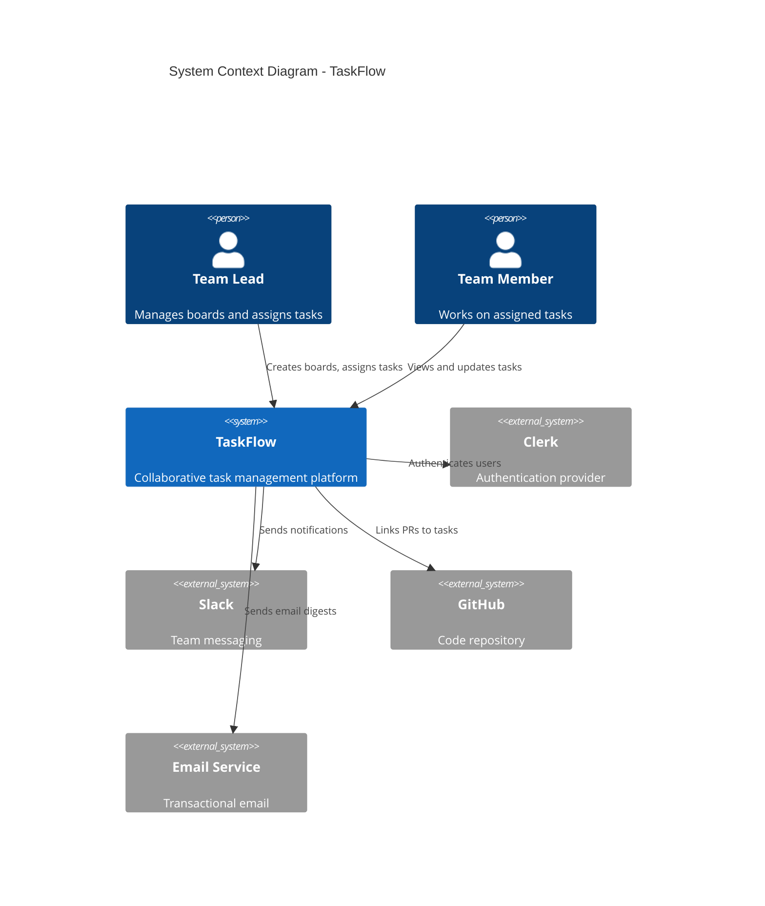
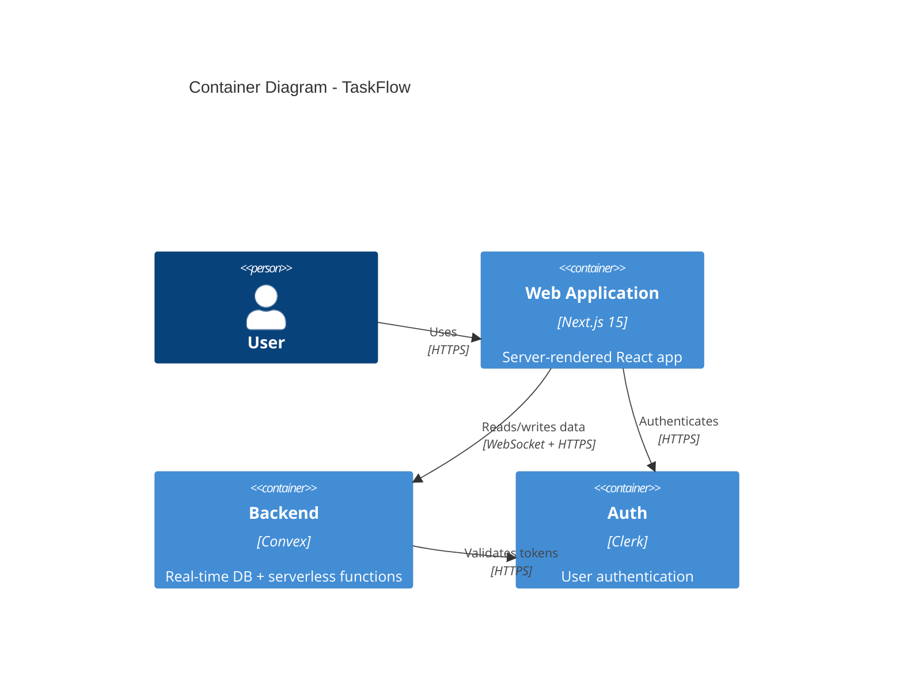

# System Architecture

**Project:** TaskFlow
**Version:** 1.0.0
**Created:** 2026-02-01

---

## Table of Contents
1. [Technology Stack](#1-technology-stack)
2. [C4 Model Diagrams](#2-c4-model-diagrams)
3. [Component Architecture](#3-component-architecture)
4. [Data Architecture](#4-data-architecture)
5. [API Contracts](#5-api-contracts)
6. [Security Architecture](#6-security-architecture)
7. [Deployment Architecture](#7-deployment-architecture)

---

## 1. Technology Stack

### Core Stack

| Layer | Technology | Version | Purpose |
|-------|------------|---------|---------|
| **Frontend** | Next.js | 15.1.0 | App Router, RSC |
| **UI Framework** | React | 19.0.0 | Component library |
| **Styling** | Tailwind CSS | 4.0 | Utility-first CSS |
| **Components** | shadcn/ui | Latest | Accessible primitives |
| **Backend** | Convex | 1.17.0 | Real-time database + serverless functions |
| **Auth** | Clerk | 5.x | Authentication and user management |

### Data Layer

| Component | Technology | Purpose |
|-----------|------------|---------|
| Primary Database | Convex | Real-time document store |
| File Storage | Convex Storage | Attachment uploads |
| Search Index | Convex Full-Text | Task and comment search |
| Cache | Edge Runtime | ISR and static caching |

### Infrastructure

| Component | Technology | Purpose |
|-----------|------------|---------|
| Hosting | Vercel | Frontend deployment |
| Backend | Convex Cloud | Serverless functions + DB |
| CDN | Vercel Edge | Static asset delivery |
| Monitoring | Axiom | Logging and observability |
| CI/CD | GitHub Actions | Automated testing and deploy |

---

## 2. C4 Model Diagrams

### Level 1: System Context Diagram



### Level 2: Container Diagram



---

## 3. Component Architecture

### Frontend Components

```
app/
├── layout.tsx                 # Root layout with providers
├── page.tsx                   # Landing / marketing page
├── (auth)/
│   ├── sign-in/page.tsx       # Clerk sign-in
│   └── sign-up/page.tsx       # Clerk sign-up
├── (app)/
│   ├── layout.tsx             # App shell (sidebar + header)
│   ├── dashboard/page.tsx     # Team overview
│   ├── boards/
│   │   ├── page.tsx           # Board list
│   │   └── [boardId]/
│   │       ├── page.tsx       # Board view (kanban)
│   │       └── settings/page.tsx
│   ├── tasks/
│   │   └── [taskId]/page.tsx  # Task detail modal/page
│   ├── team/page.tsx          # Team members
│   └── settings/page.tsx      # Workspace settings
```

### Backend Functions (Convex)

```
convex/
├── schema.ts                  # Database schema
├── auth.ts                    # Auth configuration
├── boards.ts                  # Board CRUD + queries
├── columns.ts                 # Column management
├── tasks.ts                   # Task CRUD + queries
├── comments.ts                # Comment threads
├── members.ts                 # Team membership
├── notifications.ts           # Notification generation
├── integrations/
│   ├── slack.ts               # Slack webhook
│   └── github.ts              # GitHub webhook handler
└── crons.ts                   # Scheduled jobs (digests, cleanup)
```

---

## 4. Data Architecture

### Core Entities

```
┌──────────────┐     ┌──────────────┐     ┌──────────────┐
│  Workspace   │────<│    Board     │────<│    Column    │
│              │     │              │     │              │
│ id           │     │ id           │     │ id           │
│ name         │     │ workspaceId  │     │ boardId      │
│ slug         │     │ name         │     │ name         │
│ ownerId      │     │ description  │     │ position     │
│ plan         │     │ visibility   │     │ color        │
│ createdAt    │     │ createdAt    │     │ taskLimit    │
└──────────────┘     └──────────────┘     └──────────────┘
                                                │
                                          ┌─────┴────────┐
                                          │     Task     │
                                          │              │
                                          │ id           │
                                          │ columnId     │
                                          │ title        │
                                          │ description  │
                                          │ assigneeId   │
                                          │ priority     │
                                          │ dueDate      │
                                          │ labels[]     │
                                          │ position     │
                                          │ createdAt    │
                                          └──────────────┘
                                                │
                                    ┌───────────┼───────────┐
                                    │                       │
                              ┌─────┴────────┐     ┌───────┴──────┐
                              │   Comment    │     │  Attachment  │
                              │              │     │              │
                              │ id           │     │ id           │
                              │ taskId       │     │ taskId       │
                              │ authorId     │     │ fileName     │
                              │ body         │     │ fileUrl      │
                              │ createdAt    │     │ fileSize     │
                              └──────────────┘     └──────────────┘
```

### Convex Schema

```typescript
import { defineSchema, defineTable } from "convex/server";
import { v } from "convex/values";

export default defineSchema({
  workspaces: defineTable({
    name: v.string(),
    slug: v.string(),
    ownerId: v.string(),
    plan: v.union(v.literal("free"), v.literal("pro"), v.literal("business")),
  }).index("by_slug", ["slug"]),

  boards: defineTable({
    workspaceId: v.id("workspaces"),
    name: v.string(),
    description: v.optional(v.string()),
    visibility: v.union(v.literal("private"), v.literal("public")),
  }).index("by_workspace", ["workspaceId"]),

  columns: defineTable({
    boardId: v.id("boards"),
    name: v.string(),
    position: v.number(),
    color: v.optional(v.string()),
    taskLimit: v.optional(v.number()),
  }).index("by_board", ["boardId"]),

  tasks: defineTable({
    columnId: v.id("columns"),
    boardId: v.id("boards"),
    title: v.string(),
    description: v.optional(v.string()),
    assigneeId: v.optional(v.string()),
    priority: v.union(
      v.literal("urgent"),
      v.literal("high"),
      v.literal("medium"),
      v.literal("low")
    ),
    dueDate: v.optional(v.number()),
    labels: v.array(v.string()),
    position: v.number(),
  })
    .index("by_column", ["columnId"])
    .index("by_board", ["boardId"])
    .index("by_assignee", ["assigneeId"]),
});
```

---

## 5. API Contracts

### Board Operations

```typescript
// Query: List boards for a workspace
query("boards:list", {
  args: { workspaceId: v.id("workspaces") },
  returns: v.array(boardSchema),
});

// Mutation: Create a new board
mutation("boards:create", {
  args: {
    workspaceId: v.id("workspaces"),
    name: v.string(),
    description: v.optional(v.string()),
  },
  returns: v.id("boards"),
});
```

### Task Operations

```typescript
// Query: List tasks for a board
query("tasks:listByBoard", {
  args: { boardId: v.id("boards") },
  returns: v.array(taskWithAssigneeSchema),
});

// Mutation: Move a task between columns
mutation("tasks:move", {
  args: {
    taskId: v.id("tasks"),
    targetColumnId: v.id("columns"),
    position: v.number(),
  },
});

// Mutation: Assign a task
mutation("tasks:assign", {
  args: {
    taskId: v.id("tasks"),
    assigneeId: v.string(),
  },
});
```

---

## 6. Security Architecture

### Authentication Flow

```
User -> Clerk Sign-In -> JWT Token -> Convex Auth Middleware -> Authorized Request
```

### Authorization Model

| Role | Permissions |
|------|------------|
| **Owner** | Full workspace control, billing, delete workspace |
| **Admin** | Manage members, create/delete boards, all task operations |
| **Member** | Create tasks, edit own tasks, comment, view all boards |
| **Guest** | View assigned tasks, comment on assigned tasks only |

### Data Security

| Measure | Implementation |
|---------|---------------|
| Encryption at rest | Convex managed (AES-256) |
| Encryption in transit | TLS 1.3 |
| Auth tokens | Short-lived JWTs (15 min) |
| Input validation | Zod schemas on all mutations |
| Rate limiting | Convex built-in + custom per-user limits |

---

## 7. Deployment Architecture

### Environments

| Environment | Purpose | URL |
|-------------|---------|-----|
| Development | Local development | localhost:3000 |
| Preview | PR previews | *.vercel.app |
| Staging | Pre-production testing | staging.taskflow.app |
| Production | Live application | app.taskflow.app |

### CI/CD Pipeline

```
Push to main
  -> GitHub Actions
    -> Lint + Type Check
    -> Unit Tests
    -> Integration Tests
    -> Deploy to Vercel (preview)
    -> E2E Tests (Playwright)
    -> Promote to Production
```

<!-- Truncated for brevity -- actual output is typically 800-1500 lines -->
