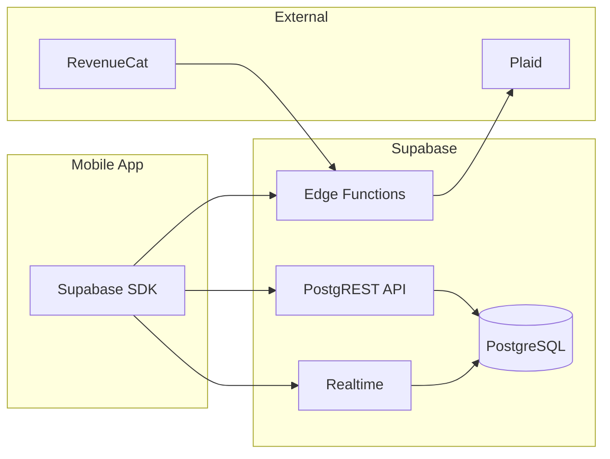

# Trading Platform - API Specification

**Version:** 1.0  
**Date:** 2025-12-11  
**API Style:** Supabase Client SDK + Edge Functions

---

## API Overview

Trading Platform uses **Supabase as the primary API layer**:
- **Direct Database Access:** Supabase Client SDK with RLS
- **Edge Functions:** For complex operations (Plaid, webhooks)
- **Realtime:** WebSocket subscriptions for live updates

### API Architecture



---

## Authentication

### Supabase Auth Endpoints

All auth is handled via Supabase SDK:

```typescript
// Sign up
const { data, error } = await supabase.auth.signUp({
  email: 'user@example.com',
  password: 'securepassword',
});

// Sign in with password
const { data, error } = await supabase.auth.signInWithPassword({
  email: 'user@example.com',
  password: 'securepassword',
});

// Sign in with Apple
const { data, error } = await supabase.auth.signInWithIdToken({
  provider: 'apple',
  token: appleIdToken,
  nonce: nonce,
});

// Sign out
await supabase.auth.signOut();

// Get current session
const { data: { session } } = await supabase.auth.getSession();
```

### JWT Token Structure

```json
{
  "sub": "user-uuid",
  "email": "user@example.com",
  "app_metadata": {},
  "user_metadata": {},
  "iat": 1702300000,
  "exp": 1702303600,
  "aud": "authenticated"
}
```

---

## Data Access (Supabase SDK)

### User Profile

```typescript
// Get profile
const { data: profile } = await supabase
  .from('user_profiles')
  .select('*')
  .single();

// Update profile
const { error } = await supabase
  .from('user_profiles')
  .update({ display_name: 'New Name' })
  .eq('user_id', userId);
```

### User Settings

```typescript
// Get settings
const { data: settings } = await supabase
  .from('user_settings')
  .select('*')
  .single();

// Update auto-invest settings
const { error } = await supabase
  .from('user_settings')
  .update({
    auto_invest_enabled: true,
    risk_level: 'balanced',
  })
  .eq('user_id', userId);
```

### Balance

```typescript
// Get current balance
const { data: balance } = await supabase
  .from('balances')
  .select('*')
  .single();

// Response shape
interface Balance {
  id: string;
  user_id: string;
  total_balance: number;    // in cents
  available_balance: number;
  pending_balance: number;
  daily_change: number;
  weekly_change: number;
  monthly_change: number;
  all_time_earnings: number;
  currency: string;
  updated_at: string;
}
```

### Income Events

```typescript
// Get income history (paginated)
const { data: events, count } = await supabase
  .from('income_events')
  .select('*', { count: 'exact' })
  .order('created_at', { ascending: false })
  .range(0, 19); // First 20 events

// Get income by date range
const { data } = await supabase
  .from('income_events')
  .select('*')
  .gte('created_at', startDate)
  .lte('created_at', endDate)
  .order('created_at', { ascending: false });

// Response shape
interface IncomeEvent {
  id: string;
  user_id: string;
  amount: number;           // in cents
  event_type: 'ai_cycle_completed' | 'auto_yield_event' | 'market_sync' | 'deposit' | 'withdrawal';
  description: string;
  ai_confidence: 'high' | 'medium' | 'low';
  created_at: string;
}
```

### Subscription

```typescript
// Get subscription with tier details
const { data: subscription } = await supabase
  .from('subscriptions')
  .select(`
    *,
    tier:subscription_tiers(*)
  `)
  .single();

// Response shape
interface Subscription {
  id: string;
  user_id: string;
  tier_id: string;
  status: 'active' | 'cancelled' | 'past_due' | 'trialing' | 'expired';
  revenuecat_id: string;
  is_founding_member: boolean;
  locked_price: number | null;
  current_period_start: string;
  current_period_end: string;
  cancel_at_period_end: boolean;
  tier: SubscriptionTier;
}
```

### AI Engine Status

```typescript
// Get AI status
const { data: aiStatus } = await supabase
  .from('ai_engine_status')
  .select('*')
  .single();

// Response shape
interface AIEngineStatus {
  id: string;
  user_id: string;
  status: 'active' | 'inactive' | 'optimizing' | 'paused';
  confidence: 'high' | 'medium' | 'low' | 'processing';
  environment: 'stable' | 'volatile' | 'opportunity';
  mode: 'safe' | 'balanced' | 'aggressive' | 'custom';
  custom_risk_percentage: number | null;
  last_cycle_at: string | null;
  next_cycle_at: string | null;
  total_cycles: number;
  explanation: string;
  updated_at: string;
}
```

### Linked Accounts

```typescript
// Get linked bank accounts
const { data: accounts } = await supabase
  .from('linked_accounts')
  .select('*')
  .eq('status', 'active');

// Response shape
interface LinkedAccount {
  id: string;
  user_id: string;
  plaid_item_id: string;
  institution_name: string;
  account_name: string;
  account_mask: string;     // Last 4 digits
  account_type: 'checking' | 'savings';
  status: 'active' | 'disconnected' | 'error';
  is_primary: boolean;
}
```

### Transactions

```typescript
// Get transaction history
const { data: transactions } = await supabase
  .from('transactions')
  .select('*, linked_account:linked_accounts(institution_name, account_mask)')
  .order('created_at', { ascending: false })
  .range(0, 19);

// Response shape
interface Transaction {
  id: string;
  user_id: string;
  type: 'deposit' | 'withdrawal';
  amount: number;
  currency: string;
  status: 'pending' | 'processing' | 'completed' | 'failed' | 'cancelled';
  linked_account_id: string;
  initiated_at: string;
  completed_at: string | null;
  linked_account: {
    institution_name: string;
    account_mask: string;
  };
}
```

---

## Realtime Subscriptions

### Balance Updates

```typescript
// Subscribe to balance changes
const channel = supabase
  .channel('balance-updates')
  .on(
    'postgres_changes',
    {
      event: 'UPDATE',
      schema: 'public',
      table: 'balances',
      filter: `user_id=eq.${userId}`,
    },
    (payload) => {
      const newBalance = payload.new as Balance;
      updateBalanceState(newBalance);
    }
  )
  .subscribe();

// Cleanup
return () => supabase.removeChannel(channel);
```

### AI Status Updates

```typescript
// Subscribe to AI engine status
const channel = supabase
  .channel('ai-status')
  .on(
    'postgres_changes',
    {
      event: 'UPDATE',
      schema: 'public',
      table: 'ai_engine_status',
      filter: `user_id=eq.${userId}`,
    },
    (payload) => {
      const newStatus = payload.new as AIEngineStatus;
      updateAIStatus(newStatus);
    }
  )
  .subscribe();
```

### Income Events

```typescript
// Subscribe to new income events
const channel = supabase
  .channel('income-events')
  .on(
    'postgres_changes',
    {
      event: 'INSERT',
      schema: 'public',
      table: 'income_events',
      filter: `user_id=eq.${userId}`,
    },
    (payload) => {
      const newEvent = payload.new as IncomeEvent;
      prependIncomeEvent(newEvent);
      showNotification(newEvent);
    }
  )
  .subscribe();
```

---

## Edge Functions

### POST `/plaid/create-link-token`

Creates a Plaid Link token for bank account linking.

**Request:**
```typescript
const { data, error } = await supabase.functions.invoke('plaid-create-link-token', {
  body: {},
});
```

**Response:**
```json
{
  "link_token": "link-sandbox-abc123",
  "expiration": "2024-12-11T12:00:00Z"
}
```

### POST `/plaid/exchange-token`

Exchanges a public token for an access token (stored server-side only).

**Request:**
```typescript
const { data, error } = await supabase.functions.invoke('plaid-exchange-token', {
  body: {
    public_token: 'public-sandbox-abc123',
    account_id: 'account-id-from-plaid',
  },
});
```

**Response:**
```json
{
  "success": true,
  "linked_account_id": "uuid-of-linked-account"
}
```

### POST `/plaid/initiate-deposit`

Initiates a deposit from a linked bank account.

**Request:**
```typescript
const { data, error } = await supabase.functions.invoke('plaid-initiate-deposit', {
  body: {
    linked_account_id: 'uuid',
    amount: 10000, // $100.00 in cents
  },
});
```

**Response:**
```json
{
  "success": true,
  "transaction_id": "uuid-of-transaction",
  "estimated_completion": "2024-12-14T00:00:00Z"
}
```

### POST `/plaid/initiate-withdrawal`

Initiates a withdrawal to a linked bank account.

**Request:**
```typescript
const { data, error } = await supabase.functions.invoke('plaid-initiate-withdrawal', {
  body: {
    linked_account_id: 'uuid',
    amount: 5000, // $50.00 in cents
  },
});
```

**Response:**
```json
{
  "success": true,
  "transaction_id": "uuid-of-transaction",
  "estimated_completion": "2024-12-14T00:00:00Z"
}
```

### POST `/webhooks/revenuecat`

Handles RevenueCat subscription webhooks.

**Webhook Events:**
- `INITIAL_PURCHASE` — New subscription
- `RENEWAL` — Subscription renewed
- `CANCELLATION` — Subscription cancelled
- `EXPIRATION` — Subscription expired
- `PRODUCT_CHANGE` — Tier upgrade/downgrade

**Signature Verification:**
```typescript
const signature = req.headers.get('X-RevenueCat-Signature');
const isValid = verifyRevenueCatSignature(body, signature, secret);
```

### POST `/notifications/send`

Sends push notifications (internal use).

**Request:**
```typescript
const { error } = await supabase.functions.invoke('notifications-send', {
  body: {
    user_id: 'uuid',
    title: 'New Earnings!',
    body: '+$12.31 from AI Cycle Completed',
    data: { type: 'income', event_id: 'uuid' },
  },
});
```

---

## Error Handling

### Standard Error Response

```typescript
interface APIError {
  code: string;
  message: string;
  details?: Record<string, unknown>;
}

// Supabase SDK error
if (error) {
  console.error('API Error:', error.code, error.message);
}

// Edge Function error
if (error) {
  const apiError = JSON.parse(error.message) as APIError;
  showErrorToast(apiError.message);
}
```

### Error Codes

| Code | Meaning |
|------|---------|
| `AUTH_REQUIRED` | User not authenticated |
| `FORBIDDEN` | Access denied (RLS) |
| `NOT_FOUND` | Resource not found |
| `VALIDATION_ERROR` | Invalid input |
| `RATE_LIMITED` | Too many requests |
| `INSUFFICIENT_BALANCE` | Not enough funds |
| `PLAID_ERROR` | Plaid API error |
| `PAYMENT_FAILED` | Payment processing failed |

---

## Rate Limiting

| Endpoint | Limit | Window |
|----------|-------|--------|
| Database queries | 100 req | 1 min |
| Edge Functions | 30 req | 1 min |
| Auth endpoints | 10 req | 1 min |
| Plaid operations | 5 req | 1 hour |

---

## Type Generation

Generate TypeScript types from Supabase schema:

```bash
npx supabase gen types typescript --project-id <project-id> > src/types/database.ts
```

Usage:

```typescript
import { Database } from '@/types/database';

type Balance = Database['public']['Tables']['balances']['Row'];
type IncomeEvent = Database['public']['Tables']['income_events']['Row'];
```

---

*API specification complete. Ready for implementation.*


