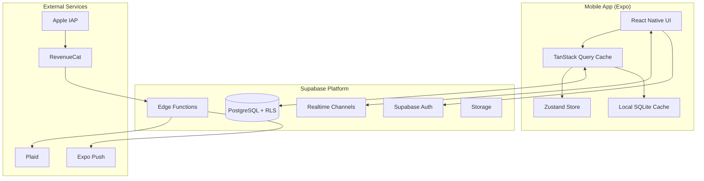
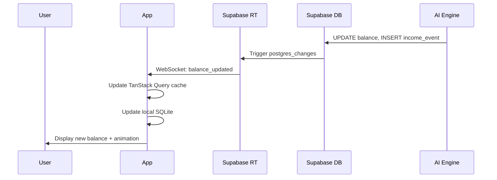
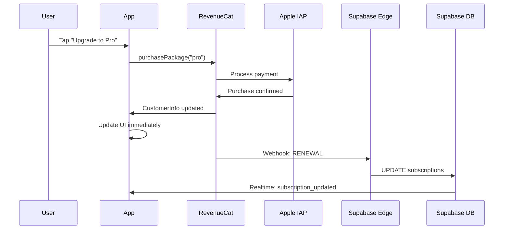
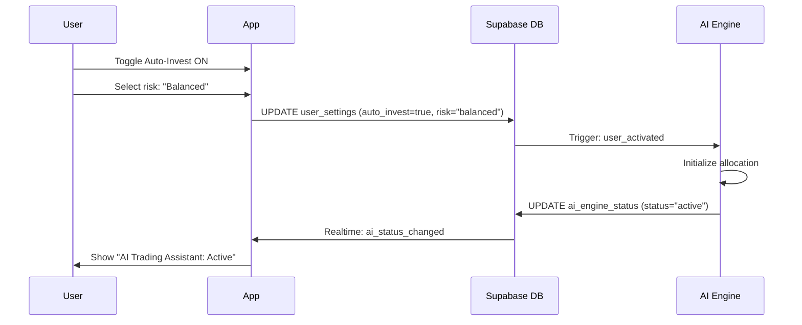
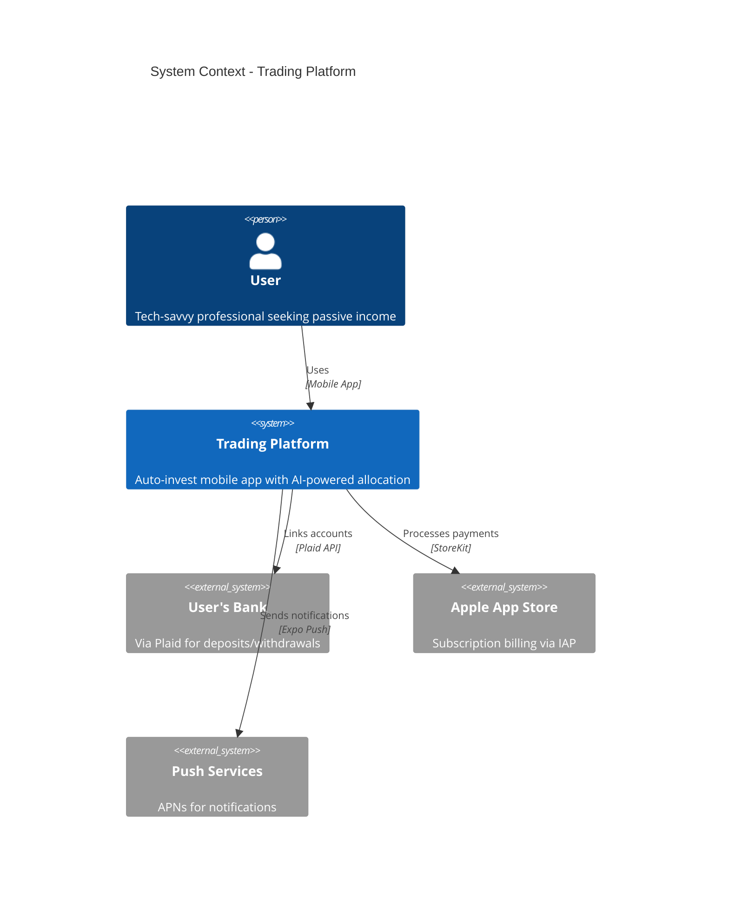
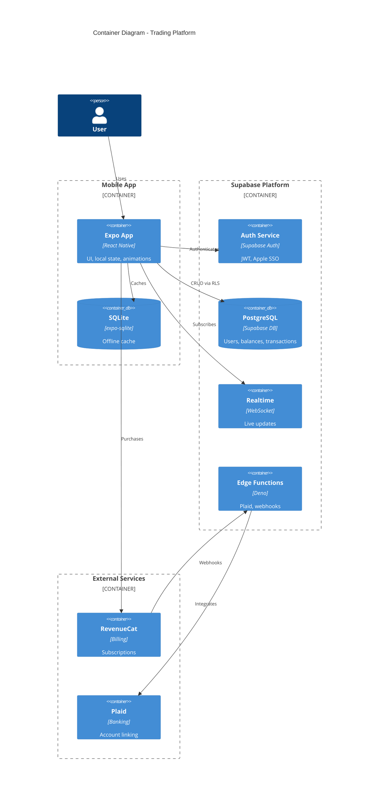

# Trading Platform - Technical Architecture

**Version:** 1.0  
**Date:** 2025-12-11  
**Status:** Approved  
**Architecture Pattern:** Clean Modular Mobile Architecture

---

## Executive Summary

Trading Platform is a mobile-first fintech application built on a **Clean Modular Architecture** pattern, optimized for real-time updates, subscription management, and secure financial data handling.

### Key Technical Decisions

| Decision | Choice | Rationale |
|----------|--------|-----------|
| **Architecture Pattern** | Clean Modular (Domain/Data/Presentation) | Separation of concerns, testability, maintainability |
| **Mobile Framework** | Expo SDK 52+ with React Native | Managed workflow, OTA updates, faster iteration |
| **Backend** | Supabase (PostgreSQL + Realtime + Edge Functions) | Real-time subscriptions, RLS security, serverless |
| **Subscriptions** | RevenueCat | Cross-platform billing, webhook sync |
| **Banking** | Plaid via Edge Functions | Secure, PCI-compliant integration |
| **State Management** | TanStack Query + Zustand | Server state caching + local UI state |

### High-Level System Diagram



---

## System Architecture Overview

### Architecture Pattern: Clean Modular Mobile

Based on Uncle Bob's Clean Architecture, adapted for mobile:

```
┌─────────────────────────────────────────────────────────────┐
│  PRESENTATION LAYER (React Native)                          │
│  ├── Screens (Home, AutoInvest, Income, AI, Account)       │
│  ├── Components (Balance, AIStatus, IncomeCard)            │
│  └── Navigation (Expo Router)                               │
├─────────────────────────────────────────────────────────────┤
│  APPLICATION LAYER (Use Cases + Hooks)                      │
│  ├── useBalance, useAutoInvest, useSubscription            │
│  ├── useAIStatus, useIncomeStream                          │
│  └── TanStack Query + Zustand                               │
├─────────────────────────────────────────────────────────────┤
│  DOMAIN LAYER (Business Logic)                              │
│  ├── Entities (User, Balance, Transaction, Subscription)   │
│  ├── Value Objects (Money, RiskLevel, AIStatus)            │
│  └── Domain Services (AutoInvestService, IncomeCalculator) │
├─────────────────────────────────────────────────────────────┤
│  DATA LAYER (Repositories + Data Sources)                   │
│  ├── Repositories (BalanceRepo, SubscriptionRepo)          │
│  ├── Remote (Supabase, RevenueCat, Plaid)                  │
│  └── Local (SQLite Cache)                                   │
└─────────────────────────────────────────────────────────────┘
```

### Dependency Rule

All dependencies point **inward**:
- Presentation depends on Application
- Application depends on Domain
- Data implements Domain interfaces
- Domain has **zero external dependencies**

---

## Core Components

### 1. Mobile Application (Expo + React Native)

| Component | Technology | Responsibility |
|-----------|------------|----------------|
| **Navigation** | Expo Router 4.x | File-based routing, deep linking |
| **UI Components** | React Native + NativeWind | Cyberpunk theme, animations |
| **State Management** | TanStack Query 5.x | Server state, caching, real-time sync |
| **Local State** | Zustand 5.x | UI state, theme, preferences |
| **Animations** | Reanimated 3.x | 60fps neon glows, pulses |
| **Forms** | React Hook Form + Zod | Deposit forms, risk settings |
| **Local Storage** | expo-sqlite | Offline balance cache |
| **Secure Storage** | expo-secure-store | Auth tokens, sensitive data |

### 2. Backend Services (Supabase)

| Service | Purpose | Key Features |
|---------|---------|--------------|
| **Supabase Auth** | User authentication | Apple SSO, email/password, JWT |
| **PostgreSQL** | Primary database | RLS, full SQL, triggers |
| **Realtime** | Live updates | Balance changes, AI status |
| **Edge Functions** | Serverless compute | Plaid integration, webhooks |
| **Storage** | File storage | User avatars, documents |

### 3. External Integrations

| Service | Purpose | Integration Pattern |
|---------|---------|---------------------|
| **RevenueCat** | Subscription billing | SDK + webhooks to Supabase |
| **Plaid** | Bank account linking | Edge Functions only (never client) |
| **Apple IAP** | Payment processing | Via RevenueCat SDK |
| **Expo Push** | Notifications | Push tokens in Supabase |

---

## Data Flow Architecture

### Real-Time Balance Updates



### Subscription Flow



### Auto-Invest Activation



---

## C4 Model Diagrams

### Level 1: System Context



### Level 2: Container Diagram



---

## Module Structure

### Application Modules

```
/src
├── /app                    # Expo Router screens
│   ├── (auth)              # Auth screens (login, signup)
│   ├── (tabs)              # Main tab screens
│   │   ├── index.tsx       # Home (balance)
│   │   ├── auto-invest.tsx # Auto-Invest activation
│   │   ├── income.tsx      # Income stream
│   │   ├── ai.tsx          # AI status dashboard
│   │   └── account.tsx     # Settings, subscription
│   └── _layout.tsx         # Root layout
│
├── /components             # Reusable UI components
│   ├── /balance            # Balance display, pulse animation
│   ├── /ai-status          # AI engine status cards
│   ├── /income             # Income feed, charts
│   ├── /subscription       # Tier cards, upgrade modal
│   └── /common             # Buttons, inputs, cards
│
├── /domain                 # Business logic (pure TypeScript)
│   ├── /entities           # User, Balance, Transaction, Subscription
│   ├── /value-objects      # Money, RiskLevel, AIStatus
│   └── /services           # AutoInvestService, IncomeCalculator
│
├── /data                   # Data layer
│   ├── /repositories       # BalanceRepo, SubscriptionRepo, UserRepo
│   ├── /remote             # Supabase client, RevenueCat client
│   └── /local              # SQLite cache, secure storage
│
├── /hooks                  # Application hooks
│   ├── useBalance.ts       # Balance fetching + realtime
│   ├── useSubscription.ts  # RevenueCat + Supabase sync
│   ├── useAIStatus.ts      # AI engine status
│   └── useAutoInvest.ts    # Activation logic
│
├── /lib                    # Utilities
│   ├── supabase.ts         # Supabase client initialization
│   ├── revenuecat.ts       # RevenueCat initialization
│   └── animations.ts       # Reanimated presets (neon glow)
│
└── /theme                  # Design system
    ├── colors.ts           # #000000, #6366F1, #818CF8
    ├── typography.ts       # Monospace, SF Pro
    └── spacing.ts          # 4px grid
```

---

## Quality Attributes

### Performance Targets

| Metric | Target | Measurement |
|--------|--------|-------------|
| **App Launch** | <2 seconds | Cold start to home screen |
| **Balance Refresh** | <500ms | Realtime update latency |
| **Animation FPS** | 60fps | Neon pulse, glow effects |
| **Offline Capability** | Full read | Cached balance available |
| **Bundle Size** | <20MB | Initial download |

### Scalability Targets

| Metric | Launch | Year 1 | Year 3 |
|--------|--------|--------|--------|
| **Concurrent Users** | 1,000 | 10,000 | 100,000 |
| **Daily Transactions** | 10,000 | 100,000 | 1,000,000 |
| **Database Size** | 1 GB | 50 GB | 500 GB |

### Reliability Targets (SLOs)

| Service | Availability | Latency (P95) |
|---------|--------------|---------------|
| **API** | 99.9% | 200ms |
| **Realtime** | 99.5% | 100ms |
| **Auth** | 99.9% | 300ms |
| **Edge Functions** | 99.5% | 500ms |

---

## Security Architecture

See [SECURITY.md](../security/SECURITY.md) for detailed security architecture.

### Security Layers Summary

1. **Transport Security:** TLS 1.3, certificate pinning
2. **Authentication:** Supabase Auth (JWT), Apple SSO, biometrics
3. **Authorization:** Row Level Security (RLS) on all tables
4. **Data Protection:** Encryption at rest, PII handling
5. **Secret Management:** expo-secure-store, environment variables
6. **Financial Security:** Plaid via Edge Functions only, no client secrets

---

## Development Workflow

### Git Workflow

- **main:** Production-ready code
- **develop:** Integration branch
- **feature/*:** Feature branches
- **release/*:** Release preparation
- **hotfix/*:** Production fixes

### CI/CD Pipeline (GitHub Actions)

```yaml
# Simplified workflow
on: [push, pull_request]
jobs:
  test:
    - lint (ESLint, Prettier)
    - type-check (TypeScript)
    - unit tests (Vitest)
    - e2e tests (Maestro)
  
  build:
    - EAS Build (iOS, Android)
    - Preview on PR
  
  deploy:
    - EAS Submit (App Store, Play Store)
    - OTA Update (production)
```

---

## Deployment Strategy

### Environments

| Environment | Purpose | Database | URL |
|-------------|---------|----------|-----|
| **Development** | Local dev | Supabase Local | localhost:3000 |
| **Preview** | PR previews | Supabase Preview | expo.dev preview |
| **Staging** | Pre-production | Supabase Staging | staging.example.com |
| **Production** | Live users | Supabase Production | app.example.com |

### Release Process

1. **Feature Complete:** Merge to `develop`
2. **QA Testing:** Deploy to staging, run Maestro tests
3. **Release Branch:** Create `release/x.y.z`
4. **App Store Submission:** EAS Submit to TestFlight/Internal Testing
5. **Production Release:** Merge to `main`, trigger production deploy
6. **OTA Updates:** Non-native changes via EAS Update

---

## Risk Assessment

### Technical Risks

| Risk | Probability | Impact | Mitigation |
|------|-------------|--------|------------|
| Supabase outage | Low | High | Local cache, graceful degradation |
| RevenueCat webhook failure | Medium | Medium | Retry logic, manual sync option |
| Plaid API changes | Low | Medium | Abstraction layer, version pinning |
| Animation jank on old devices | Medium | Medium | LOD system, reduced motion option |

### Scalability Bottlenecks

| Bottleneck | Detection | Solution |
|------------|-----------|----------|
| Database connections | Connection pool monitoring | PgBouncer, read replicas |
| Realtime channels | Channel count metrics | Shared channels, batching |
| Edge Function cold starts | Latency percentiles | Keep-warm strategy |

---

## Architecture Decision Records

See [/docs/adrs/](../adrs/) for detailed ADRs:

- **ADR-001:** Use Expo over bare React Native
- **ADR-002:** Use Supabase as primary backend
- **ADR-003:** Use RevenueCat for subscription management
- **ADR-004:** Use Plaid via Edge Functions only
- **ADR-005:** Use TanStack Query for server state

---

## References

- [Architecture Research Sources](../research/ARCHITECTURE-SOURCES-2025-12-11.md)
- [Technology Stack Details](./TECH-STACK.md)
- [Database Schema](../database/SCHEMA.md)
- [API Specification](../api/API-SPEC.md)
- [Security Architecture](../security/SECURITY.md)

---

*Architecture approved for Step 3: UX Design*


