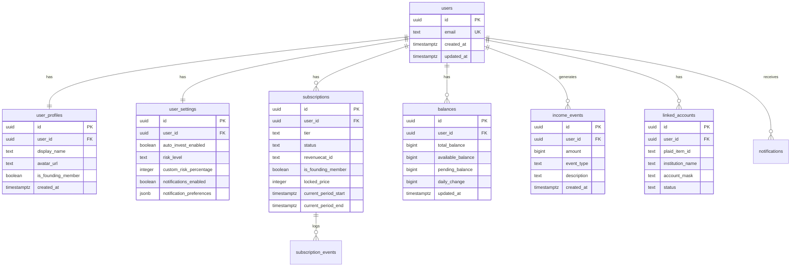

# Trading Platform - Database Schema

**Version:** 1.0  
**Date:** 2025-12-11  
**Database:** PostgreSQL (Supabase)

---

## Entity Relationship Diagram



---

## Table Definitions

### Core User Tables

#### `users` (Supabase Auth)

Managed by Supabase Auth. Extended via `user_profiles`.

#### `user_profiles`

User profile information and metadata.

```sql
CREATE TABLE user_profiles (
    id UUID PRIMARY KEY DEFAULT gen_random_uuid(),
    user_id UUID NOT NULL REFERENCES auth.users(id) ON DELETE CASCADE,
    display_name TEXT,
    avatar_url TEXT,
    is_founding_member BOOLEAN DEFAULT FALSE,
    founding_member_number INTEGER,
    created_at TIMESTAMPTZ DEFAULT NOW(),
    updated_at TIMESTAMPTZ DEFAULT NOW(),
    
    CONSTRAINT unique_user_profile UNIQUE (user_id)
);

-- RLS Policy
ALTER TABLE user_profiles ENABLE ROW LEVEL SECURITY;

CREATE POLICY "Users can view own profile" ON user_profiles
    FOR SELECT USING (auth.uid() = user_id);

CREATE POLICY "Users can update own profile" ON user_profiles
    FOR UPDATE USING (auth.uid() = user_id);

-- Trigger for updated_at
CREATE TRIGGER update_user_profiles_updated_at
    BEFORE UPDATE ON user_profiles
    FOR EACH ROW EXECUTE FUNCTION update_updated_at_column();
```

#### `user_settings`

User preferences and Auto-Invest configuration.

```sql
CREATE TABLE user_settings (
    id UUID PRIMARY KEY DEFAULT gen_random_uuid(),
    user_id UUID NOT NULL REFERENCES auth.users(id) ON DELETE CASCADE,
    
    -- Auto-Invest settings
    auto_invest_enabled BOOLEAN DEFAULT FALSE,
    risk_level TEXT DEFAULT 'balanced' CHECK (risk_level IN ('safe', 'balanced', 'aggressive', 'custom')),
    custom_risk_percentage INTEGER CHECK (custom_risk_percentage BETWEEN 1 AND 100),
    
    -- Notification settings
    notifications_enabled BOOLEAN DEFAULT TRUE,
    notification_preferences JSONB DEFAULT '{
        "daily_summary": true,
        "income_events": true,
        "ai_cycles": true,
        "system_updates": true
    }'::jsonb,
    
    -- App settings
    biometric_enabled BOOLEAN DEFAULT FALSE,
    
    created_at TIMESTAMPTZ DEFAULT NOW(),
    updated_at TIMESTAMPTZ DEFAULT NOW(),
    
    CONSTRAINT unique_user_settings UNIQUE (user_id)
);

-- RLS Policy
ALTER TABLE user_settings ENABLE ROW LEVEL SECURITY;

CREATE POLICY "Users can view own settings" ON user_settings
    FOR SELECT USING (auth.uid() = user_id);

CREATE POLICY "Users can update own settings" ON user_settings
    FOR UPDATE USING (auth.uid() = user_id);
```

---

### Subscription Tables

#### `subscription_tiers` (Reference Table)

```sql
CREATE TABLE subscription_tiers (
    id TEXT PRIMARY KEY,
    name TEXT NOT NULL,
    display_name TEXT NOT NULL,
    price_monthly INTEGER NOT NULL, -- in cents
    price_annual INTEGER NOT NULL,
    features JSONB NOT NULL,
    limits JSONB NOT NULL,
    sort_order INTEGER DEFAULT 0,
    created_at TIMESTAMPTZ DEFAULT NOW()
);

-- Seed data
INSERT INTO subscription_tiers (id, name, display_name, price_monthly, price_annual, features, limits, sort_order) VALUES
('basic', 'Basic', 'Basic', 700, 7000, 
 '{"ai_cycle_frequency": "1x_daily", "balance_updates": "daily", "ai_dashboard_level": "basic", "weekly_reports": false, "premium_ui": false}',
 '{"deposit_limit_monthly": 500000, "withdrawal_limit_daily": 100000}',
 1),
('pro', 'Pro', 'Pro', 1500, 15000,
 '{"ai_cycle_frequency": "4x_daily", "balance_updates": "hourly", "ai_dashboard_level": "enhanced", "weekly_reports": true, "premium_ui": false}',
 '{"deposit_limit_monthly": 2500000, "withdrawal_limit_daily": 500000}',
 2),
('elite', 'Elite', 'Elite', 2900, 29000,
 '{"ai_cycle_frequency": "realtime", "balance_updates": "realtime", "ai_dashboard_level": "full", "weekly_reports": true, "premium_ui": true, "premium_dashboard": true}',
 '{"deposit_limit_monthly": -1, "withdrawal_limit_daily": -1}',
 3);
```

#### `subscriptions`

User subscription status.

```sql
CREATE TABLE subscriptions (
    id UUID PRIMARY KEY DEFAULT gen_random_uuid(),
    user_id UUID NOT NULL REFERENCES auth.users(id) ON DELETE CASCADE,
    tier_id TEXT NOT NULL REFERENCES subscription_tiers(id),
    
    -- Status
    status TEXT NOT NULL DEFAULT 'active' CHECK (status IN ('active', 'cancelled', 'past_due', 'trialing', 'expired')),
    
    -- RevenueCat sync
    revenuecat_id TEXT,
    platform TEXT CHECK (platform IN ('ios', 'android', 'web')),
    
    -- Billing period
    current_period_start TIMESTAMPTZ,
    current_period_end TIMESTAMPTZ,
    cancel_at_period_end BOOLEAN DEFAULT FALSE,
    
    -- Founding member
    is_founding_member BOOLEAN DEFAULT FALSE,
    locked_price INTEGER, -- Price locked for founding members (in cents)
    
    created_at TIMESTAMPTZ DEFAULT NOW(),
    updated_at TIMESTAMPTZ DEFAULT NOW(),
    
    CONSTRAINT unique_user_subscription UNIQUE (user_id)
);

-- Index for quick tier lookups
CREATE INDEX idx_subscriptions_tier ON subscriptions(tier_id);
CREATE INDEX idx_subscriptions_status ON subscriptions(status);

-- RLS Policy
ALTER TABLE subscriptions ENABLE ROW LEVEL SECURITY;

CREATE POLICY "Users can view own subscription" ON subscriptions
    FOR SELECT USING (auth.uid() = user_id);

-- Enable Realtime
ALTER PUBLICATION supabase_realtime ADD TABLE subscriptions;
```

#### `subscription_events`

Audit log for subscription changes.

```sql
CREATE TABLE subscription_events (
    id UUID PRIMARY KEY DEFAULT gen_random_uuid(),
    user_id UUID NOT NULL REFERENCES auth.users(id),
    event_type TEXT NOT NULL CHECK (event_type IN (
        'subscribed', 'upgraded', 'downgraded', 
        'cancelled', 'renewed', 'expired', 'reactivated'
    )),
    from_tier TEXT,
    to_tier TEXT,
    metadata JSONB,
    created_at TIMESTAMPTZ DEFAULT NOW()
);

-- Index for user event history
CREATE INDEX idx_subscription_events_user ON subscription_events(user_id, created_at DESC);

-- RLS Policy
ALTER TABLE subscription_events ENABLE ROW LEVEL SECURITY;

CREATE POLICY "Users can view own events" ON subscription_events
    FOR SELECT USING (auth.uid() = user_id);
```

---

### Financial Tables

#### `balances`

User balance information (updated by AI Engine).

```sql
CREATE TABLE balances (
    id UUID PRIMARY KEY DEFAULT gen_random_uuid(),
    user_id UUID NOT NULL REFERENCES auth.users(id) ON DELETE CASCADE,
    
    -- Balance amounts (stored in cents to avoid floating point)
    total_balance BIGINT DEFAULT 0,
    available_balance BIGINT DEFAULT 0,
    pending_balance BIGINT DEFAULT 0,
    
    -- Performance metrics
    daily_change BIGINT DEFAULT 0,
    weekly_change BIGINT DEFAULT 0,
    monthly_change BIGINT DEFAULT 0,
    all_time_earnings BIGINT DEFAULT 0,
    
    -- Currency
    currency TEXT DEFAULT 'USD',
    
    updated_at TIMESTAMPTZ DEFAULT NOW(),
    
    CONSTRAINT unique_user_balance UNIQUE (user_id)
);

-- RLS Policy
ALTER TABLE balances ENABLE ROW LEVEL SECURITY;

CREATE POLICY "Users can view own balance" ON balances
    FOR SELECT USING (auth.uid() = user_id);

-- Enable Realtime for live balance updates
ALTER PUBLICATION supabase_realtime ADD TABLE balances;
```

#### `income_events`

Individual income/earnings events.

```sql
CREATE TABLE income_events (
    id UUID PRIMARY KEY DEFAULT gen_random_uuid(),
    user_id UUID NOT NULL REFERENCES auth.users(id) ON DELETE CASCADE,
    
    -- Event details
    amount BIGINT NOT NULL, -- in cents
    event_type TEXT NOT NULL CHECK (event_type IN (
        'ai_cycle_completed', 'auto_yield_event', 'market_sync',
        'deposit', 'withdrawal', 'dividend', 'interest'
    )),
    description TEXT,
    
    -- AI metadata
    ai_confidence TEXT CHECK (ai_confidence IN ('high', 'medium', 'low')),
    cycle_id TEXT,
    
    created_at TIMESTAMPTZ DEFAULT NOW()
);

-- Index for user income history
CREATE INDEX idx_income_events_user_date ON income_events(user_id, created_at DESC);
CREATE INDEX idx_income_events_type ON income_events(event_type);

-- RLS Policy
ALTER TABLE income_events ENABLE ROW LEVEL SECURITY;

CREATE POLICY "Users can view own income events" ON income_events
    FOR SELECT USING (auth.uid() = user_id);

-- Enable Realtime
ALTER PUBLICATION supabase_realtime ADD TABLE income_events;
```

#### `transactions`

Deposit and withdrawal transactions.

```sql
CREATE TABLE transactions (
    id UUID PRIMARY KEY DEFAULT gen_random_uuid(),
    user_id UUID NOT NULL REFERENCES auth.users(id) ON DELETE CASCADE,
    
    -- Transaction details
    type TEXT NOT NULL CHECK (type IN ('deposit', 'withdrawal')),
    amount BIGINT NOT NULL,
    currency TEXT DEFAULT 'USD',
    status TEXT NOT NULL DEFAULT 'pending' CHECK (status IN ('pending', 'processing', 'completed', 'failed', 'cancelled')),
    
    -- Bank account reference
    linked_account_id UUID REFERENCES linked_accounts(id),
    
    -- Processing details
    external_id TEXT, -- Plaid transfer ID
    failure_reason TEXT,
    
    -- Timestamps
    initiated_at TIMESTAMPTZ DEFAULT NOW(),
    completed_at TIMESTAMPTZ,
    
    created_at TIMESTAMPTZ DEFAULT NOW(),
    updated_at TIMESTAMPTZ DEFAULT NOW()
);

-- Indexes
CREATE INDEX idx_transactions_user_date ON transactions(user_id, created_at DESC);
CREATE INDEX idx_transactions_status ON transactions(status);

-- RLS Policy
ALTER TABLE transactions ENABLE ROW LEVEL SECURITY;

CREATE POLICY "Users can view own transactions" ON transactions
    FOR SELECT USING (auth.uid() = user_id);
```

---

### Banking Tables

#### `linked_accounts`

Plaid-linked bank accounts.

```sql
CREATE TABLE linked_accounts (
    id UUID PRIMARY KEY DEFAULT gen_random_uuid(),
    user_id UUID NOT NULL REFERENCES auth.users(id) ON DELETE CASCADE,
    
    -- Plaid references (stored encrypted, access tokens in Edge Functions only)
    plaid_item_id TEXT NOT NULL,
    plaid_account_id TEXT NOT NULL,
    
    -- Display info (safe to show user)
    institution_name TEXT NOT NULL,
    institution_id TEXT,
    account_name TEXT,
    account_mask TEXT, -- Last 4 digits
    account_type TEXT CHECK (account_type IN ('checking', 'savings')),
    
    -- Status
    status TEXT DEFAULT 'active' CHECK (status IN ('active', 'disconnected', 'error')),
    error_code TEXT,
    
    -- Flags
    is_primary BOOLEAN DEFAULT FALSE,
    
    created_at TIMESTAMPTZ DEFAULT NOW(),
    updated_at TIMESTAMPTZ DEFAULT NOW()
);

-- Indexes
CREATE INDEX idx_linked_accounts_user ON linked_accounts(user_id);
CREATE INDEX idx_linked_accounts_status ON linked_accounts(status);

-- RLS Policy
ALTER TABLE linked_accounts ENABLE ROW LEVEL SECURITY;

CREATE POLICY "Users can view own linked accounts" ON linked_accounts
    FOR SELECT USING (auth.uid() = user_id);
```

---

### AI Engine Tables

#### `ai_engine_status`

Current AI engine status per user.

```sql
CREATE TABLE ai_engine_status (
    id UUID PRIMARY KEY DEFAULT gen_random_uuid(),
    user_id UUID NOT NULL REFERENCES auth.users(id) ON DELETE CASCADE,
    
    -- Status indicators
    status TEXT DEFAULT 'inactive' CHECK (status IN ('active', 'inactive', 'optimizing', 'paused')),
    confidence TEXT DEFAULT 'medium' CHECK (confidence IN ('high', 'medium', 'low', 'processing')),
    environment TEXT DEFAULT 'stable' CHECK (environment IN ('stable', 'volatile', 'opportunity')),
    
    -- Mode (mirrors user settings)
    mode TEXT DEFAULT 'balanced' CHECK (mode IN ('safe', 'balanced', 'aggressive', 'custom')),
    custom_risk_percentage INTEGER,
    
    -- Activity
    last_cycle_at TIMESTAMPTZ,
    next_cycle_at TIMESTAMPTZ,
    total_cycles INTEGER DEFAULT 0,
    
    -- Explanation text
    explanation TEXT DEFAULT 'Your AI is ready to start managing your funds.',
    
    updated_at TIMESTAMPTZ DEFAULT NOW(),
    
    CONSTRAINT unique_user_ai_status UNIQUE (user_id)
);

-- RLS Policy
ALTER TABLE ai_engine_status ENABLE ROW LEVEL SECURITY;

CREATE POLICY "Users can view own AI status" ON ai_engine_status
    FOR SELECT USING (auth.uid() = user_id);

-- Enable Realtime
ALTER PUBLICATION supabase_realtime ADD TABLE ai_engine_status;
```

---

### Notification Tables

#### `push_tokens`

Device push notification tokens.

```sql
CREATE TABLE push_tokens (
    id UUID PRIMARY KEY DEFAULT gen_random_uuid(),
    user_id UUID NOT NULL REFERENCES auth.users(id) ON DELETE CASCADE,
    token TEXT NOT NULL,
    platform TEXT NOT NULL CHECK (platform IN ('ios', 'android')),
    device_id TEXT,
    is_active BOOLEAN DEFAULT TRUE,
    created_at TIMESTAMPTZ DEFAULT NOW(),
    updated_at TIMESTAMPTZ DEFAULT NOW(),
    
    CONSTRAINT unique_user_token UNIQUE (user_id, token)
);

-- RLS Policy
ALTER TABLE push_tokens ENABLE ROW LEVEL SECURITY;

CREATE POLICY "Users can manage own push tokens" ON push_tokens
    FOR ALL USING (auth.uid() = user_id);
```

#### `notifications`

Notification history.

```sql
CREATE TABLE notifications (
    id UUID PRIMARY KEY DEFAULT gen_random_uuid(),
    user_id UUID NOT NULL REFERENCES auth.users(id) ON DELETE CASCADE,
    
    -- Content
    title TEXT NOT NULL,
    body TEXT NOT NULL,
    type TEXT NOT NULL CHECK (type IN ('income', 'ai_cycle', 'subscription', 'system', 'deposit', 'withdrawal')),
    
    -- Status
    is_read BOOLEAN DEFAULT FALSE,
    
    -- Metadata
    data JSONB,
    
    created_at TIMESTAMPTZ DEFAULT NOW()
);

-- Index for user notifications
CREATE INDEX idx_notifications_user_date ON notifications(user_id, created_at DESC);
CREATE INDEX idx_notifications_unread ON notifications(user_id, is_read) WHERE NOT is_read;

-- RLS Policy
ALTER TABLE notifications ENABLE ROW LEVEL SECURITY;

CREATE POLICY "Users can view own notifications" ON notifications
    FOR SELECT USING (auth.uid() = user_id);

CREATE POLICY "Users can update own notifications" ON notifications
    FOR UPDATE USING (auth.uid() = user_id);
```

---

## Database Functions

### `update_updated_at_column()`

Trigger function for automatic `updated_at` updates.

```sql
CREATE OR REPLACE FUNCTION update_updated_at_column()
RETURNS TRIGGER AS $$
BEGIN
    NEW.updated_at = NOW();
    RETURN NEW;
END;
$$ language 'plpgsql';
```

### `on_auth_user_created()`

Trigger to initialize user data on signup.

```sql
CREATE OR REPLACE FUNCTION on_auth_user_created()
RETURNS TRIGGER AS $$
BEGIN
    -- Create user profile
    INSERT INTO user_profiles (user_id) VALUES (NEW.id);
    
    -- Create user settings
    INSERT INTO user_settings (user_id) VALUES (NEW.id);
    
    -- Create initial balance
    INSERT INTO balances (user_id) VALUES (NEW.id);
    
    -- Create AI engine status
    INSERT INTO ai_engine_status (user_id) VALUES (NEW.id);
    
    -- Create free subscription
    INSERT INTO subscriptions (user_id, tier_id, status)
    VALUES (NEW.id, 'basic', 'trialing');
    
    RETURN NEW;
END;
$$ language 'plpgsql' security definer;

-- Trigger on auth.users
CREATE TRIGGER on_auth_user_created
    AFTER INSERT ON auth.users
    FOR EACH ROW EXECUTE FUNCTION on_auth_user_created();
```

---

## Indexes Summary

| Table | Index | Columns | Purpose |
|-------|-------|---------|---------|
| subscriptions | idx_subscriptions_tier | tier_id | Tier filtering |
| subscriptions | idx_subscriptions_status | status | Status filtering |
| income_events | idx_income_events_user_date | user_id, created_at DESC | User history |
| transactions | idx_transactions_user_date | user_id, created_at DESC | User history |
| notifications | idx_notifications_unread | user_id, is_read | Unread count |

---

## Realtime Configuration

Tables with Realtime enabled:
- `balances` — Live balance updates
- `subscriptions` — Tier changes
- `income_events` — New earnings
- `ai_engine_status` — AI status changes

---

*Database schema ready for implementation.*


