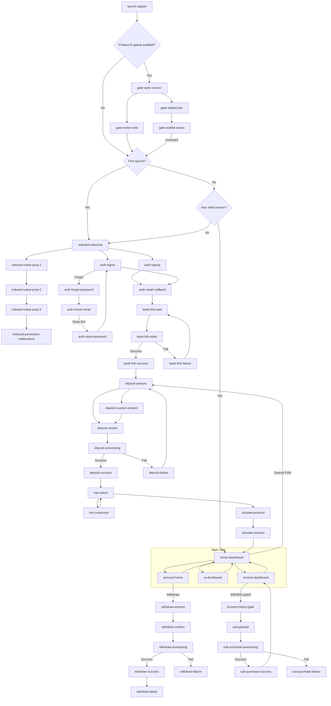

# Transition Map — Trading Platform

**Date:** 2025-12-12  
**Step:** 4 — Flow Tree & Screen Architecture  
**Platform:** iOS Mobile (Expo Router)

---

## Navigation Model

- **Root:** Launch router → (Gating?) → (Onboarding/Auth?) → Main Tabs
- **Primary Navigation:** Bottom tabs (Home / Income / Deposit modal / AI / Account)
- **Secondary Navigation:** Stack push for drill-down (detail screens)
- **Modal Navigation:** Deposit, Withdraw, Upgrade paywall

---

## Navigation Diagram

---

## Transition Table (Core)

| From | Action | To | Condition |
|------|--------|----|-----------|
| `launch-splash` | Auto | `gate-early-access` | Prelaunch gating enabled |
| `launch-splash` | Auto | `onboard-welcome` | First launch / no session |
| `launch-splash` | Auto | `home-dashboard` | Valid session |
| `onboard-welcome` | Tap “Get Started” | `auth-signup` | Default primary CTA |
| `auth-signin` | Tap “Forgot Password” | `auth-forgot-password` | — |
| `auth-forgot-password` | Submit | `auth-check-email` | Email sent |
| `auth-check-email` | Deep link | `auth-reset-password` | Has token |
| `auth-oauth-callback` | Auto | `bank-link-start` | New user setup |
| `bank-link-success` | Continue | `deposit-amount` | Setup flow |
| `deposit-success` | Continue | `risk-select` | First deposit |
| `activate-success` | Continue | `home-dashboard` | Setup complete |
| `home-dashboard` | Tap Balance | `home-balance-detail` | — |
| `income-dashboard` | Tap event | `income-event-detail` | — |
| `income-dashboard` | Toggle 30D/90D | `income-history-gate` | Feature gated |
| `income-history-gate` | Tap upgrade | `sub-paywall` | — |
| `sub-paywall` | Purchase | `sub-purchase-processing` | RevenueCat/StoreKit |
| `sub-purchase-success` | Done | `income-dashboard` | Unlock applied |
| `account-home` | Tap Withdraw | `withdraw-amount` | Has linked bank |
| `withdraw-success` | View details | `withdraw-detail` | — |

---

## Deep Link Entry Points

> Based on Expo Router conventions (see `/docs/ux/INFORMATION-ARCHITECTURE.md`).

| Deep Link | Target Screen | Notes |
|----------|---------------|------|
| `tradingplatform://` | `home-dashboard` (or `onboard-welcome`) | Router chooses based on auth |
| `tradingplatform://income` | `income-dashboard` | Push notifications, campaigns |
| `tradingplatform://ai` | `ai-dashboard` | AI status updates |
| `tradingplatform://deposit` | `deposit-amount` | Deposit reminders |
| `tradingplatform://upgrade` | `sub-paywall` | Upsell campaigns |
| `tradingplatform://activity/[id]` | `activity-detail` | Transaction notification |
| `tradingplatform://income/[id]` | `income-event-detail` | Income event deep link |
| `tradingplatform://account/subscription` | `sub-current-plan` | Account management |

---

**Status:** ✅ Transitions mapped  
**Next Artifact:** `/docs/flows/TRACEABILITY-MATRIX.md` (PRD feature → screens)

