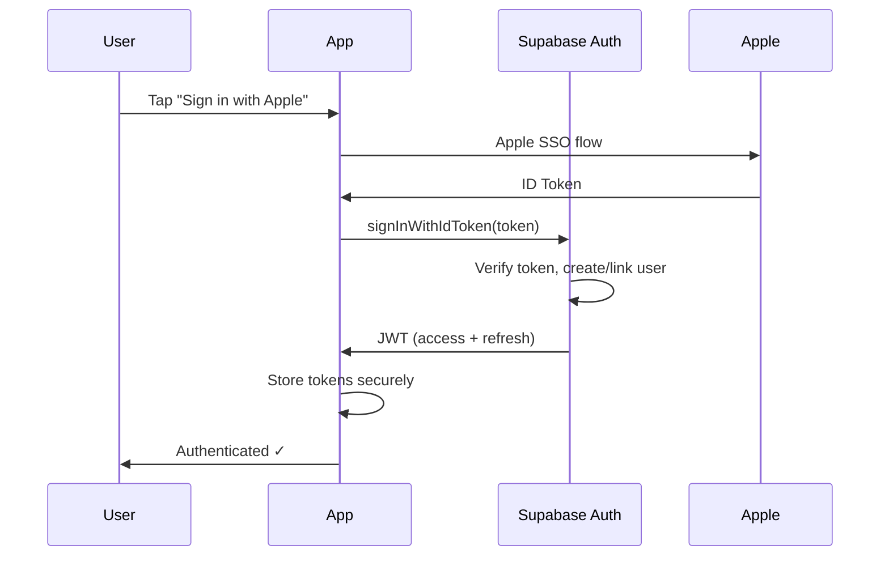
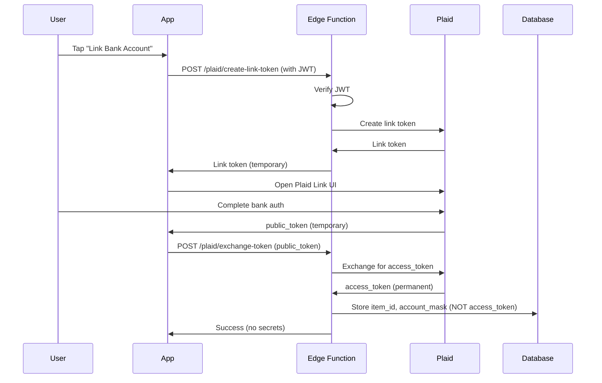

# Trading Platform - Security Architecture

**Version:** 1.0  
**Date:** 2025-12-11  
**Compliance Target:** SOC 2 Type II (future)

---

## Security Overview

Trading Platform implements a **defense-in-depth** security model with multiple layers of protection for financial data.

### Security Principles

1. **Zero Trust** — Never trust, always verify
2. **Least Privilege** — Minimal access by default
3. **Defense in Depth** — Multiple security layers
4. **Secure by Default** — Security baked into architecture

---

## Authentication Architecture

### Primary Authentication: Supabase Auth



### Authentication Methods

| Method | Use Case | Security Level |
|--------|----------|----------------|
| **Apple Sign In** | Primary (required for App Store) | High |
| **Email + Password** | Fallback | Medium (+ email verification) |
| **Magic Link** | Password reset | High |

### Token Management

```typescript
// Supabase handles token refresh automatically
// Access token: 1 hour expiry
// Refresh token: 1 week expiry (with rotation)

supabase.auth.onAuthStateChange((event, session) => {
  if (event === 'TOKEN_REFRESHED') {
    // New tokens automatically stored
  }
  if (event === 'SIGNED_OUT') {
    // Clear all local data
    clearLocalStorage();
  }
});
```

### Biometric Authentication

For sensitive operations (withdrawals, settings):

```typescript
import * as LocalAuthentication from 'expo-local-authentication';

async function requireBiometricAuth(): Promise<boolean> {
  const hasHardware = await LocalAuthentication.hasHardwareAsync();
  if (!hasHardware) return true; // Skip if not available
  
  const result = await LocalAuthentication.authenticateAsync({
    promptMessage: 'Confirm your identity',
    fallbackLabel: 'Use passcode',
  });
  
  return result.success;
}
```

---

## Authorization: Row Level Security (RLS)

**Every table has RLS enabled.** Users can only access their own data.

### RLS Policy Examples

```sql
-- Users can only see their own balance
CREATE POLICY "Users can view own balance" ON balances
    FOR SELECT
    USING (auth.uid() = user_id);

-- Users can only view their own transactions
CREATE POLICY "Users can view own transactions" ON transactions
    FOR SELECT
    USING (auth.uid() = user_id);

-- Users cannot directly insert/update balances (only AI Engine via service role)
-- No INSERT/UPDATE policies for balances = users cannot modify

-- Users can update their own settings
CREATE POLICY "Users can update own settings" ON user_settings
    FOR UPDATE
    USING (auth.uid() = user_id)
    WITH CHECK (auth.uid() = user_id);
```

### Service Role Access

Only server-side code (Edge Functions) uses the service role key:

```typescript
// Edge Function (server-side only)
const supabaseAdmin = createClient(
  Deno.env.get('SUPABASE_URL')!,
  Deno.env.get('SUPABASE_SERVICE_ROLE_KEY')!, // Never exposed to client
);

// Can bypass RLS for admin operations
await supabaseAdmin
  .from('balances')
  .update({ total_balance: newBalance })
  .eq('user_id', userId);
```

---

## Data Security

### Encryption

| Data State | Encryption Method |
|------------|-------------------|
| **In Transit** | TLS 1.3 (Supabase default) |
| **At Rest (Database)** | AES-256 (Supabase managed) |
| **At Rest (Device)** | iOS Keychain / Android Keystore |

### Sensitive Data Handling

| Data Type | Storage Location | Access Pattern |
|-----------|------------------|----------------|
| **Auth Tokens** | expo-secure-store | App only |
| **Balance (display)** | TanStack Query cache | Ephemeral |
| **Balance (offline)** | expo-sqlite | Encrypted device storage |
| **Bank Account Numbers** | Never stored on device | Plaid masks (last 4 only) |
| **Plaid Access Tokens** | Edge Functions only | Never on client |

### PII Handling

```typescript
// Never log PII
console.log('User authenticated:', userId); // ✓ OK
console.log('User email:', email); // ✗ Never do this

// Mask sensitive data in displays
const maskedAccount = `****${accountNumber.slice(-4)}`;
```

---

## Financial Security

### Plaid Integration (Secure Pattern)

**Critical: Plaid integration happens ONLY in Edge Functions, never on the client.**



**What's stored where:**

| Secret | Location | Accessible By |
|--------|----------|---------------|
| Plaid Client ID | Edge Function env | Server only |
| Plaid Secret | Edge Function env | Server only |
| Access Token | Edge Function memory (during call) | Never persisted on client |
| Item ID | Supabase (linked_accounts) | User via RLS |
| Account Mask | Supabase (linked_accounts) | User via RLS |

### Transaction Security

```sql
-- All financial operations are audited
CREATE TABLE financial_audit_log (
    id UUID PRIMARY KEY DEFAULT gen_random_uuid(),
    user_id UUID NOT NULL,
    action TEXT NOT NULL,
    amount BIGINT,
    details JSONB,
    ip_address TEXT,
    user_agent TEXT,
    created_at TIMESTAMPTZ DEFAULT NOW()
);

-- Trigger for balance changes
CREATE OR REPLACE FUNCTION log_balance_changes()
RETURNS TRIGGER AS $$
BEGIN
    INSERT INTO financial_audit_log (user_id, action, amount, details)
    VALUES (
        NEW.user_id,
        'balance_update',
        NEW.total_balance - COALESCE(OLD.total_balance, 0),
        jsonb_build_object(
            'old_balance', OLD.total_balance,
            'new_balance', NEW.total_balance
        )
    );
    RETURN NEW;
END;
$$ LANGUAGE plpgsql SECURITY DEFINER;
```

---

## Application Security (OWASP Top 10)

### OWASP Mitigations

| Vulnerability | Mitigation |
|---------------|------------|
| **A01: Broken Access Control** | RLS on all tables, JWT verification |
| **A02: Cryptographic Failures** | TLS 1.3, AES-256 at rest, secure storage |
| **A03: Injection** | Parameterized queries (Supabase SDK) |
| **A04: Insecure Design** | Clean architecture, defense in depth |
| **A05: Security Misconfiguration** | Environment-based config, no defaults |
| **A06: Vulnerable Components** | Dependabot, npm audit, Snyk |
| **A07: Auth Failures** | Supabase Auth, rate limiting, lockout |
| **A08: Data Integrity Failures** | Code signing, OTA update verification |
| **A09: Logging Failures** | Audit logs, Sentry, no PII in logs |
| **A10: SSRF** | No server-side URL fetching from user input |

### Input Validation

```typescript
// All inputs validated with Zod before API calls
import { z } from 'zod';

const depositSchema = z.object({
  amount: z.number().positive().max(100000), // Max $1000 per deposit
  linkedAccountId: z.string().uuid(),
});

function validateDeposit(data: unknown) {
  return depositSchema.parse(data);
}
```

### Rate Limiting

Implemented at Edge Function level:

```typescript
// Edge Function rate limiting
const rateLimit = {
  deposit: { max: 5, window: '1h' },
  withdrawal: { max: 3, window: '1h' },
  linkAccount: { max: 3, window: '24h' },
};
```

---

## Network Security

### Certificate Pinning (Future)

For production, implement certificate pinning:

```typescript
// Using react-native-ssl-pinning (future enhancement)
import { fetch } from 'react-native-ssl-pinning';

const response = await fetch(supabaseUrl, {
  sslPinning: {
    certs: ['supabase-certificate'],
  },
});
```

### Security Headers

Supabase Edge Functions return security headers:

```typescript
const headers = {
  'Content-Type': 'application/json',
  'X-Content-Type-Options': 'nosniff',
  'X-Frame-Options': 'DENY',
  'Cache-Control': 'no-store',
};
```

---

## Device Security

### Jailbreak/Root Detection

Optional detection for high-security users:

```typescript
import { isDeviceRooted } from 'expo-device';

async function checkDeviceSecurity() {
  const rooted = await isDeviceRooted();
  if (rooted) {
    // Show warning, optionally restrict features
    showSecurityWarning();
  }
}
```

### Screen Capture Protection

For sensitive screens (balance, transactions):

```typescript
import * as ScreenCapture from 'expo-screen-capture';

// Prevent screenshots on sensitive screens
useEffect(() => {
  ScreenCapture.preventScreenCaptureAsync();
  return () => {
    ScreenCapture.allowScreenCaptureAsync();
  };
}, []);
```

---

## Incident Response

### Security Event Monitoring

```typescript
// Log security events to Supabase
async function logSecurityEvent(event: {
  type: 'login_failed' | 'suspicious_activity' | 'rate_limited';
  userId?: string;
  details: Record<string, unknown>;
}) {
  await supabase.from('security_events').insert({
    event_type: event.type,
    user_id: event.userId,
    details: event.details,
    ip_address: 'server-side-only',
  });
}
```

### Lockout Policy

- 5 failed login attempts → 15-minute lockout
- 10 failed attempts → Account locked, email notification
- Suspicious activity → Real-time alert to admin

---

## Compliance Roadmap

### Current State

- ✅ RLS on all tables
- ✅ JWT authentication
- ✅ TLS encryption
- ✅ Secure secret handling

### SOC 2 Type II (Target: 6 months post-launch)

- [ ] Formal security policies
- [ ] Access control documentation
- [ ] Audit log retention (1 year)
- [ ] Penetration testing
- [ ] Vendor security assessments

---

## Security Checklist

### Before Launch

- [ ] All tables have RLS policies
- [ ] No secrets in client code
- [ ] Plaid tokens never on device
- [ ] Rate limiting configured
- [ ] Audit logging enabled
- [ ] Error messages don't leak info
- [ ] Biometric auth for sensitive ops
- [ ] Security headers configured

### Ongoing

- [ ] Monthly dependency updates
- [ ] Quarterly security review
- [ ] Annual penetration test
- [ ] Incident response drills

---

*Security architecture approved. Implements defense-in-depth for fintech requirements.*


