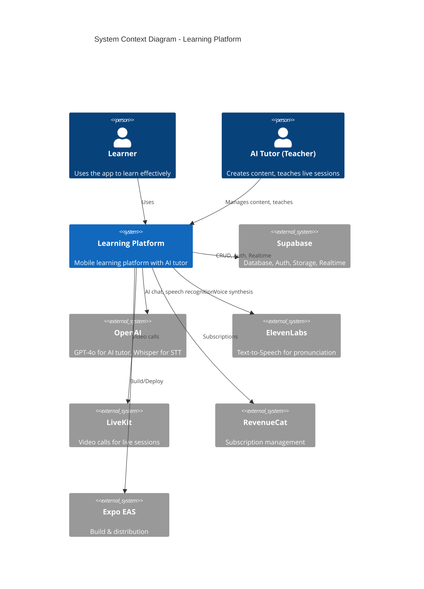
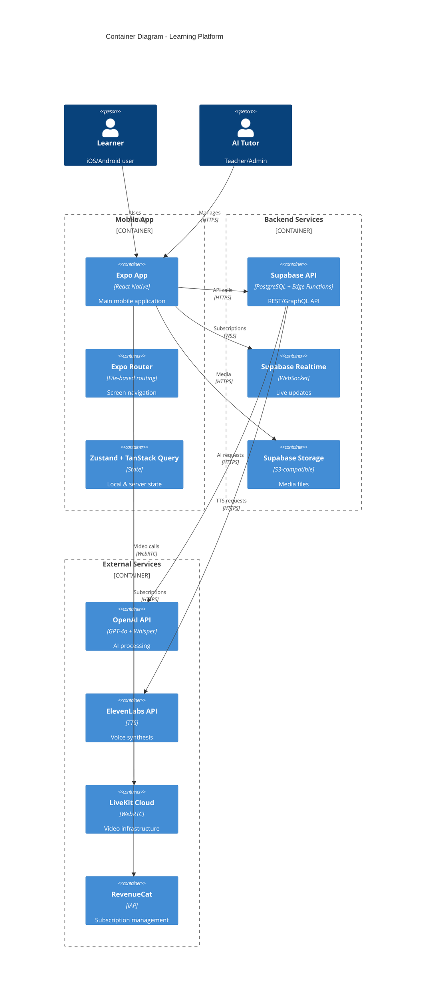
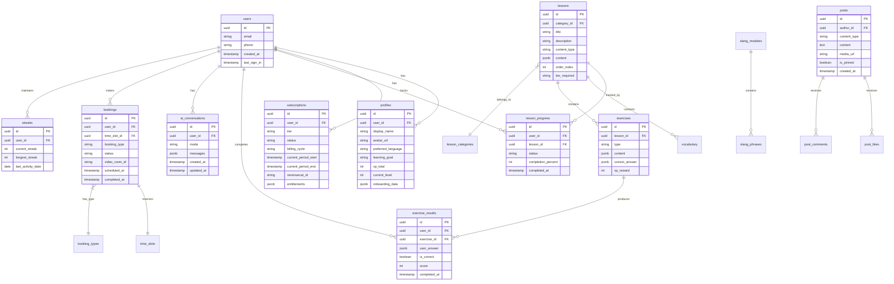
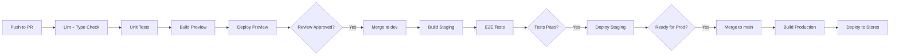
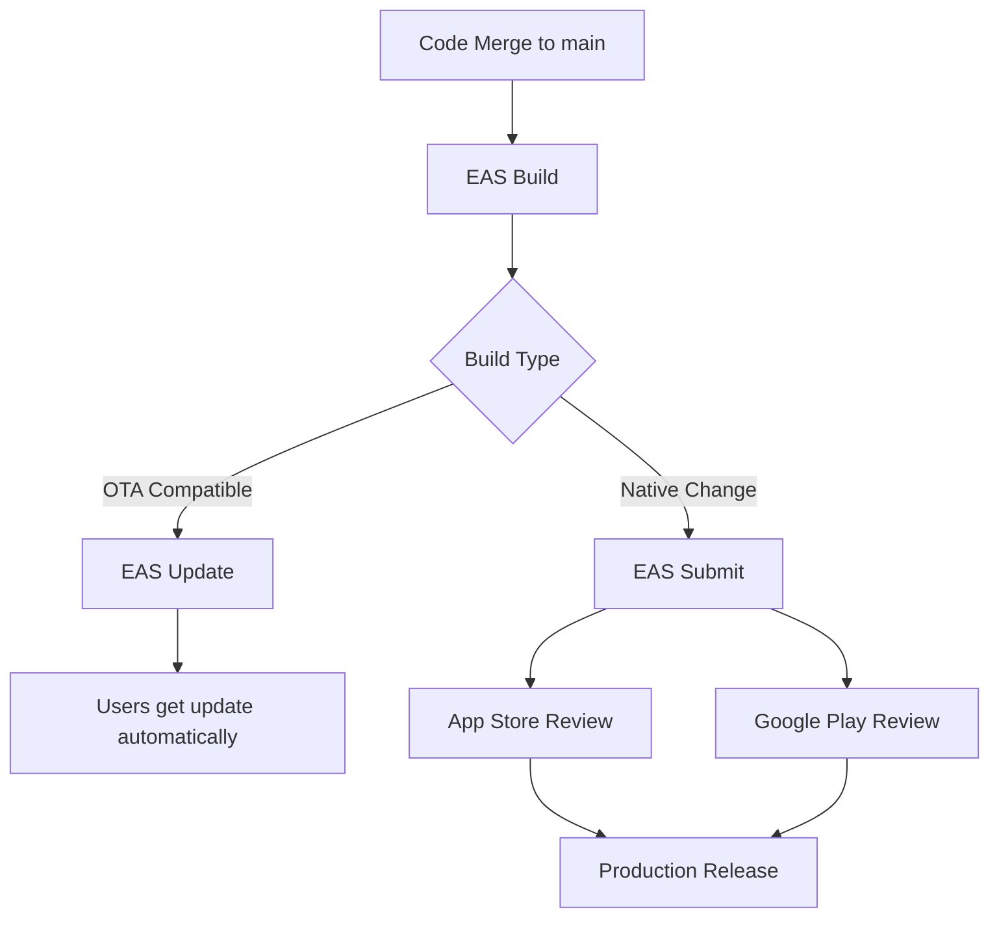

# Learning Platform — Technical Architecture

**Version:** 1.0 | **Date:** 2025-12-17 | **Status:** Draft  
**Pattern:** Modular Monolith (Feature-Based)  
**Platforms:** iOS, Android (via Expo)

---

## 1. Executive Summary

### Architecture Pattern & Rationale

**Pattern:** Modular Monolith with Feature-Based Organization

**Why Modular Monolith (not Microservices):**
- **Team Size:** 2-3 developers — microservices add operational overhead without benefit
- **Shared Database:** Single Supabase instance with clear table boundaries
- **Deployment Simplicity:** Single Expo app binary, single API deployment
- **Future Evolution:** Can extract services later if scaling requires

**Key Technical Decisions:**
1. **Expo + React Native** — Cross-platform mobile with managed workflow
2. **Supabase** — PostgreSQL + Auth + Realtime + Storage in one platform
3. **LiveKit** — Low-latency video calls with React Native SDK
4. **RevenueCat** — Subscription management abstracting Apple/Google complexity
5. **OpenAI + ElevenLabs** — AI-powered conversation and pronunciation

### High-Level System Diagram



---

## 2. Technology Stack

### Frontend (Mobile App)

| Layer | Technology | Version | Purpose |
|-------|------------|---------|---------|
| Framework | Expo | SDK 52+ | Managed React Native workflow |
| UI Framework | React Native | 0.76+ | Cross-platform UI |
| Navigation | Expo Router | v4 | File-based routing |
| Styling | NativeWind | v4 | Tailwind CSS for React Native |
| State Management | Zustand | v5 | Simple, performant state |
| Server State | TanStack Query | v5 | Caching, refetching, mutations |
| Forms | React Hook Form | v7 | Form state management |
| Icons | Lucide React Native | latest | Consistent iconography |

### Backend (Supabase)

| Layer | Technology | Version | Purpose |
|-------|------------|---------|---------|
| Database | PostgreSQL | 15+ | Relational data storage |
| Auth | Supabase Auth | latest | Email, social, phone auth |
| Realtime | Supabase Realtime | latest | Live subscriptions, presence |
| Storage | Supabase Storage | latest | Media files, worksheets |
| Edge Functions | Deno | latest | Server-side API logic |
| Row Level Security | PostgreSQL RLS | native | Authorization policies |

### External Services

| Service | Provider | Purpose | SDK |
|---------|----------|---------|-----|
| AI Chat | OpenAI GPT-4o | Conversational AI tutor | `openai` npm |
| Speech-to-Text | OpenAI Whisper | Pronunciation feedback | `openai` npm |
| Text-to-Speech | ElevenLabs | Audio pronunciation | `@11labs/client` |
| Video Calls | LiveKit | 1:1 and group sessions | `@livekit/react-native` |
| Subscriptions | RevenueCat | IAP management | `react-native-purchases` |
| Push Notifications | Expo Notifications | Engagement | `expo-notifications` |
| Analytics | Expo Analytics | Usage tracking | `expo-analytics` |

### Infrastructure

| Component | Provider | Purpose |
|-----------|----------|---------|
| Mobile Builds | Expo EAS | iOS/Android binary builds |
| API Hosting | Supabase Edge Functions | Serverless API endpoints |
| Database | Supabase Cloud | Managed PostgreSQL |
| CDN | Supabase Storage CDN | Media delivery |
| Admin Dashboard | Vercel | Web-based content management |

---

## 3. System Architecture

### Container Diagram



### Feature Modules

The app is organized into feature-based modules:

```
app/
├── (auth)/           # Authentication screens
│   ├── login.tsx
│   ├── register.tsx
│   └── forgot-password.tsx
├── (tabs)/           # Main tab navigation
│   ├── home.tsx      # Dashboard, continue learning
│   ├── learn.tsx     # Lessons, vocabulary, exercises
│   ├── practice.tsx  # AI tutor, speaking exercises
│   ├── schedule.tsx  # Booking, upcoming sessions
│   └── profile.tsx   # Settings, subscription, progress
├── lessons/          # Lesson content screens
├── ai-tutor/         # AI chat and voice modes
├── video-call/       # LiveKit integration
├── booking/          # Session booking flow
└── subscription/     # Paywall, upgrade flows
```

---

## 4. Data Architecture

### Entity Relationship Diagram



### Key Database Tables

#### Core Tables

| Table | Purpose | RLS Policy |
|-------|---------|------------|
| `users` | Auth.users (managed by Supabase) | Built-in |
| `profiles` | Extended user data, preferences | Own data only |
| `subscriptions` | Tier, status, billing info | Own data only |

#### Learning Tables

| Table | Purpose | RLS Policy |
|-------|---------|------------|
| `lessons` | Lesson content, ordering | Read by tier |
| `lesson_categories` | Lesson organization | Public read |
| `vocabulary` | Words, phrases, audio URLs | Read by tier |
| `exercises` | Quiz/exercise content | Read by tier |
| `lesson_progress` | User completion tracking | Own data only |
| `exercise_results` | User answer history | Own data only |

#### AI & Interaction Tables

| Table | Purpose | RLS Policy |
|-------|---------|------------|
| `ai_conversations` | Chat history with AI tutor | Own data only |
| `speaking_attempts` | Pronunciation recordings | Own data only |

#### Booking Tables

| Table | Purpose | RLS Policy |
|-------|---------|------------|
| `time_slots` | AI Tutor's availability | Public read |
| `bookings` | User reservations | Own + admin |
| `booking_types` | 1:1, group class types | Public read |

#### Engagement Tables

| Table | Purpose | RLS Policy |
|-------|---------|------------|
| `streaks` | Daily activity tracking | Own data only |
| `achievements` | Badges, milestones | Own data only |
| `posts` | AI Tutor's feed content | Public read |
| `post_likes` | User engagement | Own data only |

---

## 5. API Design

### API Architecture

**Approach:** Supabase Client SDK + Edge Functions for custom logic

**Why This Approach:**
- Supabase client handles CRUD operations with RLS
- Edge Functions for AI integrations, complex business logic
- No separate API server needed (reduces infrastructure)

### Edge Functions

| Function | Endpoint | Purpose |
|----------|----------|---------|
| `ai-chat` | `/functions/v1/ai-chat` | GPT-4o conversation |
| `ai-voice` | `/functions/v1/ai-voice` | Voice-to-voice AI (Whisper + ElevenLabs) |
| `pronunciation-score` | `/functions/v1/pronunciation-score` | Evaluate speaking attempts |
| `generate-token` | `/functions/v1/generate-token` | LiveKit room tokens |
| `sync-subscription` | `/functions/v1/sync-subscription` | RevenueCat webhook handler |
| `send-notification` | `/functions/v1/send-notification` | Push notification dispatch |

### API Request/Response Examples

#### AI Chat

```typescript
// POST /functions/v1/ai-chat
{
  "mode": "conversation" | "grammar" | "drill" | "story",
  "messages": [
    { "role": "user", "content": "How are you?" }
  ],
  "context": {
    "lesson_id": "uuid",
    "user_level": "beginner"
  }
}

// Response
{
  "response": {
    "role": "assistant",
    "content": "I'm doing great, thanks! And you?"
  },
  "corrections": [
    { "original": "...", "corrected": "...", "explanation": "..." }
  ],
  "usage": {
    "prompt_tokens": 150,
    "completion_tokens": 50
  }
}
```

#### Generate LiveKit Token

```typescript
// POST /functions/v1/generate-token
{
  "room_name": "booking-uuid",
  "participant_name": "Learner Name"
}

// Response
{
  "token": "eyJhbGciOiJIUzI1NiIsInR5cCI6IkpXVCJ9...",
  "url": "wss://learning-platform.livekit.cloud"
}
```

### Rate Limiting (By Tier)

| Tier | AI Chat/Day | AI Voice/Month | API Calls/Min |
|------|-------------|----------------|---------------|
| Free | 10 | 0 | 30 |
| Essential | Unlimited | 30 min | 100 |
| Pro | Unlimited | Unlimited | 300 |
| VIP | Unlimited | Unlimited | 500 |

---

## 6. Security Architecture

### Authentication

**Provider:** Supabase Auth

**Supported Methods:**
- Email/password with verification
- Apple Sign-In (required for iOS App Store)
- Google Sign-In
- Phone/SMS (future)

**Session Management:**
- JWT tokens with 1-hour expiry
- Refresh tokens with 7-day expiry
- Secure storage via `@react-native-async-storage/async-storage`

### Authorization

**Approach:** Row Level Security (RLS) + Edge Function Checks

**RLS Policies Example:**

```sql
-- Users can only read/write their own profile
CREATE POLICY "Users can view own profile"
ON profiles FOR SELECT
USING (auth.uid() = user_id);

CREATE POLICY "Users can update own profile"
ON profiles FOR UPDATE
USING (auth.uid() = user_id);

-- Lessons accessible based on subscription tier
CREATE POLICY "Lessons by tier"
ON lessons FOR SELECT
USING (
  tier_required = 'free' 
  OR tier_required = (
    SELECT tier FROM subscriptions 
    WHERE user_id = auth.uid() 
    AND status = 'active'
  )
);
```

### Data Security

| Layer | Protection |
|-------|------------|
| Transit | TLS 1.3 for all connections |
| Rest | AES-256 encryption (Supabase default) |
| API Keys | Stored in environment variables, never in code |
| PII | Minimal collection, encrypted storage |
| Secrets | Supabase Vault for API keys |

### OWASP Top 10 Mitigations

| Vulnerability | Mitigation |
|---------------|------------|
| Injection | Parameterized queries (Supabase client), RLS |
| Broken Auth | Supabase Auth handles session management |
| Sensitive Data | HTTPS only, encrypted storage, minimal PII |
| XXE | JSON-only APIs, no XML parsing |
| Broken Access | RLS policies, tier checks in Edge Functions |
| Security Misconfig | Supabase managed infrastructure |
| XSS | React Native (no DOM), text content sanitization |
| Insecure Deserialization | JSON schema validation |
| Vulnerable Components | Dependabot alerts, regular updates |
| Insufficient Logging | Supabase logs + Sentry error tracking |

---

## 7. Performance & Scalability

### Performance Targets

| Metric | Target | Measurement |
|--------|--------|-------------|
| App Launch | < 3 seconds | Cold start to interactive |
| Screen Transition | < 300ms | Navigation response |
| API Response (P95) | < 500ms | Database queries |
| AI Response (P95) | < 3 seconds | Chat completion |
| Video Connect | < 5 seconds | Room join time |
| Video Latency | < 500ms | End-to-end |

### Mobile Performance

| Optimization | Implementation |
|--------------|----------------|
| Code Splitting | Expo Router automatic |
| Image Optimization | `expo-image` with caching |
| List Virtualization | `FlashList` for large lists |
| Bundle Size | Tree shaking, lazy loading |
| Offline Support | TanStack Query persistence |

### Scalability Strategy

| Component | Strategy |
|-----------|----------|
| Database | Supabase connection pooling, read replicas (if needed) |
| API | Edge Functions auto-scale |
| Storage | CDN delivery, optimized media |
| Video | LiveKit Cloud auto-scales |
| Subscriptions | RevenueCat handles scale |

### SLO/SLI Definitions

| SLI | Target SLO | Error Budget |
|-----|------------|--------------|
| Availability | 99.9% | 8.76 hours/year |
| API Latency (P95) | < 500ms | 1% of requests can exceed |
| Error Rate | < 1% | 1% of API calls |
| Video Quality | 720p sustained | Degrade to 480p if needed |

---

## 8. Development Workflow

### Git Workflow

```
main          ─────────────────────────────────────────►
                 │                      │
                 │  PR + Review         │  PR + Review
                 ▼                      ▼
dev           ───●───────●───────●───────●───────●──────►
                 │       │       │       │       │
feature/*     ───●───────●       │       │       │
                         │       │       │       │
feature/*     ───────────●───────●       │       │
                                 │       │       │
bugfix/*      ───────────────────●───────●       │
```

**Branch Naming:**
- `feature/feat-name` — New features
- `bugfix/bug-description` — Bug fixes
- `refactor/area` — Code improvements

### CI/CD Pipeline



**CI/CD Tools:**
- **GitHub Actions** — Pipeline orchestration
- **Expo EAS Build** — iOS/Android builds
- **Expo EAS Submit** — Store submissions
- **Expo EAS Update** — OTA updates

### Testing Strategy

| Layer | Tool | Coverage Target |
|-------|------|-----------------|
| Unit Tests | Vitest | 80% core logic |
| Component Tests | React Native Testing Library | Key components |
| E2E Tests | Maestro | Critical user flows |
| API Tests | Vitest + MSW | Edge Functions |

---

## 9. Deployment Strategy

### Environments

| Environment | Purpose | Supabase Project |
|-------------|---------|------------------|
| Development | Local development | Local / Dev project |
| Staging | Pre-release testing | Staging project |
| Production | Live users | Production project |

### Mobile Deployment



**OTA Updates (Expo Updates):**
- JavaScript/asset changes without store review
- Staged rollout (10% → 50% → 100%)
- Rollback capability

**Store Releases:**
- Native code changes require full build
- TestFlight for iOS beta
- Internal testing for Android beta

### Database Migrations

**Tool:** Supabase CLI migrations

**Process:**
1. Create migration: `supabase migration new migration_name`
2. Write SQL in `supabase/migrations/`
3. Test locally: `supabase db reset`
4. Push to staging: `supabase db push --linked`
5. Review and push to production

---

## 10. Risk Assessment

### Technical Risks

| Risk | Probability | Impact | Mitigation |
|------|-------------|--------|------------|
| AI API costs spike | Medium | High | Usage caps by tier, caching common responses |
| LiveKit outage | Low | High | Fallback to external link (Zoom) |
| Supabase downtime | Low | Critical | Status monitoring, incident response plan |
| App Store rejection | Medium | Medium | Follow guidelines, thorough testing |
| Expo SDK upgrade issues | Medium | Medium | Test in staging, gradual rollout |

### Dependency Risks

| Dependency | Risk | Mitigation |
|------------|------|------------|
| OpenAI API | Pricing changes, rate limits | Abstract behind service layer |
| ElevenLabs | API changes | Abstract, can swap to alternatives |
| RevenueCat | Vendor lock-in | Worth it for IAP complexity reduction |
| LiveKit | Self-host option available | Can migrate to self-hosted if needed |

### Scalability Bottlenecks

| Bottleneck | Threshold | Solution |
|------------|-----------|----------|
| Database connections | 500 concurrent | Connection pooling (PgBouncer) |
| AI requests | Cost-based | Caching, rate limiting |
| Video concurrent | LiveKit plan-based | Upgrade LiveKit plan |
| Storage | 100GB | CDN caching, media optimization |

---

## Appendix

### ADR Index

| ADR | Decision | Status |
|-----|----------|--------|
| ADR-001 | Use Expo Managed Workflow | Accepted |
| ADR-002 | Use Supabase as BaaS | Accepted |
| ADR-003 | Use LiveKit for Video | Accepted |
| ADR-004 | Use RevenueCat for Subscriptions | Accepted |
| ADR-005 | Modular Monolith Architecture | Accepted |

### Research Sources

See: `/docs/research/ARCH-SOURCES-2025-12-17.md`

---

**Document Status:** Draft  
**Next Step:** Human approval → Proceed to Step 3 (UX Design)

---

## System Architecture Overview

This system is implemented as a **Layered** (Clean-inspired) **modular monolith** with feature boundaries.  
See the existing C4 diagrams in **“High-Level System Diagram”** and **“Container Diagram.”**

**Stack alignment:** Source of truth is `/docs/stack-profile.json`.

---

## Core Components

- **Mobile App (Expo + React Native)**: UI, navigation, offline-friendly UX
- **Supabase**: Postgres database + Auth + Storage + RLS
- **Edge Functions**: API logic, rate limiting, webhooks
- **AI Providers**: OpenAI (LLM + Whisper), ElevenLabs (TTS)
- **LiveKit**: video rooms for 1:1 + group sessions
- **RevenueCat**: subscription entitlements and paywall gating

---

## Data Architecture

- Postgres schema with RLS-first authorization
- Core entities: users, progress, lessons, practice attempts, bookings, subscriptions

---

## API Design

- Supabase Edge Functions as the primary API surface
- Versioned routes, rate limiting per tier, and idempotent webhooks

---

## Security Architecture

- **RLS everywhere** for tenant isolation
- JWT session validation (Supabase Auth)
- Secrets in server-side env only (never in client)
- Rate limiting for AI endpoints and auth attempts

---

## Infrastructure & Deployment

- EAS builds for iOS/Android
- Supabase-managed Postgres + Edge Functions deployment
- OTA updates (where appropriate) with careful version gating

---

## Quality Attributes

- Performance: target smooth UI + predictable network behavior (skeletons over spinners)
- Reliability: explicit offline / maintenance states
- Security: RLS + least privilege by default

---

## Final Review Gate (Step 2)

Please review the Technical Architecture and files.  
- Reply `approve step 2` to proceed to Step 3 (UX Design), or  
- Reply `revise step 2: <notes>` to iterate.  
I won't continue until you approve.

