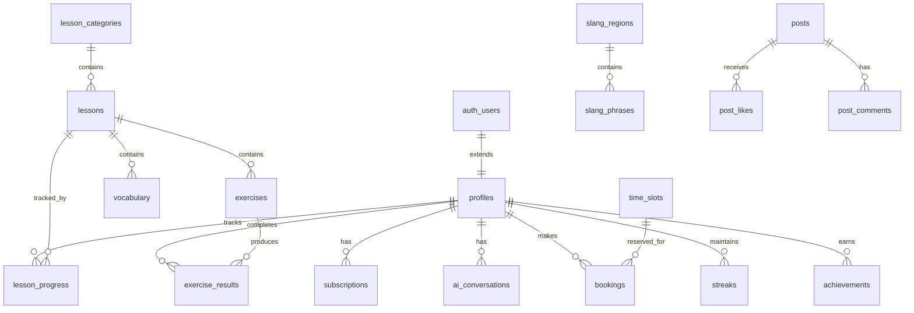

# Learning Platform — Database Schema

**Version:** 1.0 | **Date:** 2025-12-17  
**Database:** PostgreSQL 15+ (Supabase)  
**ORM:** Supabase Client SDK (direct queries with RLS)

---

## Schema Overview



---

## Core Tables

### `profiles`

Extended user profile data (extends `auth.users`).

```sql
CREATE TABLE profiles (
  id UUID PRIMARY KEY REFERENCES auth.users(id) ON DELETE CASCADE,
  display_name TEXT,
  avatar_url TEXT,
  preferred_language TEXT DEFAULT 'en',
  learning_goal TEXT CHECK (learning_goal IN ('travel', 'fluency', 'work', 'culture', 'heritage')),
  native_language TEXT DEFAULT 'en',
  xp_total INTEGER DEFAULT 0,
  current_level INTEGER DEFAULT 1,
  onboarding_completed BOOLEAN DEFAULT FALSE,
  onboarding_data JSONB DEFAULT '{}',
  notification_preferences JSONB DEFAULT '{"push": true, "email": true, "verb_of_day": true}',
  timezone TEXT DEFAULT 'America/New_York',
  created_at TIMESTAMPTZ DEFAULT NOW(),
  updated_at TIMESTAMPTZ DEFAULT NOW()
);

-- Indexes
CREATE INDEX idx_profiles_level ON profiles(current_level);
CREATE INDEX idx_profiles_xp ON profiles(xp_total DESC);

-- RLS
ALTER TABLE profiles ENABLE ROW LEVEL SECURITY;

CREATE POLICY "Users can view own profile"
ON profiles FOR SELECT
USING (auth.uid() = id);

CREATE POLICY "Users can update own profile"
ON profiles FOR UPDATE
USING (auth.uid() = id);

CREATE POLICY "Users can insert own profile"
ON profiles FOR INSERT
WITH CHECK (auth.uid() = id);
```

### `subscriptions`

Subscription status synced from RevenueCat.

```sql
CREATE TABLE subscriptions (
  id UUID PRIMARY KEY DEFAULT gen_random_uuid(),
  user_id UUID NOT NULL REFERENCES profiles(id) ON DELETE CASCADE,
  tier TEXT NOT NULL CHECK (tier IN ('free', 'essential', 'pro', 'vip')),
  status TEXT NOT NULL CHECK (status IN ('active', 'canceled', 'expired', 'trial', 'grace_period')),
  billing_cycle TEXT CHECK (billing_cycle IN ('monthly', 'annual')),
  current_period_start TIMESTAMPTZ,
  current_period_end TIMESTAMPTZ,
  trial_end TIMESTAMPTZ,
  cancel_at_period_end BOOLEAN DEFAULT FALSE,
  revenuecat_subscriber_id TEXT UNIQUE,
  revenuecat_entitlements JSONB DEFAULT '[]',
  platform TEXT CHECK (platform IN ('ios', 'android', 'web')),
  created_at TIMESTAMPTZ DEFAULT NOW(),
  updated_at TIMESTAMPTZ DEFAULT NOW(),
  
  UNIQUE(user_id)
);

-- Indexes
CREATE INDEX idx_subscriptions_user ON subscriptions(user_id);
CREATE INDEX idx_subscriptions_tier ON subscriptions(tier);
CREATE INDEX idx_subscriptions_status ON subscriptions(status);
CREATE INDEX idx_subscriptions_revenuecat ON subscriptions(revenuecat_subscriber_id);

-- RLS
ALTER TABLE subscriptions ENABLE ROW LEVEL SECURITY;

CREATE POLICY "Users can view own subscription"
ON subscriptions FOR SELECT
USING (auth.uid() = user_id);

-- Insert/Update only via Edge Functions (service role)
```

---

## Learning Content Tables

### `lesson_categories`

Lesson organization and grouping.

```sql
CREATE TABLE lesson_categories (
  id UUID PRIMARY KEY DEFAULT gen_random_uuid(),
  name TEXT NOT NULL,
  slug TEXT NOT NULL UNIQUE,
  description TEXT,
  icon TEXT,
  color TEXT,
  order_index INTEGER DEFAULT 0,
  is_active BOOLEAN DEFAULT TRUE,
  created_at TIMESTAMPTZ DEFAULT NOW()
);

-- RLS (public read)
ALTER TABLE lesson_categories ENABLE ROW LEVEL SECURITY;

CREATE POLICY "Anyone can read categories"
ON lesson_categories FOR SELECT
USING (true);
```

### `lessons`

Lesson content and structure.

```sql
CREATE TABLE lessons (
  id UUID PRIMARY KEY DEFAULT gen_random_uuid(),
  category_id UUID REFERENCES lesson_categories(id) ON DELETE SET NULL,
  title TEXT NOT NULL,
  slug TEXT NOT NULL UNIQUE,
  description TEXT,
  content_type TEXT CHECK (content_type IN ('grammar', 'vocabulary', 'conversation', 'culture', 'slang')),
  content JSONB NOT NULL DEFAULT '{}',
  -- Content structure:
  -- {
  --   "sections": [
  --     { "type": "text", "content": "..." },
  --     { "type": "audio", "url": "...", "transcript": "..." },
  --     { "type": "example", "spanish": "...", "english": "..." }
  --   ],
  --   "key_points": ["...", "..."],
  --   "audio_url": "..."
  -- }
  duration_minutes INTEGER DEFAULT 10,
  difficulty TEXT CHECK (difficulty IN ('beginner', 'intermediate', 'advanced')),
  tier_required TEXT DEFAULT 'free' CHECK (tier_required IN ('free', 'essential', 'pro', 'vip')),
  order_index INTEGER DEFAULT 0,
  xp_reward INTEGER DEFAULT 10,
  is_active BOOLEAN DEFAULT TRUE,
  created_at TIMESTAMPTZ DEFAULT NOW(),
  updated_at TIMESTAMPTZ DEFAULT NOW()
);

-- Indexes
CREATE INDEX idx_lessons_category ON lessons(category_id);
CREATE INDEX idx_lessons_tier ON lessons(tier_required);
CREATE INDEX idx_lessons_order ON lessons(order_index);
CREATE INDEX idx_lessons_slug ON lessons(slug);

-- RLS (tier-based access)
ALTER TABLE lessons ENABLE ROW LEVEL SECURITY;

CREATE POLICY "Lessons by tier"
ON lessons FOR SELECT
USING (
  is_active = TRUE
  AND (
    tier_required = 'free'
    OR tier_required = (
      SELECT tier FROM subscriptions
      WHERE user_id = auth.uid() AND status = 'active'
    )
    OR (
      SELECT tier FROM subscriptions
      WHERE user_id = auth.uid() AND status = 'active'
    ) IN ('pro', 'vip') -- Pro/VIP get all content
  )
);
```

### `vocabulary`

Vocabulary words and phrases.

```sql
CREATE TABLE vocabulary (
  id UUID PRIMARY KEY DEFAULT gen_random_uuid(),
  lesson_id UUID REFERENCES lessons(id) ON DELETE CASCADE,
  spanish TEXT NOT NULL,
  english TEXT NOT NULL,
  pronunciation_ipa TEXT,
  audio_url TEXT,
  part_of_speech TEXT CHECK (part_of_speech IN ('noun', 'verb', 'adjective', 'adverb', 'phrase', 'other')),
  example_spanish TEXT,
  example_english TEXT,
  notes TEXT,
  difficulty TEXT CHECK (difficulty IN ('beginner', 'intermediate', 'advanced')),
  tier_required TEXT DEFAULT 'free',
  is_verb_of_day_eligible BOOLEAN DEFAULT FALSE,
  created_at TIMESTAMPTZ DEFAULT NOW()
);

-- Indexes
CREATE INDEX idx_vocabulary_lesson ON vocabulary(lesson_id);
CREATE INDEX idx_vocabulary_verb_of_day ON vocabulary(is_verb_of_day_eligible) WHERE is_verb_of_day_eligible = TRUE;

-- RLS (same as lessons)
ALTER TABLE vocabulary ENABLE ROW LEVEL SECURITY;

CREATE POLICY "Vocabulary by lesson access"
ON vocabulary FOR SELECT
USING (
  lesson_id IS NULL
  OR EXISTS (
    SELECT 1 FROM lessons l
    WHERE l.id = vocabulary.lesson_id
    AND (
      l.tier_required = 'free'
      OR l.tier_required = (SELECT tier FROM subscriptions WHERE user_id = auth.uid() AND status = 'active')
      OR (SELECT tier FROM subscriptions WHERE user_id = auth.uid() AND status = 'active') IN ('pro', 'vip')
    )
  )
);
```

### `exercises`

Quiz and exercise content.

```sql
CREATE TABLE exercises (
  id UUID PRIMARY KEY DEFAULT gen_random_uuid(),
  lesson_id UUID REFERENCES lessons(id) ON DELETE CASCADE,
  type TEXT NOT NULL CHECK (type IN (
    'multiple_choice',
    'fill_blank',
    'sentence_build',
    'listening',
    'speaking',
    'translation'
  )),
  question JSONB NOT NULL,
  -- Question structure varies by type:
  -- multiple_choice: { "prompt": "...", "options": ["a", "b", "c", "d"], "audio_url": "..." }
  -- fill_blank: { "sentence": "The ___ of two ideas creates something new", "blanks": [{ "position": 1 }] }
  -- sentence_build: { "words": ["Practice", "makes", "perfect", "progress"], "translation": "Practice makes perfect progress" }
  -- listening: { "audio_url": "...", "question": "What did they say?" }
  -- speaking: { "prompt": "Say: Hello", "target": "Hello", "audio_url": "..." }
  correct_answer JSONB NOT NULL,
  explanation TEXT,
  hints JSONB DEFAULT '[]',
  xp_reward INTEGER DEFAULT 5,
  order_index INTEGER DEFAULT 0,
  created_at TIMESTAMPTZ DEFAULT NOW()
);

-- Indexes
CREATE INDEX idx_exercises_lesson ON exercises(lesson_id);
CREATE INDEX idx_exercises_type ON exercises(type);

-- RLS (inherit from lesson access)
ALTER TABLE exercises ENABLE ROW LEVEL SECURITY;

CREATE POLICY "Exercises by lesson access"
ON exercises FOR SELECT
USING (
  EXISTS (
    SELECT 1 FROM lessons l
    WHERE l.id = exercises.lesson_id
    AND l.is_active = TRUE
  )
);
```

---

## User Progress Tables

### `lesson_progress`

User completion tracking.

```sql
CREATE TABLE lesson_progress (
  id UUID PRIMARY KEY DEFAULT gen_random_uuid(),
  user_id UUID NOT NULL REFERENCES profiles(id) ON DELETE CASCADE,
  lesson_id UUID NOT NULL REFERENCES lessons(id) ON DELETE CASCADE,
  status TEXT NOT NULL DEFAULT 'not_started' CHECK (status IN ('not_started', 'in_progress', 'completed')),
  completion_percent INTEGER DEFAULT 0 CHECK (completion_percent >= 0 AND completion_percent <= 100),
  last_position JSONB DEFAULT '{}', -- { "section_index": 0, "scroll_position": 0 }
  started_at TIMESTAMPTZ,
  completed_at TIMESTAMPTZ,
  xp_earned INTEGER DEFAULT 0,
  created_at TIMESTAMPTZ DEFAULT NOW(),
  updated_at TIMESTAMPTZ DEFAULT NOW(),
  
  UNIQUE(user_id, lesson_id)
);

-- Indexes
CREATE INDEX idx_lesson_progress_user ON lesson_progress(user_id);
CREATE INDEX idx_lesson_progress_lesson ON lesson_progress(lesson_id);
CREATE INDEX idx_lesson_progress_status ON lesson_progress(status);

-- RLS
ALTER TABLE lesson_progress ENABLE ROW LEVEL SECURITY;

CREATE POLICY "Users can view own progress"
ON lesson_progress FOR SELECT
USING (auth.uid() = user_id);

CREATE POLICY "Users can update own progress"
ON lesson_progress FOR UPDATE
USING (auth.uid() = user_id);

CREATE POLICY "Users can insert own progress"
ON lesson_progress FOR INSERT
WITH CHECK (auth.uid() = user_id);
```

### `exercise_results`

Exercise attempt history.

```sql
CREATE TABLE exercise_results (
  id UUID PRIMARY KEY DEFAULT gen_random_uuid(),
  user_id UUID NOT NULL REFERENCES profiles(id) ON DELETE CASCADE,
  exercise_id UUID NOT NULL REFERENCES exercises(id) ON DELETE CASCADE,
  user_answer JSONB NOT NULL,
  is_correct BOOLEAN NOT NULL,
  score INTEGER DEFAULT 0, -- For partial credit exercises
  hints_used INTEGER DEFAULT 0,
  time_taken_seconds INTEGER,
  xp_earned INTEGER DEFAULT 0,
  feedback JSONB DEFAULT '{}', -- AI-generated feedback for speaking exercises
  created_at TIMESTAMPTZ DEFAULT NOW()
);

-- Indexes
CREATE INDEX idx_exercise_results_user ON exercise_results(user_id);
CREATE INDEX idx_exercise_results_exercise ON exercise_results(exercise_id);
CREATE INDEX idx_exercise_results_correct ON exercise_results(is_correct);
CREATE INDEX idx_exercise_results_created ON exercise_results(created_at DESC);

-- RLS
ALTER TABLE exercise_results ENABLE ROW LEVEL SECURITY;

CREATE POLICY "Users can view own results"
ON exercise_results FOR SELECT
USING (auth.uid() = user_id);

CREATE POLICY "Users can insert own results"
ON exercise_results FOR INSERT
WITH CHECK (auth.uid() = user_id);
```

### `streaks`

Daily activity streaks.

```sql
CREATE TABLE streaks (
  id UUID PRIMARY KEY DEFAULT gen_random_uuid(),
  user_id UUID NOT NULL REFERENCES profiles(id) ON DELETE CASCADE UNIQUE,
  current_streak INTEGER DEFAULT 0,
  longest_streak INTEGER DEFAULT 0,
  last_activity_date DATE,
  streak_freezes_remaining INTEGER DEFAULT 0,
  created_at TIMESTAMPTZ DEFAULT NOW(),
  updated_at TIMESTAMPTZ DEFAULT NOW()
);

-- Indexes
CREATE INDEX idx_streaks_user ON streaks(user_id);
CREATE INDEX idx_streaks_current ON streaks(current_streak DESC);

-- RLS
ALTER TABLE streaks ENABLE ROW LEVEL SECURITY;

CREATE POLICY "Users can view own streaks"
ON streaks FOR SELECT
USING (auth.uid() = user_id);

CREATE POLICY "Users can update own streaks"
ON streaks FOR UPDATE
USING (auth.uid() = user_id);
```

### `achievements`

Badges and milestones.

```sql
CREATE TABLE achievement_definitions (
  id UUID PRIMARY KEY DEFAULT gen_random_uuid(),
  name TEXT NOT NULL,
  slug TEXT NOT NULL UNIQUE,
  description TEXT,
  icon TEXT,
  category TEXT CHECK (category IN ('streak', 'lessons', 'exercises', 'social', 'special')),
  requirement JSONB NOT NULL, -- { "type": "streak", "value": 7 }
  xp_reward INTEGER DEFAULT 0,
  is_active BOOLEAN DEFAULT TRUE,
  created_at TIMESTAMPTZ DEFAULT NOW()
);

CREATE TABLE user_achievements (
  id UUID PRIMARY KEY DEFAULT gen_random_uuid(),
  user_id UUID NOT NULL REFERENCES profiles(id) ON DELETE CASCADE,
  achievement_id UUID NOT NULL REFERENCES achievement_definitions(id) ON DELETE CASCADE,
  earned_at TIMESTAMPTZ DEFAULT NOW(),
  
  UNIQUE(user_id, achievement_id)
);

-- Indexes
CREATE INDEX idx_user_achievements_user ON user_achievements(user_id);

-- RLS
ALTER TABLE achievement_definitions ENABLE ROW LEVEL SECURITY;
ALTER TABLE user_achievements ENABLE ROW LEVEL SECURITY;

CREATE POLICY "Anyone can read achievements"
ON achievement_definitions FOR SELECT
USING (is_active = TRUE);

CREATE POLICY "Users can view own earned achievements"
ON user_achievements FOR SELECT
USING (auth.uid() = user_id);
```

---

## AI & Conversation Tables

### `ai_conversations`

AI tutor chat history.

```sql
CREATE TABLE ai_conversations (
  id UUID PRIMARY KEY DEFAULT gen_random_uuid(),
  user_id UUID NOT NULL REFERENCES profiles(id) ON DELETE CASCADE,
  mode TEXT NOT NULL CHECK (mode IN ('chat', 'grammar', 'drill', 'story', 'voice')),
  title TEXT, -- Auto-generated from first message
  messages JSONB NOT NULL DEFAULT '[]',
  -- Messages structure:
  -- [
  --   { "role": "user", "content": "...", "timestamp": "..." },
  --   { "role": "assistant", "content": "...", "timestamp": "...", "corrections": [...] }
  -- ]
  context JSONB DEFAULT '{}', -- { "lesson_id": "...", "topic": "..." }
  token_usage JSONB DEFAULT '{"prompt": 0, "completion": 0}',
  is_active BOOLEAN DEFAULT TRUE,
  created_at TIMESTAMPTZ DEFAULT NOW(),
  updated_at TIMESTAMPTZ DEFAULT NOW()
);

-- Indexes
CREATE INDEX idx_ai_conversations_user ON ai_conversations(user_id);
CREATE INDEX idx_ai_conversations_mode ON ai_conversations(mode);
CREATE INDEX idx_ai_conversations_created ON ai_conversations(created_at DESC);

-- RLS
ALTER TABLE ai_conversations ENABLE ROW LEVEL SECURITY;

CREATE POLICY "Users can view own conversations"
ON ai_conversations FOR SELECT
USING (auth.uid() = user_id);

CREATE POLICY "Users can create own conversations"
ON ai_conversations FOR INSERT
WITH CHECK (auth.uid() = user_id);

CREATE POLICY "Users can update own conversations"
ON ai_conversations FOR UPDATE
USING (auth.uid() = user_id);
```

### `speaking_attempts`

Speaking exercise recordings and scores.

```sql
CREATE TABLE speaking_attempts (
  id UUID PRIMARY KEY DEFAULT gen_random_uuid(),
  user_id UUID NOT NULL REFERENCES profiles(id) ON DELETE CASCADE,
  exercise_id UUID REFERENCES exercises(id) ON DELETE SET NULL,
  target_text TEXT NOT NULL,
  audio_url TEXT, -- Stored in Supabase Storage
  transcription TEXT,
  pronunciation_score INTEGER CHECK (pronunciation_score >= 0 AND pronunciation_score <= 100),
  accuracy_score INTEGER CHECK (accuracy_score >= 0 AND accuracy_score <= 100),
  fluency_score INTEGER CHECK (fluency_score >= 0 AND fluency_score <= 100),
  overall_score INTEGER CHECK (overall_score >= 0 AND overall_score <= 100),
  feedback JSONB DEFAULT '{}',
  created_at TIMESTAMPTZ DEFAULT NOW()
);

-- Indexes
CREATE INDEX idx_speaking_attempts_user ON speaking_attempts(user_id);
CREATE INDEX idx_speaking_attempts_created ON speaking_attempts(created_at DESC);

-- RLS
ALTER TABLE speaking_attempts ENABLE ROW LEVEL SECURITY;

CREATE POLICY "Users can view own attempts"
ON speaking_attempts FOR SELECT
USING (auth.uid() = user_id);

CREATE POLICY "Users can create own attempts"
ON speaking_attempts FOR INSERT
WITH CHECK (auth.uid() = user_id);
```

---

## Booking Tables

### `time_slots`

AI Tutor's availability for booking.

```sql
CREATE TABLE time_slots (
  id UUID PRIMARY KEY DEFAULT gen_random_uuid(),
  start_time TIMESTAMPTZ NOT NULL,
  end_time TIMESTAMPTZ NOT NULL,
  is_available BOOLEAN DEFAULT TRUE,
  slot_type TEXT CHECK (slot_type IN ('1on1', 'group')),
  max_participants INTEGER DEFAULT 1,
  created_at TIMESTAMPTZ DEFAULT NOW(),
  
  CONSTRAINT valid_time_range CHECK (end_time > start_time)
);

-- Indexes
CREATE INDEX idx_time_slots_start ON time_slots(start_time);
CREATE INDEX idx_time_slots_available ON time_slots(is_available) WHERE is_available = TRUE;

-- RLS (public read)
ALTER TABLE time_slots ENABLE ROW LEVEL SECURITY;

CREATE POLICY "Anyone can view available slots"
ON time_slots FOR SELECT
USING (is_available = TRUE AND start_time > NOW());
```

### `bookings`

User session bookings.

```sql
CREATE TABLE bookings (
  id UUID PRIMARY KEY DEFAULT gen_random_uuid(),
  user_id UUID NOT NULL REFERENCES profiles(id) ON DELETE CASCADE,
  time_slot_id UUID NOT NULL REFERENCES time_slots(id) ON DELETE CASCADE,
  booking_type TEXT NOT NULL CHECK (booking_type IN ('1on1', 'group')),
  status TEXT NOT NULL DEFAULT 'confirmed' CHECK (status IN ('pending', 'confirmed', 'completed', 'canceled', 'no_show')),
  video_room_id TEXT, -- LiveKit room ID
  notes TEXT,
  payment_status TEXT CHECK (payment_status IN ('pending', 'paid', 'refunded', 'waived')),
  payment_amount INTEGER, -- Cents
  reminder_sent BOOLEAN DEFAULT FALSE,
  created_at TIMESTAMPTZ DEFAULT NOW(),
  updated_at TIMESTAMPTZ DEFAULT NOW()
);

-- Indexes
CREATE INDEX idx_bookings_user ON bookings(user_id);
CREATE INDEX idx_bookings_slot ON bookings(time_slot_id);
CREATE INDEX idx_bookings_status ON bookings(status);
CREATE INDEX idx_bookings_upcoming ON bookings(user_id, status) WHERE status = 'confirmed';

-- RLS
ALTER TABLE bookings ENABLE ROW LEVEL SECURITY;

CREATE POLICY "Users can view own bookings"
ON bookings FOR SELECT
USING (auth.uid() = user_id);

CREATE POLICY "Users can create own bookings"
ON bookings FOR INSERT
WITH CHECK (auth.uid() = user_id);

CREATE POLICY "Users can update own bookings"
ON bookings FOR UPDATE
USING (auth.uid() = user_id);
```

---

## Content Feed Tables

### `posts`

AI Tutor's content feed posts.

```sql
CREATE TABLE posts (
  id UUID PRIMARY KEY DEFAULT gen_random_uuid(),
  author_id UUID NOT NULL REFERENCES profiles(id) ON DELETE CASCADE,
  content_type TEXT NOT NULL CHECK (content_type IN ('announcement', 'tip', 'video', 'homework', 'worksheet', 'reminder', 'promo')),
  title TEXT,
  content TEXT NOT NULL,
  media_url TEXT,
  media_type TEXT CHECK (media_type IN ('image', 'video', 'pdf')),
  related_lesson_id UUID REFERENCES lessons(id) ON DELETE SET NULL,
  is_pinned BOOLEAN DEFAULT FALSE,
  is_published BOOLEAN DEFAULT TRUE,
  scheduled_at TIMESTAMPTZ,
  likes_count INTEGER DEFAULT 0,
  comments_count INTEGER DEFAULT 0,
  created_at TIMESTAMPTZ DEFAULT NOW(),
  updated_at TIMESTAMPTZ DEFAULT NOW()
);

-- Indexes
CREATE INDEX idx_posts_author ON posts(author_id);
CREATE INDEX idx_posts_published ON posts(is_published, created_at DESC) WHERE is_published = TRUE;
CREATE INDEX idx_posts_pinned ON posts(is_pinned DESC, created_at DESC);

-- RLS
ALTER TABLE posts ENABLE ROW LEVEL SECURITY;

CREATE POLICY "Anyone can view published posts"
ON posts FOR SELECT
USING (is_published = TRUE);
```

### `post_likes`

Post engagement tracking.

```sql
CREATE TABLE post_likes (
  id UUID PRIMARY KEY DEFAULT gen_random_uuid(),
  user_id UUID NOT NULL REFERENCES profiles(id) ON DELETE CASCADE,
  post_id UUID NOT NULL REFERENCES posts(id) ON DELETE CASCADE,
  created_at TIMESTAMPTZ DEFAULT NOW(),
  
  UNIQUE(user_id, post_id)
);

-- Indexes
CREATE INDEX idx_post_likes_post ON post_likes(post_id);
CREATE INDEX idx_post_likes_user ON post_likes(user_id);

-- RLS
ALTER TABLE post_likes ENABLE ROW LEVEL SECURITY;

CREATE POLICY "Users can view own likes"
ON post_likes FOR SELECT
USING (auth.uid() = user_id);

CREATE POLICY "Users can like posts"
ON post_likes FOR INSERT
WITH CHECK (auth.uid() = user_id);

CREATE POLICY "Users can unlike posts"
ON post_likes FOR DELETE
USING (auth.uid() = user_id);
```

---

## Slang Modules Tables

### `slang_regions`

Regional slang categories.

```sql
CREATE TABLE slang_regions (
  id UUID PRIMARY KEY DEFAULT gen_random_uuid(),
  name TEXT NOT NULL,
  slug TEXT NOT NULL UNIQUE,
  description TEXT,
  flag_emoji TEXT,
  tier_required TEXT DEFAULT 'pro',
  order_index INTEGER DEFAULT 0,
  is_active BOOLEAN DEFAULT TRUE,
  created_at TIMESTAMPTZ DEFAULT NOW()
);

-- RLS
ALTER TABLE slang_regions ENABLE ROW LEVEL SECURITY;

CREATE POLICY "Regions by tier"
ON slang_regions FOR SELECT
USING (
  is_active = TRUE
  AND (
    tier_required = 'free'
    OR (SELECT tier FROM subscriptions WHERE user_id = auth.uid() AND status = 'active') IN ('essential', 'pro', 'vip')
  )
);
```

### `slang_phrases`

Regional slang content.

```sql
CREATE TABLE slang_phrases (
  id UUID PRIMARY KEY DEFAULT gen_random_uuid(),
  region_id UUID NOT NULL REFERENCES slang_regions(id) ON DELETE CASCADE,
  phrase TEXT NOT NULL,
  meaning TEXT NOT NULL,
  literal_translation TEXT,
  audio_url TEXT,
  example_usage TEXT,
  cultural_note TEXT,
  is_active BOOLEAN DEFAULT TRUE,
  created_at TIMESTAMPTZ DEFAULT NOW()
);

-- Indexes
CREATE INDEX idx_slang_phrases_region ON slang_phrases(region_id);

-- RLS (inherit from region)
ALTER TABLE slang_phrases ENABLE ROW LEVEL SECURITY;

CREATE POLICY "Phrases by region access"
ON slang_phrases FOR SELECT
USING (
  is_active = TRUE
  AND EXISTS (
    SELECT 1 FROM slang_regions sr
    WHERE sr.id = slang_phrases.region_id
    AND sr.is_active = TRUE
  )
);
```

---

## Database Functions

### Update XP and Check Level Up

```sql
CREATE OR REPLACE FUNCTION update_user_xp(
  p_user_id UUID,
  p_xp_amount INTEGER
)
RETURNS TABLE(new_xp INTEGER, new_level INTEGER, leveled_up BOOLEAN)
LANGUAGE plpgsql
SECURITY DEFINER
AS $$
DECLARE
  v_current_xp INTEGER;
  v_current_level INTEGER;
  v_new_level INTEGER;
BEGIN
  -- Get current stats
  SELECT xp_total, current_level INTO v_current_xp, v_current_level
  FROM profiles WHERE id = p_user_id;
  
  -- Update XP
  UPDATE profiles
  SET xp_total = xp_total + p_xp_amount,
      updated_at = NOW()
  WHERE id = p_user_id
  RETURNING xp_total INTO v_current_xp;
  
  -- Calculate new level (100 XP per level, with scaling)
  v_new_level := 1 + FLOOR(SQRT(v_current_xp / 50.0))::INTEGER;
  
  IF v_new_level > v_current_level THEN
    UPDATE profiles SET current_level = v_new_level WHERE id = p_user_id;
  END IF;
  
  RETURN QUERY SELECT v_current_xp, v_new_level, v_new_level > v_current_level;
END;
$$;
```

### Update Streak

```sql
CREATE OR REPLACE FUNCTION update_streak(p_user_id UUID)
RETURNS TABLE(current_streak INTEGER, is_new_day BOOLEAN)
LANGUAGE plpgsql
SECURITY DEFINER
AS $$
DECLARE
  v_last_date DATE;
  v_today DATE := CURRENT_DATE;
  v_current_streak INTEGER;
BEGIN
  -- Get or create streak record
  INSERT INTO streaks (user_id, current_streak, last_activity_date)
  VALUES (p_user_id, 0, NULL)
  ON CONFLICT (user_id) DO NOTHING;
  
  SELECT last_activity_date, streaks.current_streak 
  INTO v_last_date, v_current_streak
  FROM streaks WHERE user_id = p_user_id;
  
  -- Already logged today
  IF v_last_date = v_today THEN
    RETURN QUERY SELECT v_current_streak, FALSE;
    RETURN;
  END IF;
  
  -- Consecutive day - increment
  IF v_last_date = v_today - INTERVAL '1 day' THEN
    UPDATE streaks
    SET current_streak = current_streak + 1,
        longest_streak = GREATEST(longest_streak, current_streak + 1),
        last_activity_date = v_today,
        updated_at = NOW()
    WHERE user_id = p_user_id
    RETURNING streaks.current_streak INTO v_current_streak;
  ELSE
    -- Streak broken - reset to 1
    UPDATE streaks
    SET current_streak = 1,
        last_activity_date = v_today,
        updated_at = NOW()
    WHERE user_id = p_user_id;
    v_current_streak := 1;
  END IF;
  
  RETURN QUERY SELECT v_current_streak, TRUE;
END;
$$;
```

---

## Migration Strategy

### Initial Setup

1. Run Supabase project creation
2. Apply migrations in order from `supabase/migrations/`
3. Seed initial data (categories, achievements, sample lessons)

### Migration Files Structure

```
supabase/
├── migrations/
│   ├── 20251217000001_create_profiles.sql
│   ├── 20251217000002_create_subscriptions.sql
│   ├── 20251217000003_create_lessons.sql
│   ├── 20251217000004_create_exercises.sql
│   ├── 20251217000005_create_progress.sql
│   ├── 20251217000006_create_ai_conversations.sql
│   ├── 20251217000007_create_bookings.sql
│   ├── 20251217000008_create_posts.sql
│   ├── 20251217000009_create_slang.sql
│   ├── 20251217000010_create_functions.sql
│   └── 20251217000011_seed_data.sql
└── seed.sql
```

---

## Indexes Summary

| Table | Index | Purpose |
|-------|-------|---------|
| profiles | xp_total DESC | Leaderboard queries |
| lessons | category_id, tier_required | Content filtering |
| lesson_progress | user_id, status | Progress dashboard |
| exercise_results | user_id, created_at | History queries |
| ai_conversations | user_id, created_at | Conversation history |
| bookings | user_id, status | Upcoming sessions |
| posts | is_published, created_at | Feed queries |

---

*Schema Version: 1.0*  
*Last Updated: 2025-12-17*

