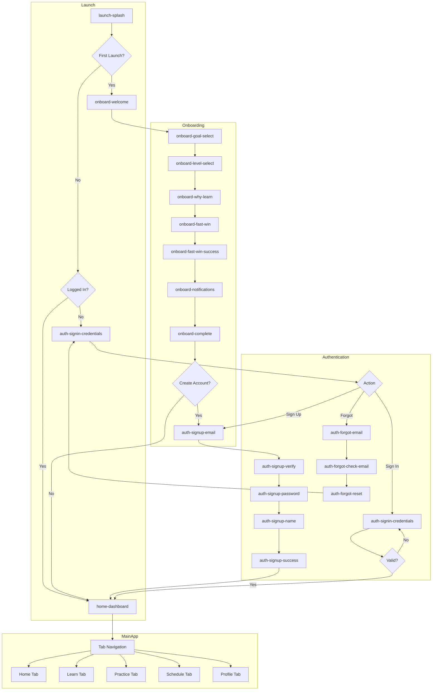
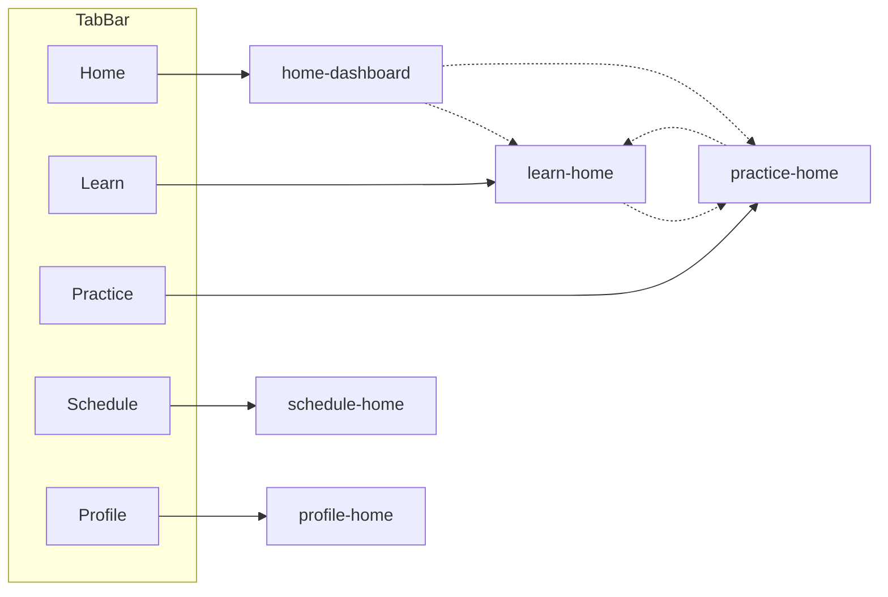

# Learning Platform — Transition Map

**Version:** 1.0 | **Date:** 2025-12-17  
**Platform:** iOS & Android (Expo)

---

## Navigation Architecture

### Navigation Libraries
- **Expo Router v4** — File-based routing
- **React Navigation v7** — Underlying navigation engine
- **Stack Navigator** — Within-tab navigation
- **Tab Navigator** — Main app tabs
- **Modal Stack** — Overlays and sheets

---

## Navigation Diagram



---

## Tab Navigation Flow



---

## Entry / Exit Coverage

Every screen in `/docs/flows/SCREEN-INVENTORY.md` has at least one **Entry** route (deep link, navigation, or modal) and at least one exit path back to a hub (Home/Learn/Practice/Schedule/Profile) or an adjacent flow.

## Detailed Transition Tables

### 1. Launch Flow

| From Screen | Action | To Screen | Condition | Animation |
|-------------|--------|-----------|-----------|-----------|
| `launch-splash` | Auto (2s) | `onboard-welcome` | First launch, no user | Fade |
| `launch-splash` | Auto (2s) | `auth-signin-credentials` | Has user, not logged in | Fade |
| `launch-splash` | Auto (2s) | `home-dashboard` | Logged in | Fade |
| `launch-splash` | Auto (5s) | `error-offline` | No network | Fade |
| `launch-update-required` | Tap "Update" | App Store | External | None |
| `launch-maintenance` | Tap "Retry" | `launch-splash` | — | Fade |

### 2. Onboarding Flow

| From Screen | Action | To Screen | Condition | Animation |
|-------------|--------|-----------|-----------|-----------|
| `onboard-welcome` | Tap "Start Speaking" | `onboard-goal-select` | — | Push |
| `onboard-welcome` | Tap "I have an account" | `auth-signin-credentials` | — | Push |
| `onboard-goal-select` | Select goal | `onboard-level-select` | Goal selected | Push |
| `onboard-goal-select` | Back | `onboard-welcome` | — | Pop |
| `onboard-level-select` | Select level | `onboard-why-learn` | Level selected | Push |
| `onboard-level-select` | Back | `onboard-goal-select` | — | Pop |
| `onboard-why-learn` | Continue/Skip | `onboard-fast-win` | — | Push |
| `onboard-fast-win` | Correct pronunciation | `onboard-fast-win-success` | — | Modal |
| `onboard-fast-win-success` | Tap "Continue" | `onboard-notifications` | — | Push |
| `onboard-notifications` | Allow/Deny | `onboard-complete` | — | Push |
| `onboard-complete` | Tap "Create Account" | `auth-signup-email` | — | Push |
| `onboard-complete` | Tap "Continue as Guest" | `home-dashboard` | — | Reset |

### 3. Authentication Flow

| From Screen | Action | To Screen | Condition | Animation |
|-------------|--------|-----------|-----------|-----------|
| `auth-signup-email` | Submit email | `auth-signup-verify` | Valid email | Push |
| `auth-signup-email` | Tap social auth | `auth-oauth-callback` | — | Modal |
| `auth-signup-email` | Tap "Sign In" | `auth-signin-credentials` | — | Replace |
| `auth-signup-verify` | Enter code | `auth-signup-password` | Valid code | Push |
| `auth-signup-verify` | Tap "Change email" | `auth-signup-email` | — | Pop |
| `auth-signup-password` | Set password | `auth-signup-name` | Valid password | Push |
| `auth-signup-name` | Enter name | `auth-signup-success` | — | Push |
| `auth-signup-success` | Auto/Tap | `home-dashboard` | — | Reset |
| `auth-signin-credentials` | Submit | `home-dashboard` | Valid credentials | Reset |
| `auth-signin-credentials` | Submit | `auth-signin-2fa` | 2FA enabled | Push |
| `auth-signin-credentials` | Tap "Sign Up" | `auth-signup-email` | — | Replace |
| `auth-signin-credentials` | Tap "Forgot Password" | `auth-forgot-email` | — | Push |
| `auth-signin-2fa` | Enter code | `home-dashboard` | Valid 2FA | Reset |
| `auth-forgot-email` | Submit | `auth-forgot-check-email` | — | Push |
| `auth-forgot-check-email` | Tap link in email | `auth-forgot-reset` | Via deep link | Push |
| `auth-forgot-reset` | Set new password | `auth-signin-credentials` | — | Reset |
| `auth-oauth-callback` | Success | `home-dashboard` | New user + onboard done | Reset |
| `auth-oauth-callback` | Success | `onboard-goal-select` | New user | Reset |

### 4. Home Flow

| From Screen | Action | To Screen | Condition | Animation |
|-------------|--------|-----------|-----------|-----------|
| `home-dashboard` | Tap lesson card | `learn-lesson-detail` | — | Push |
| `home-dashboard` | Tap verb of day | `home-verb-of-day` | — | Modal (sheet) |
| `home-dashboard` | Tap streak | `home-streak-detail` | — | Modal (sheet) |
| `home-dashboard` | Tap AI button | `ai-chat-conversation` | — | Push |
| `home-dashboard` | Tap daily challenge | `home-daily-challenge` | — | Push |
| `home-dashboard` | Pull down | Refresh | — | Native |
| `home-verb-of-day` | Dismiss | `home-dashboard` | — | Modal close |
| `home-streak-detail` | Dismiss | `home-dashboard` | — | Modal close |
| `home-daily-challenge` | Complete | `practice-result` | — | Push |

### 5. Learn Flow

| From Screen | Action | To Screen | Condition | Animation |
|-------------|--------|-----------|-----------|-----------|
| `learn-home` | Tap category | `learn-category-list` | — | Push |
| `learn-home` | Tap "Vocabulary" | `learn-vocab-list` | — | Push |
| `learn-home` | Tap "Slang" | `learn-slang-regions` | — | Push |
| `learn-home` | Tap "Stories" | `learn-story-list` | — | Push |
| `learn-category-list` | Tap category | `learn-lesson-list` | — | Push |
| `learn-lesson-list` | Tap lesson | `learn-lesson-detail` | Unlocked | Push |
| `learn-lesson-list` | Tap lesson | `learn-lesson-locked` | Locked | Modal |
| `learn-lesson-detail` | Tap "Start" | `learn-lesson-content` | — | Push |
| `learn-lesson-content` | Complete page | Next page | — | Slide |
| `learn-lesson-content` | Complete lesson | `learn-lesson-complete` | — | Push |
| `learn-lesson-complete` | Tap "Continue" | `learn-lesson-list` | — | Pop to |
| `learn-lesson-complete` | Tap "Practice" | `practice-exercise-select` | — | Push |
| `learn-vocab-list` | Tap word | `learn-vocab-detail` | — | Push |
| `learn-vocab-detail` | Tap "Flashcards" | `learn-vocab-flashcard` | — | Push |
| `learn-slang-regions` | Tap region | `learn-slang-list` | — | Push |
| `learn-slang-list` | Tap phrase | `learn-slang-detail` | — | Push |
| `learn-story-list` | Tap story | `learn-story-reader` | — | Push |
| `learn-story-reader` | Tap word | Word detail | — | Popover |

### 6. Practice Flow

| From Screen | Action | To Screen | Condition | Animation |
|-------------|--------|-----------|-----------|-----------|
| `practice-home` | Tap exercise type | `practice-exercise-select` | — | Push |
| `practice-home` | Tap AI Tutor | `ai-home` | — | Push |
| `practice-exercise-select` | Select exercise | Exercise screen | — | Push |
| `practice-quiz-mcq` | Answer | Next question | Not last | Slide |
| `practice-quiz-mcq` | Answer | `practice-result` | Last question | Push |
| `practice-speaking` | Record | `practice-pronunciation-score` | — | Push |
| `practice-pronunciation-score` | Continue | `practice-result` | — | Push |
| `practice-result` | Tap "Detail" | `practice-result-detail` | — | Push |
| `practice-result` | Tap "Continue" | Next exercise or home | — | Pop/Push |

### 7. AI Tutor Flow

| From Screen | Action | To Screen | Condition | Animation |
|-------------|--------|-----------|-----------|-----------|
| `ai-home` | Tap mode | `ai-mode-select` | — | Push |
| `ai-home` | Tap "Talk to AI Tutor" | `ai-voice-talk` | — | Push |
| `ai-mode-select` | Select "Conversation" | `ai-chat-conversation` | — | Push |
| `ai-mode-select` | Select "Grammar" | `ai-chat-grammar` | — | Push |
| `ai-mode-select` | Select "Story" | `ai-chat-story` | — | Push |
| `ai-mode-select` | Select "Drill" | `ai-chat-drill` | — | Push |
| `ai-chat-*` | Send message | AI response | — | None |
| `ai-chat-*` | Tap "End Session" | `ai-session-summary` | — | Push |
| `ai-voice-talk` | Tap mic | `ai-voice-listening` | — | None |
| `ai-voice-listening` | Release/stop | `ai-voice-response` | — | None |
| `ai-voice-response` | AI finishes | `ai-voice-talk` | — | None |
| `ai-voice-talk` | Tap "End" | `ai-session-summary` | — | Push |

### 8. Schedule Flow

| From Screen | Action | To Screen | Condition | Animation |
|-------------|--------|-----------|-----------|-----------|
| `schedule-home` | Tap "Book" | `schedule-calendar` | — | Push |
| `schedule-home` | Tap upcoming | `schedule-session-detail` | — | Push |
| `schedule-calendar` | Select date | `schedule-slot-select` | — | Modal (sheet) |
| `schedule-slot-select` | Select slot | `schedule-confirm` | — | Push |
| `schedule-confirm` | Tap "Confirm" | `schedule-success` | Payment success | Push |
| `schedule-confirm` | Tap "Confirm" | Payment error | Payment fails | Alert |
| `schedule-success` | Tap "Done" | `schedule-home` | — | Pop to |
| `schedule-session-detail` | Tap "Join" | `schedule-video-room` | Session time | Push (full) |
| `schedule-session-detail` | Tap "Cancel" | Confirm dialog | — | Alert |
| `schedule-video-room` | Call ends | `schedule-video-ended` | — | Push |
| `schedule-video-ended` | Tap "Done" | `schedule-home` | — | Pop to |

### 9. Subscription Flow

| From Screen | Action | To Screen | Condition | Animation |
|-------------|--------|-----------|-----------|-----------|
| Any premium feature | Tap blocked feature | `sub-paywall` | Free user | Modal (sheet→full) |
| `sub-paywall` | Select plan | `sub-checkout` | — | Push |
| `sub-paywall` | Tap "Compare" | `sub-plan-compare` | — | Push |
| `sub-checkout` | Complete purchase | `sub-success` | Success | Push |
| `sub-success` | Tap "Start" | Previous screen | — | Dismiss all |
| `profile-home` | Tap "Subscription" | `sub-manage` | Subscribed | Push |
| `sub-manage` | Tap "Cancel" | `sub-cancel` | — | Push |
| `sub-cancel` | Confirm | `sub-manage` | — | Pop |

---

## Deep Link Scheme

### URL Scheme: `learning-platform://`

| Deep Link | Target Screen | Auth Required | Parameters |
|-----------|---------------|---------------|------------|
| `learning-platform://` | `home-dashboard` | Yes | — |
| `learning-platform://home` | `home-dashboard` | Yes | — |
| `learning-platform://lesson/{id}` | `learn-lesson-detail` | Yes | `id: uuid` |
| `learning-platform://lesson/{id}/exercise/{n}` | Exercise screen | Yes | `id: uuid, n: int` |
| `learning-platform://vocab/{id}` | `learn-vocab-detail` | Yes | `id: uuid` |
| `learning-platform://chat` | `ai-chat-conversation` | Yes | — |
| `learning-platform://chat/grammar` | `ai-chat-grammar` | Yes | — |
| `learning-platform://chat/voice` | `ai-voice-talk` | Yes | — |
| `learning-platform://booking/{id}` | `schedule-session-detail` | Yes | `id: uuid` |
| `learning-platform://subscribe` | `sub-paywall` | No | — |
| `learning-platform://subscribe/{tier}` | `sub-checkout` | No | `tier: string` |
| `learning-platform://profile` | `profile-home` | Yes | — |
| `learning-platform://settings` | `settings-home` | Yes | — |
| `learning-platform://reset-password` | `auth-forgot-reset` | No | `token: string` |
| `learning-platform://verify-email` | `auth-signup-verify` | No | `code: string` |

### Universal Links (iOS) / App Links (Android)

| Domain | Path | Target |
|--------|------|--------|
| `app.app.example.com` | `/lesson/:id` | `learn-lesson-detail` |
| `app.app.example.com` | `/join/:id` | `schedule-video-room` |
| `app.app.example.com` | `/subscribe` | `sub-paywall` |
| `app.app.example.com` | `/reset` | `auth-forgot-reset` |

---

## Push Notification Deep Links

| Notification Type | Payload Action | Target Screen |
|-------------------|----------------|---------------|
| Streak reminder | `action: streak` | `home-dashboard` |
| Lesson reminder | `action: lesson, id: xxx` | `learn-lesson-detail` |
| Session reminder (24h) | `action: booking, id: xxx` | `schedule-session-detail` |
| Session reminder (1h) | `action: booking, id: xxx` | `schedule-session-detail` |
| Session starting | `action: join, id: xxx` | `schedule-video-room` |
| New post from AI Tutor | `action: feed` | `feed-home` |
| Achievement unlocked | `action: achievement, id: xxx` | `profile-achievements` |
| Homework assigned | `action: homework, id: xxx` | `feed-homework` |

---

## Back Navigation Rules

### Stack Navigation
- Native back gesture (iOS: swipe from left edge, Android: back button)
- Back button in header
- Each tab maintains its own stack

### Modal Dismissal
- Swipe down gesture (bottom sheets)
- Tap outside (modals with backdrop)
- Close button (full-screen modals)

### Special Cases
| Screen | Back Behavior |
|--------|---------------|
| `home-dashboard` | Exit app (double-tap warning) |
| `auth-signup-success` | Blocked (no back) |
| `sub-success` | Dismiss to origin |
| `schedule-video-room` | Confirm dialog before leaving |
| `onboard-fast-win` | Discouraged (can go back) |

---

## Transition Animations

### Push (Stack)
```typescript
// Standard push animation
{
  animation: 'slide_from_right',
  gestureEnabled: true,
}
```

### Modal (Sheet)
```typescript
// Bottom sheet modal
{
  presentation: 'modal',
  animation: 'slide_from_bottom',
  gestureEnabled: true,
}
```

### Full Screen Modal
```typescript
// Full screen takeover
{
  presentation: 'fullScreenModal',
  animation: 'fade',
  gestureEnabled: false,
}
```

### Celebration
```typescript
// Success/celebration screens
{
  animation: 'fade',
  animationDuration: 200,
}
// + confetti overlay
```

---

## State Persistence

### Persisted State
- Current tab selection
- Scroll positions (within session)
- Form drafts (AI chat, homework)
- Playback position (audio, video)

### Reset on Logout
- All navigation stacks
- All tab states
- All cached data

---

*Transition Map Version: 1.0*  
*Last Updated: 2025-12-17*

