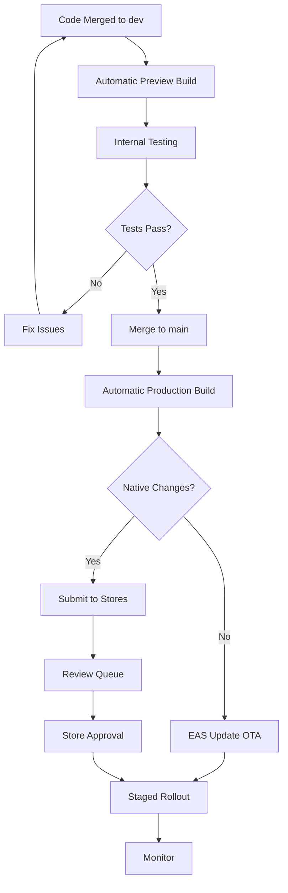
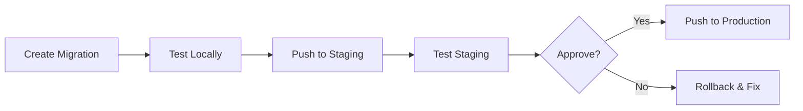

# Learning Platform — Deployment Strategy

**Version:** 1.0 | **Date:** 2025-12-17  
**Platforms:** iOS, Android  
**Build System:** Expo EAS

---

## Environments

| Environment | Purpose | Supabase Project | EAS Channel |
|-------------|---------|------------------|-------------|
| Development | Local development | Local / Dev project | N/A |
| Preview | PR previews | Preview project | `preview` |
| Staging | Pre-release testing | Staging project | `staging` |
| Production | Live users | Production project | `production` |

---

## Mobile App Deployment

### Build Configuration

**eas.json:**
```json
{
  "cli": {
    "version": ">= 12.0.0"
  },
  "build": {
    "development": {
      "developmentClient": true,
      "distribution": "internal",
      "env": {
        "EXPO_PUBLIC_SUPABASE_URL": "https://dev-project.supabase.co",
        "EXPO_PUBLIC_SUPABASE_ANON_KEY": "dev_anon_key"
      }
    },
    "preview": {
      "distribution": "internal",
      "channel": "preview",
      "env": {
        "EXPO_PUBLIC_SUPABASE_URL": "https://preview-project.supabase.co",
        "EXPO_PUBLIC_SUPABASE_ANON_KEY": "preview_anon_key"
      }
    },
    "staging": {
      "distribution": "internal",
      "channel": "staging",
      "env": {
        "EXPO_PUBLIC_SUPABASE_URL": "https://staging-project.supabase.co",
        "EXPO_PUBLIC_SUPABASE_ANON_KEY": "staging_anon_key",
        "EXPO_PUBLIC_REVENUECAT_IOS_KEY": "staging_rc_ios",
        "EXPO_PUBLIC_REVENUECAT_ANDROID_KEY": "staging_rc_android"
      }
    },
    "production": {
      "channel": "production",
      "autoIncrement": "buildNumber",
      "env": {
        "EXPO_PUBLIC_SUPABASE_URL": "https://prod-project.supabase.co",
        "EXPO_PUBLIC_SUPABASE_ANON_KEY": "prod_anon_key",
        "EXPO_PUBLIC_REVENUECAT_IOS_KEY": "prod_rc_ios",
        "EXPO_PUBLIC_REVENUECAT_ANDROID_KEY": "prod_rc_android"
      }
    }
  },
  "submit": {
    "production": {
      "ios": {
        "appleId": "team@app.example.com",
        "ascAppId": "123456789",
        "appleTeamId": "ABCD1234"
      },
      "android": {
        "serviceAccountKeyPath": "./google-service-account.json",
        "track": "production"
      }
    }
  }
}
```

### Build Commands

```bash
# Development build (with dev client)
eas build --profile development --platform all

# Preview build (internal testing)
eas build --profile preview --platform all

# Staging build (pre-release)
eas build --profile staging --platform all

# Production build
eas build --profile production --platform all

# Submit to stores
eas submit --platform all
```

---

## Deployment Workflow

### Standard Release Flow



### GitHub Actions Workflow

**.github/workflows/deploy.yml:**
```yaml
name: Build and Deploy

on:
  push:
    branches: [main]
  pull_request:
    branches: [dev, main]

jobs:
  lint-and-test:
    runs-on: ubuntu-latest
    steps:
      - uses: actions/checkout@v4
      - uses: actions/setup-node@v4
        with:
          node-version: '20'
          cache: 'npm'
      - run: npm ci
      - run: npm run lint
      - run: npm run typecheck
      - run: npm test

  build-preview:
    needs: lint-and-test
    if: github.event_name == 'pull_request'
    runs-on: ubuntu-latest
    steps:
      - uses: actions/checkout@v4
      - uses: expo/expo-github-action@v8
        with:
          eas-version: latest
          token: ${{ secrets.EXPO_TOKEN }}
      - run: npm ci
      - run: eas build --profile preview --platform all --non-interactive

  deploy-production:
    needs: lint-and-test
    if: github.ref == 'refs/heads/main'
    runs-on: ubuntu-latest
    steps:
      - uses: actions/checkout@v4
      - uses: expo/expo-github-action@v8
        with:
          eas-version: latest
          token: ${{ secrets.EXPO_TOKEN }}
      - run: npm ci
      - name: Check for native changes
        id: check-native
        run: |
          # Check if app.json or native code changed
          if git diff --name-only HEAD~1 | grep -qE '(app\.json|ios/|android/)'; then
            echo "native_changed=true" >> $GITHUB_OUTPUT
          else
            echo "native_changed=false" >> $GITHUB_OUTPUT
          fi
      - name: OTA Update
        if: steps.check-native.outputs.native_changed == 'false'
        run: eas update --channel production --message "${{ github.event.head_commit.message }}"
      - name: Build and Submit
        if: steps.check-native.outputs.native_changed == 'true'
        run: |
          eas build --profile production --platform all --non-interactive --auto-submit
```

---

## OTA Updates (Expo Updates)

### When to Use OTA

| Change Type | Use OTA? | Reasoning |
|-------------|----------|-----------|
| Bug fix in JS/TS | ✅ Yes | Fast deployment |
| UI tweaks | ✅ Yes | No native changes |
| New features (JS only) | ✅ Yes | Iterate quickly |
| New native module | ❌ No | Requires new binary |
| app.json changes | ❌ No | Affects native build |
| Expo SDK upgrade | ❌ No | Native changes |

### Staged Rollout

```bash
# Deploy to 10% of users
eas update --channel production --message "v1.2.1 hotfix" --rollout-percentage 10

# Expand to 50% after monitoring
eas update:rollout --channel production --percentage 50

# Full rollout
eas update:rollout --channel production --percentage 100
```

### Rollback

```bash
# List recent updates
eas update:list --channel production

# Rollback to previous update
eas update:rollback --channel production
```

---

## Database Migrations

### Migration Workflow



### Commands

```bash
# Create new migration
supabase migration new add_new_feature

# Test locally
supabase db reset

# Push to staging
supabase db push --linked --db-url "postgresql://..."

# Push to production (with backup)
supabase db backup create
supabase db push --linked
```

### Migration Best Practices

1. **Always backwards compatible** — Add columns nullable, then backfill
2. **Test with production data copy** — Anonymized production snapshot
3. **Run during low traffic** — Schedule for off-peak hours
4. **Have rollback ready** — Keep reverse migration script prepared

### Example Migration

```sql
-- 20251217_add_premium_features.sql

-- Step 1: Add new column (nullable first)
ALTER TABLE profiles ADD COLUMN favorite_lessons UUID[];

-- Step 2: Create new table
CREATE TABLE learning_paths (
  id UUID PRIMARY KEY DEFAULT gen_random_uuid(),
  name TEXT NOT NULL,
  lessons UUID[] NOT NULL,
  created_at TIMESTAMPTZ DEFAULT NOW()
);

-- Step 3: Enable RLS
ALTER TABLE learning_paths ENABLE ROW LEVEL SECURITY;

CREATE POLICY "Public read learning paths"
ON learning_paths FOR SELECT USING (true);

-- Step 4: Create index
CREATE INDEX idx_profiles_favorites ON profiles USING GIN (favorite_lessons);
```

---

## Edge Function Deployment

### Deployment Commands

```bash
# Deploy single function
supabase functions deploy ai-chat

# Deploy all functions
supabase functions deploy

# Deploy to production
supabase functions deploy --project-ref production-ref
```

### Secrets Management

```bash
# Set secret
supabase secrets set OPENAI_API_KEY=sk-...

# List secrets
supabase secrets list

# Unset secret
supabase secrets unset OPENAI_API_KEY
```

### Function Versioning

Edge Functions are versioned with the codebase. No separate versioning needed.

---

## Rollback Procedures

### Mobile App Rollback

**OTA Rollback (Recommended):**
```bash
eas update:rollback --channel production
```

**Binary Rollback (If OTA fails):**
1. Build previous commit: `git checkout <previous-tag> && eas build`
2. Submit to stores with expedited review request
3. Monitor rollout

### Database Rollback

```bash
# Restore from backup
supabase db backup restore <backup-id>

# Or run reverse migration
supabase migration repair --status reverted <migration-name>
```

### Edge Function Rollback

```bash
# Deploy previous version
git checkout <previous-tag>
supabase functions deploy
```

---

## Monitoring Post-Deployment

### Metrics to Watch

| Metric | Tool | Alert Threshold |
|--------|------|-----------------|
| App Crashes | Sentry | > 1% crash rate |
| API Errors | Supabase | > 5% error rate |
| API Latency | Supabase | P95 > 2s |
| User Complaints | App Store | New negative reviews |
| Revenue | RevenueCat | Unexpected drops |

### Health Checks

```typescript
// /functions/v1/health
export async function healthCheck() {
  const checks = {
    database: await checkDatabase(),
    openai: await checkOpenAI(),
    elevenlabs: await checkElevenLabs(),
    livekit: await checkLiveKit(),
  };
  
  const allHealthy = Object.values(checks).every(c => c.healthy);
  
  return new Response(JSON.stringify({
    status: allHealthy ? 'healthy' : 'degraded',
    checks,
    timestamp: new Date().toISOString(),
  }), {
    status: allHealthy ? 200 : 503,
  });
}
```

---

## Release Checklist

### Pre-Release

- [ ] All tests passing
- [ ] Staging environment verified
- [ ] Database migrations tested
- [ ] Edge Functions deployed to staging
- [ ] RevenueCat products configured
- [ ] App Store/Play Store metadata updated
- [ ] Changelog prepared

### Release Day

- [ ] Backup production database
- [ ] Deploy Edge Functions
- [ ] Run database migrations
- [ ] Deploy app (OTA or binary)
- [ ] Monitor error rates
- [ ] Monitor crash reports
- [ ] Verify critical flows

### Post-Release

- [ ] Monitor for 24 hours
- [ ] Check user feedback
- [ ] Update documentation
- [ ] Retrospective (if major release)

---

*Deployment Document Version: 1.0*  
*Last Updated: 2025-12-17*

